# Harness Blueprint — Salesforce Managed Package Workspace (historical design record)

> Historical status: this document preserves the original rationale and functional essence. The
> operational hardening branch reopened Git/MCP/hooks/CI topics that this blueprint parked. Current
> runtime authority is listed in `README.md`; do not use a conflicting historical statement as an
> execution rule. In particular, the current repository root is the only `brain-core` workspace
> folder and the only SFDX root; any wrapper, nested-project, or separate-repository topology below
> is historical only.

## 0. Jak czytać ten dokument

Ten plik to jedyne źródło prawdy o projekcie brain-core harnessu dla GitHub Copilot w VS Code,
budowanego pod pracę SDLC na zamkniętym managed package Salesforce. Powstał z serii sesji
planistycznych i zawiera nie tylko architekturę, ale **decyzje wraz z uzasadnieniem** — żeby
ktokolwiek (człowiek albo agent) czytający to za pół roku rozumiał nie tylko "co", ale "dlaczego".

Konwencje w tym dokumencie:
- `<TU_WSTAW_...>` oznacza dane, których nie znamy i musi je uzupełnić człowiek.
- Sekcja 16 zbiera wszystkie takie placeholdery w jednym miejscu.
- Sekcja 15 ("Parking lot") to rzeczy świadomie odłożone — nie przeoczone, tylko odłożone.
- Ten dokument powinien być aktualizowany przy każdej nowej decyzji projektowej, a nie zastępowany
  nową rozmową od zera. Traktuj go jako pamięć trwałą projektu, nie jednorazowy briefing.

**Status (zaktualizowano 2026-07-09)**: harness ZBUDOWANY w tym repozytorium zgodnie ze
strukturą z sekcji 5 — trzy pliki Principles + cienki `copilot-instructions.md`, 5 agentów,
12 skilli, 7 promptów, scaffolding `.ai/` (knowledge z indeksem README, memory, templates, qa)
oraz strukturalne `.cache/` i `output/` (puste, `.cache/` gitignorowane). Pliki harnessu po
angielsku; terminy polskie zachowane w `glossary.md` / `keyword-taxonomy.md`. Świadome
odstępstwa od litery specyfikacji (wszystkie odnotowane, żadne ciche): dodany
`.ai/qa/test-cases/README.md` (dokumentuje konwencję nazewniczą suite'ów), pliki `.gitkeep`
utrwalające puste foldery, krok fail-fast na brakujący Query ID w `generate-release-handover`,
czwarta kolumna "Manual steps reference" w tabeli artefaktów (niedomknięcie "te same 4 kolumny"
w sekcji 13 — do potwierdzenia), oraz brak wartości `model:`/finalnych `tools:` w frontmatter
agentów (blueprint ich nie przesądza — TODO(verify)). Pełna lista flag, TODO(verify) i
priorytetyzowana checklista placeholderów `<TU_WSTAW_...>`: **BUILD_REPORT.md** w rootcie repo.
Diagramy w HARNESS_DIAGRAMS.md sekcje 1.1/1.3 pokazują 4 agentów — nieaktualne względem
blueprintu (5 agentów); blueprint wygrywa (R1).

---

## 1. Cel i kontekst projektu

Firma pracuje na zamkniętym **managed package Salesforce** (`<TU_WSTAW_NAMESPACE_PAKIETU>`) —
nie ma dostępu do kodu Apex/LWC pakietu i nie może go modyfikować. Cel projektu: zbudować
workspace VS Code, w którym GitHub Copilot jest maksymalnie skuteczny mimo tego ograniczenia,
poprzez jawną, ustrukturyzowaną "warstwę mózgu" (brain-core): Principles, Knowledge, Memory,
Orchestration, Harness.

Zakres wykracza poza samo pisanie kodu/configu — harness obejmuje też pełną warstwę QA:
synchronizację i wyszukiwanie Test Case'ów z Azure Test Plans, kuratorowany słownik keywords, i
automatyczne generowanie testów Playwright na bazie kroków testowych (z istniejącego Test Case'a
albo opisanych wprost przez testera). Jeden brain-core, dwie strony tej samej monety: pisanie
zmiany i jej testowanie.

Powód, dla którego to w ogóle jest trudniejsze niż zwykły projekt: w typowym repo agent AI
uczy się systemu, czytając kod źródłowy. Tu połowa "logiki systemu" nie jest kodem, tylko:
(a) konfiguracją zapisaną jako rekordy w tabelach referencyjnych, (b) zachowaniem wewnętrznym
managed package, którego nie widać z zewnątrz. Agent musi to odkrywać i spisywać, zamiast czytać.

---

## 2. Fakty o środowisku Salesforce (ustalone w rozmowie)

- **Model danych jest hybrydowy.** Są prawdziwe custom obiekty z polami, deployowane jako
  metadane. Historyczny przykład `ExampleManagedObject__c` poniżej jest wyłącznie syntetycznym
  wzorcem — nie opisuje realnego pakietu. Obok tego może istnieć wzorzec lookup-do-tabeli
  referencyjnej, w którym wartość statusu jest rekordem na osobnym obiekcie edytowalnym w runtime,
  a nie picklistą ani Custom Metadata Type. Każdy realny przypadek wymaga osobnej weryfikacji.
- **Deploymenty metadanych się zdarzają.** To nie jest projekt czysto data-driven — realnie
  deployujemy pola, obiekty, automatyzacje, które są pod naszą kontrolą.
- **Brak Dev Hub / scratch orgów.** Praca deweloperska dzieje się na **Full Copy Sandbox
  (zanonimizowany)**, prawdopodobnie współdzielonym przez zespół.
- **Refresh sandboxa jest rzadki** (ok. raz na pół roku), a dane referencyjne pozostają
  stabilne między refreshami. To NIE jest ryzyko operacyjne dla tego projektu — świadomie
  nie modelujemy wokół tego żadnej logiki odtwarzania danych.
- **Środowiska**: Full Copy Sandbox (dev) → QA → UAT → Production. Dokładne aliasy `sf` CLI
  do ustalenia — patrz sekcja 16.
- **Deploymenty metadanych są cotygodniowe**, na UAT. Każdy development ma swój własny,
  kompletny `manifest/package.xml` (standardowy SFDX) — jeden manifest odpowiada dokładnie
  jednemu developmentowi, nie zbiorczemu tygodniowemu batchowi.
- **Git istnieje, ale tylko częściowo.** Jest używany na etapie UAT → Prod. Dev zaczyna się
  od środowiska zwanego "intDev", które **nie ma gita**. Cały ten temat (git + sposób, w jaki
  spina się z environments) jest świadomie POZA zakresem tego etapu projektu — patrz sekcja 15.
- **Deployment idzie przez Salesforce DevOps Center**, operujący na work itemach. Mechanika
  tego procesu jest świadomie POZA zakresem tego etapu — patrz sekcja 15.
- **Visualforce wciąż w użyciu** dla części UI, częściowo jako rozszerzenia w punktach, które
  pakiet udostępnia, częściowo jako relikty starszych wdrożeń.
- **Narzędzia MCP już podłączone**: Salesforce DX MCP Server oraz Azure DevOps MCP Server
  (oficjalny, `microsoft/azure-devops-mcp`). Pierwotnie realnie potrzebne były tylko domeny
  `core` + `work-items` + `wiki` (zespół nie pracuje na Pull Requestach ani pipeline'ach przez
  ten kanał) — **od momentu dodania warstwy QA doszła domena `test-plans`** (sekcja 3, sekcja 14).

---

## 3. Kluczowe decyzje architektoniczne i uzasadnienia

To jest najważniejsza sekcja tego dokumentu — każda decyzja poniżej była świadomym wyborem
między alternatywami, nie jedyną możliwą opcją.

**Decyzja: podział na `.github/` (natywnie ładowane) vs `.ai/` (referencyjne, na żądanie).**
Uzasadnienie: `.github/instructions/*.instructions.md` to jedyny mechanizm, który VS Code
Copilot automatycznie wczytuje do każdego requestu (przez `applyTo`). Knowledge i Memory nie
muszą być ładowane automatycznie do każdej wiadomości — agent sięga po nie świadomie, gdy
potrzebuje faktów. Gdyby Principles trafiły do osobnego, nienatywnego folderu, przestałyby być
"konstytucją zawsze obowiązującą" i stałyby się zwykłą dokumentacją, którą agent może, ale nie
musi przeczytać. Stąd: to, co MUSI być zawsze aktywne, żyje w `.github/`; to, co jest
materiałem referencyjnym, żyje w `.ai/`.

**Decyzja: trzy warstwy Principles z jawną hierarchią pierwszeństwa.**
Uzasadnienie: reguły pochodzą z trzech niezależnych źródeł o różnej częstotliwości zmian i
różnym "właścicielu" — branża (rzadko się zmienia, nie zależy od firmy), organizacja (Wasze
wewnętrzne standardy), vendor pakietu (twarde ograniczenia techniczne). Rozdzielenie na trzy
pliki zamiast jednego pozwala aktualizować każdy niezależnie i jasno przypisać odpowiedzialność
za utrzymanie. Hierarchia pierwszeństwa przy konflikcie: **Managed Package Constraints >
Organization Principles > Salesforce best practices ogólne** — bo ograniczenie technicznie
narzucone przez vendora jest twardsze niż nasza wewnętrzna preferencja, która z kolei jest
twardsza niż ogólna dobra praktyka branżowa.

**Decyzja: Knowledge = fakty, Principles = reguły — rozdzielone świadomie.**
Uzasadnienie: "syntetyczny ExampleManagedObject ma pole Status lookup do Reference Data" pokazuje
kształt faktu (Knowledge). "Na package-owned object nie wolno dodawać record-triggered Flow bez
zweryfikowanego extension point" pokazuje kształt reguły (Principles, konkretnie Managed Package
Constraints). Bez tego rozdzielenia te dwie
rzeczy mieszają się w jednym miejscu i trudno potem zaktualizować jedno bez ryzyka zepsucia
drugiego — a mają zupełnie inny rytm zmian (fakty o obiektach zmieniają się rzadko, ograniczenia
vendora mogą się zmienić przy każdym upgradzie pakietu).

**Decyzja: cztery agenty mapowane na fazy SDLC, zamiast jednego uniwersalnego agenta.**
Uzasadnienie: firma explicite chciała pokrycia zasadami zarówno fazy Solution Design, jak i
Development jako odrębnych momentów procesu. Jeden uniwersalny agent nie wymusza przejścia
przez fazę projektową przed implementacją — łatwo "od razu zacząć kodować" bez przemyślenia
konfliktu z Managed Package Constraints. Cztery role: Projektant (design), Śledczy (fakty,
na żądanie), Deweloper (implementacja), Recenzent (finalny check) — każda z jasną
odpowiedzialnością i jasnym momentem w procesie.

**Decyzja: Śledczy configu (config-investigator) to narzędzie na żądanie, nie krok w sekwencji.**
Uzasadnienie: zarówno Projektant, jak i Deweloper muszą czasem ustalić fakt o systemie (np.
"co dokładnie robi ten rekord referencyjny"), ale nie zawsze — część zmian nie wymaga nowego
śledztwa, bo fakt już jest spisany w Knowledge. Modelowanie tego jako osobnego, obowiązkowego
kroku w sekwencji dodałoby tarcie tam, gdzie nie jest potrzebne.

**Decyzja: git, deployment i mechanika Salesforce DevOps Center świadomie POZA zakresem.**
Uzasadnienie: to temat opisany przez zespół jako "ciężki i bardzo specyficzny" — mieszanie go
z resztą architektury na tym etapie ryzykowałoby utknięciem w szczegółach jednego, wąskiego
tematu kosztem reszty. Świadome odłożenie, do podjęcia w osobnej, dedykowanej sesji.

**Decyzja: Azure DevOps ograniczony do domen `core` + `work-items` + `wiki`.**
Uzasadnienie: zespół faktycznie nie pracuje na Pull Requestach ani pipeline'ach przez ten kanał
— ADO służy tu do śledzenia work itemów (user stories, taski, komentarze, załączniki) i wiki,
nie do zarządzania kodem. Włączenie domen `repositories`/`pipelines` dodałoby narzędzia, które
nigdy nie są używane, zaśmiecając listę dostępnych narzędzi bez korzyści.

**Decyzja: Salesforce DX MCP bez wpisu dla `prod` domyślnie w konfiguracji.**
Uzasadnienie: obrona w głąb — nawet gdyby jakaś reguła czy instrukcja zawiodła, agent fizycznie
nie ma narzędzia wskazującego na środowisko produkcyjne, dopóki ktoś świadomie go nie doda.

**Decyzja: skille jako uogólnienie procedur używanych przez więcej niż jednego agenta.**
Uzasadnienie: bez tego Projektant, Deweloper i Śledczy mieliby tę samą logikę (np. "jak zbadać
nieznany obiekt") zduplikowaną w trzech osobnych plikach agentów — trudniejsze w utrzymaniu,
łatwiej się rozjeżdża przy aktualizacji. Skille żyją niezależnie od konkretnego agenta.

**Decyzja: na tym etapie budujemy tylko pliki `.md` (Principles, Knowledge, profile agentów,
skille) — bez hooków, skryptów i bez finalizowania `mcp.json`.**
Uzasadnienie: świadome ograniczenie zakresu na start. Hooki i skrypty to mechanizm egzekwowania
(deterministyczny), a jego sens zależy od tego, żeby reguły "miękkie" (Principles) były już
dojrzałe i przetestowane w praktyce. Budowanie ich równolegle rozprasza uwagę i utrudnia iterację.

**Decyzja: `.cache/`, `output/` i `.ai/templates/` jako trzy kolejne foldery, każdy z jedną
jasną naturą (pełne uzasadnienie w sekcji 13).**
Uzasadnienie w skrócie: różna natura wymaga różnej polityki gita i widoczności — cache jest
surowy i gitignorowany, output jest widoczny bo człowiek ma go otwierać, templates dzielą naturę
z resztą `.ai/`. Zasada "jeden folder = jedna polityka" zastosowana konsekwentnie.

**Decyzja: `/document-metadata-change` polega na precondition, nie na walidacji zakresu
`package.xml`.**
Uzasadnienie: pierwotnie rozważany był mechanizm disambiguacji (cache → jawny argument →
fallback z ostrzeżeniem) na wypadek, gdyby jeden manifest obejmował więcej niż jeden development.
Po weryfikacji z zespołem okazało się, że `package.xml` zawsze odpowiada dokładnie jednemu
developmentowi — to odpowiedzialność dewelopera przed odpaleniem prompta, nie coś, co skill
powinien wykrywać. Zamiast budować niepotrzebną logikę, prompt zawiera jawne ostrzeżenie
(precondition note) o tym założeniu. Prostsze rozwiązanie wygrało z rozwiązywaniem problemu,
który nie istniał.

**Decyzja: pytanie o manualne kroki wdrożeniowe jako ostatni krok przed zapisem dokumentacji.**
Uzasadnienie: automatyczna analiza `package.xml` i `force-app` nigdy nie złapie tego, co nie jest
metadanymi — ręczna aktywacja Flow po deployu, jednorazowa poprawka danych, cokolwiek poza
zakresem plików. Odpowiedź "brak" jest zapisywana jawnie w dokumencie, nie znika po cichu —
ten sam nawyk co wszędzie indziej w tym projekcie: brak informacji ma być widoczny.

**Decyzja: logika `/fetch-ado-item` przeniesiona ze skryptu prompta do skilla
`fetch-ado-item`; ustanowiona ogólna zasada reużywalności.**
Uzasadnienie: pierwotnie cała logika (cache-check, rozgałęzienie single/hierarchy, tiered
detail, fallback bez parenta) siedziała w treści `.prompt.md` — niekonsekwencja względem wzorca
już zastosowanego przy `/document-metadata-change` + `generate-technical-documentation`. Realny
powód poprawki: `generate-technical-documentation` potrzebuje danych z ADO (tytuł/opis itemu do
sekcji "Podsumowanie biznesowe"), a bez wyciągnięcia logiki do skilla nie miał jak jej reużyć bez
duplikacji. Odtąd obowiązuje ogólna zasada: **cokolwiek jest używane przez więcej niż jednego
konsumenta (inny prompt, inny agent, inny skill) staje się skillem; prompty są zawsze cienkie**
— parsują argumenty i wywołują skill(e), żadna logika biznesowa nie mieszka w `.prompt.md`.

**Decyzja: skill `fetch-ado-item` zyskuje parametr `childDetail=<summary|full>`.**
Uzasadnienie: pierwotny projekt dawał dzieciom/siblingom w trybie `hierarchy` zawsze tylko
tytuł/typ/stan — dobre dla kontekstu Projektanta, złe dla `check-feature-coverage` (sekcja 11),
który musi porównać **pełną treść** każdej User Story z Feature/BRD. Zamiast nowego trybu albo
duplikowania logiki — jeden parametr, domyślnie `summary` (zachowuje dotychczasowe zachowanie),
opcjonalnie `full` dla konsumentów, którzy potrzebują więcej.

**Decyzja: `/feature-health` jako brama przed fazą Solution Design, nie część istniejącego
pipeline'u.**
Uzasadnienie: zanim Projektant zacznie projektować rozwiązanie dla konkretnej User Story, warto
sprawdzić, czy rozbicie Feature (i ewentualnego BRD) na Stories jest w ogóle kompletne — luka
złapana teraz kosztuje rozmowę, złapana po fazie designu kosztuje przeprojektowanie. Traktowana
jako osobna, wcześniejsza brama, nie krok w istniejącym pipeline'ie Projektant→Deweloper→Recenzent,
bo dotyczy innego poziomu hierarchii ADO (Feature, nie pojedyncza Story) i innego pytania
("czy rozbicie jest kompletne", nie "jak to zaimplementować").

**Decyzja: katalog odkrytych ograniczeń managed package przenosi się z Principles do nowej
domeny Knowledge (`known-limitations.md`).**
Uzasadnienie: `managed-package-constraints.instructions.md` pierwotnie miało `applyTo: "**"` i
ładowało się do każdego requestu. To nie skaluje się do rosnącego, granularnego katalogu ograniczeń pojedynczych
funkcji/stron (np. konkretna zamknięta strona VF). Taki katalog to fakty o systemie — dokładnie
ta sama natura co `automation-map.md` — więc trafia do Knowledge, na żądanie, konsultowany przez
`investigate-object`, `check-against-principles` i `check-feature-coverage`. Principles zostaje
cienki: ogólna zasada + tylko wpisy na tyle szerokie, że warto je mieć zawsze aktywne.

**Decyzja: `.ai/knowledge/README.md` jako nawigacyjny indeks, osobno od tego dokumentu.**
Uzasadnienie: żaden mechanizm platformy nie mówi agentowi, co siedzi w którym z dziesięciu
plików `.ai/knowledge/` — to działało dotąd wyłącznie dzięki ręcznie wpisanym odniesieniom w
treści konkretnych skilli, co psuje się po cichu przy każdym nowym pliku Knowledge (dokładnie to
przydarzyło się przy dodawaniu `known-limitations.md`). Ten dokument (`HARNESS_BLUEPRINT.md`)
się do tego nie nadaje — czytany raz przy budowie, nie przy każdym użyciu skilla, i niesie 700+
linii uzasadnień niepotrzebnych do samej nawigacji. `.ai/knowledge/README.md` to osobny,
roboczy artefakt: jedno zdanie na plik, czytany przez agentów/skille przy każdym użyciu.

**Decyzja: `update-knowledge-base` podbity z "niższy priorytet" do pełnego priorytetu.**
Uzasadnienie: skill i indeks się wzajemnie uzupełniają — bez indeksu `update-knowledge-base` nie
ma z czego korzystać przy routingu ustaleń do właściwego pliku, a bez tego skilla indeks nie ma
kto pilnować, żeby był aktualny przy każdym nowym pliku Knowledge. Teraz gdy ma jasne zadanie
(routing + utrzymanie README), nie ma powodu trzymać go niżej niż resztę skilli.

**Decyzja: `.ai/templates/knowledge-entry.md` jako trzeci szablon, z dodanym polem "Powiązane".**
Uzasadnienie: format wpisu Knowledge żył dotąd tylko jako opis w sekcji 8 tego dokumentu — ten
sam problem co reszta harnessu bez templates: każdy przyszły skill piszący do Knowledge musiałby
mieć go zaszyty osobno. Pole "Powiązane" (odniesienie do innych wpisów/plików) dopisane na wzór
`decisions-log.md` — przy dużych obiektach z dużą automatyzacją, powiązania między wpisami będą
częste i warte jawnego zapisania, nie tylko domyślnego.

**Decyzja: podział `object-descriptions.md` / `field-descriptions.md` / `automation-map.md` na
pliki per obiekt (`.ai/knowledge/objects/<Nazwa>.md`) odłożony do osiągnięcia progu, nie
budowany teraz. `object-relations.md` NIE dzieli się tym samym mechanizmem.**
Uzasadnienie: te trzy domeny są jedyne z natury przypisane do pojedynczego obiektu — przy dużych
obiektach z dużą automatyzacją (zgłoszone ryzyko) urosną najszybciej i najbardziej ucierpią na
jednym płaskim pliku (trudniejsze przeszukiwanie, więcej okazji do konfliktu edycji przy
współdzielonym sandboksie). Dzielenie pustego jeszcze pliku to koszt bez korzyści — próg do
podziału: ok. 15-20 opisanych obiektów w jednym pliku, albo gdy przeszukiwanie zaczyna realnie
zajmować więcej czasu niż samo badanie obiektu. Po podziale — jeden plik per obiekt łączący
opis+pola+automatyzację (bo i tak czytane razem), nie trzy osobne subfoldery per domena.
`object-relations.md` zostaje jednym, cross-cutting plikiem nawet po podziale — relacja z natury
dotyczy dwóch obiektów naraz, więc nie da się jej czysto przypisać do jednego pliku per obiekt;
to inny kształt skalowania niż przy opisach/polach/automatyzacji.

**Decyzja: skrypt indeksacji/wyszukiwania Knowledge świadomie POZA MVP, zapisany w Parking
Locie z własnym progiem, odrębnym od hooków/skryptów egzekwujących.**
Uzasadnienie: to nie ten sam rodzaj "później" co hooki (które czekają na dojrzałe Principles) —
to czeka na to, żeby Knowledge realnie urosło na tyle, że nawigacja przez samo README przestanie
wystarczać. Naturalnie ten sam moment w czasie co próg podziału powyżej — gdy plików/wpisów jest
tyle, że warto je dzielić, to zwykle ten sam moment, w którym warto mieć coś, co przeszukuje
wiele małych plików zamiast człowieka scrollującego README.

**Decyzja: Solution Design / dokumentacja techniczna linkowana do work itemu przez natywny
link typu "wiki page", nie custom field z URL-em.**
Uzasadnienie: Azure DevOps wspiera to jako formalny, systemowy typ linku (External Link Type)
od TFS 2018.2 — odpytywalny przez standardowe API relacji work itemu, widoczny w zakładce
Links. To pozwala każdemu przyszłemu skillowi (nie tylko `generate-release-handover`) programowo
odnaleźć powiązaną dokumentację, zamiast parsować wartość konkretnego pola.

**Decyzja: `fetch-ado-item` zyskuje `includeTestCases=<true|false>`, sprawdzający dwa źródła
relacji naraz.** Uzasadnienie: Test Case linkuje się do User Story/Buga przez inny mechanizm niż
hierarchia Parent/Child (formalnie "Tested By/Tests", ale zespół obserwuje to razem z resztą pod
"Related" w UI, bez rozróżnienia typu) — Microsoft explicite potwierdza, że tej relacji nie da
się odpytać przez hierarchię tak jak dzieci Feature. Nie wiadomo, którego typu faktycznie używa
zespół, więc zamiast zakładać jeden wariant, skill sprawdza oba (formalne "Tested By" i zwykłe
"Related" odfiltrowane po `Work Item Type = Test Case`) i łączy wynik z deduplikacją — ten sam
nawyk co reszta harnessu: sprawdzić, nie zakładać.

**Decyzja: ADO Query dla zakresu miesięcznego handoveru to referencja (zapisany Query ID), nie
logika WIQL projektowana w tym dokumencie.** Uzasadnienie: dokładne kryterium "co wchodzi w
release tego miesiąca" (Iteration Path, Area Path, zakres dat, dozwolone stany) to decyzja
zespołu o ich własnym procesie, nie coś, co powinno być zgadywane czy narzucane z zewnątrz.
Prostszy, bezpieczniejszy input dla skilla: ID istniejącego, zapisanego query w Azure DevOps —
placeholder w sekcji 16 jak każdy inny.

**Decyzja: nowa, ogólna zasada — preferuj deklaratywne wyjście (markdown) + istniejące
narzędzie/rozszerzenie do konwersji formatu, zamiast agenta piszącego i uruchamiającego własny
skrypt (Python, PowerShell itd.) przez CLI.** Uzasadnienie, trzy powody na stałe: (1) markdown
czyta się i weryfikuje bezpośrednio — wygenerowany skrypt trzeba czytać linijka po linijce, żeby
wiedzieć co robi, (2) uruchamianie CLI/skryptów to regularne pytania o zgodę, przy zadaniach
cyklicznych (jak comiesięczny handover) czysta, powtarzalna frustracja, (3) znane, ustabilizowane
narzędzie ma przewidywalne zachowanie za każdym razem; skrypt wygenerowany na nowo może się
subtelnie różnić przy każdym uruchomieniu. Retroaktywnie potwierdza to, że `generate-technical-
documentation` i `check-feature-coverage` już robiły to dobrze (kończą na zwykłym pliku `.md`) —
`generate-release-handover` (poniżej) był jedynym miejscem zaprojektowanym inaczej, poprawione
zanim w ogóle powstało. Konkretnie dla handoveru: skill kończy pracę na markdownie, eksport do
DOCX/PDF to osobny, ręczny krok człowieka przez rozszerzenie VS Code (Markdown PDF —
`yzane.markdown-pdf`, PDF natywnie, DOCX przez doinstalowany Pandoc jako backend; alternatywa
`vscode-pandoc` dla wyższej jakości DOCX z własnym reference-doc, jeśli domyślne stylowanie się
okaże niewystarczające).

**Decyzja: nowy skill `generate-release-handover` + cienki prompt `/release-handover`, nie nowy,
piąty agent.** Uzasadnienie: to dobrze zdefiniowana, powtarzalna procedura cykliczna (raz w
miesiącu), nie faza SDLC wymagająca szerokiego osądu jak Projektant czy Deweloper — "release
manager" w opisie zespołu to rola człowieka odpalającego prompt, nie nowa persona w harnessie.

**Decyzja: nowy top-level folder w `.ai/` — `.ai/qa/` — na zsynchronizowane dane z Azure Test
Plans, osobno od `.ai/knowledge/` i osobno od `.cache/`.** Uzasadnienie: dane z synchronizacji
całego suita naraz mają inny rytm i inną naturę niż zarówno cache (surowy, gitignorowany,
per-item), jak i Knowledge (indywidualnie badany fakt z polem "Poziom pewności" i "Jak
ustalono" — które nie mają sensu dla czegoś zsynchronizowanego wprost z ADO). Podział na dwie
warstwy szczegółowości: pełny detal (kroki, expected results) trafia do `.cache/test-cases/<id>.json`
— to czyste lustro ADO, nie ma po co tego wersjonować, skoro ADO i tak jest źródłem prawdy;
lekki indeks (ID, tytuł, ewentualnie priorytet/tagi) trafia do `.ai/qa/test-cases/<suiteId>-
<nazwa>.md`, commitowany, bo to współdzielony zasób zespołu. Podział na plik per suite od razu,
nie po progu jak przy obiektach w Knowledge — suite to gotowa, naturalna granica od pierwszego
dnia, nie trzeba czekać aż plik urośnie.

**Decyzja: domena `test-plans` dołączona do konfiguracji Azure DevOps MCP — rozszerzenie
wcześniej świadomie zawężonego zakresu.** Uzasadnienie: przynależność Test Case'a do Test Suite'u
to osobny model API (Plan → Suite → Test Case) niż relacje work itemów, więc `work-items` +
`wiki` (dotychczasowy zakres) tego nie pokrywają. To nie jest cofnięcie wcześniejszej decyzji o
zawężeniu domen (Parking Lot, sekcja 15) — po prostu wtedy nie istniała jeszcze warstwa QA;
zakres MCP rośnie razem z realną potrzebą, nie z góry.

**Decyzja: nowy skill `sync-test-cases` + cienki prompt `/sync-test-cases`, akceptujący link,
Suite ID albo Plan ID.** Uzasadnienie: zespół potwierdził, że czasem wygodniej podać sam Plan ID
niż wklejać pełny link. Jeśli podano konkretny Suite ID (wprost albo sparsowany z linku) — sync
tego jednego suita. Jeśli podano tylko Plan ID bez konkretnego suita — skill najpierw wylicza
wszystkie suity w tym planie, potem synchronizuje każdy tym samym mechanizmem, w pętli; struktura
plików (jeden plik per suite) obsługuje to bez zmian, po prostu produkując więcej plików naraz.

**Decyzja: nowy skill `suggest-test-cases`, wywoływany przez `generate-technical-documentation`,
nie osobny, równoległy mechanizm.** Uzasadnienie: kroki 1-2 nowego wymagania (analiza
Feature/Story/Bug, analiza metadanych) to dokładnie to, co `generate-technical-documentation`
już robi — budowanie tego od nowa byłoby czystą duplikacją. Dopasowanie test case'ów to
**wielosygnałowe rozumowanie modelu, nie sztywny algorytm keyword-matchingu**: (1) dotknięte
artefakty z `package.xml` jako sygnał podstawowy, (2) rozszerzenie słownictwa technicznego na
biznesowe przez `object-descriptions.md`/`business-processes.md`, (3) kontekst z tytułu/opisu
Feature/Story, (4) model ocenia trafność tytułów z `.ai/qa/` na tak zebranym kontekście. Algorytm
dopasowania byłby swego rodzaju "własnym skryptem" przeniesionym z warstwy dokumentów na warstwę
wyszukiwania — ten sam powód, dla którego unikamy obu. Wynik zawsze pogrupowany wg pewności
("wysokie prawdopodobieństwo" / "warto sprawdzić"), z jawnym uzasadnieniem per sugestia, nigdy
jako potwierdzone pokrycie. Ekstrahowany jako osobny skill (nie krok wewnątrz
`generate-technical-documentation`), bo `check-feature-coverage` mógłby go kiedyś reużyć do
sprawdzenia pokrycia testowego na poziomie Feature.

**Decyzja: kontrolowany słownik `.ai/knowledge/keyword-taxonomy.md`, rosnący wyłącznie przez
jawne potwierdzenie człowieka.** Uzasadnienie: fuzzy-dopasowanie rozumowaniem modelu (decyzja
powyżej) działa dobrze, ale bez wspólnego słownika dwa opisy tej samej rzeczy ("Billing" vs
"Invoicing") wciąż wymagają, żeby model zgadywał synonimiczność za każdym razem od nowa. Wspólny,
ograniczony zestaw terminów rozwiązuje to raz. Rośnie tylko przez potwierdzenie — skille mogą
zasugerować nowy termin, nigdy dopisać go po cichu — z tego samego powodu co ograniczenia w
`managed-package-constraints.instructions.md` czy fakty w Knowledge: niekontrolowany wzrost
słownika odtwarza dokładnie ten chaos, przed którym miał chronić.

**Decyzja: `.ai/qa/keywords-map.md` jako osobna mapa Test Case ID → keywords, nie pole w
plikach `test-cases/<suiteId>-<nazwa>.md`.** Uzasadnienie: ten sam podział natury co gdzie
indziej w projekcie — `test-cases/*.md` to auto-sync, maszynowe, nadpisywane przy każdym
`/sync-test-cases`; `keywords-map.md` to kuratorowane przez człowieka, nie powinno zniknąć przy
kolejnym syncu. Ryzyko do pilnowania: osierocony wpis w mapie, jeśli test case zniknie z syncu —
`sync-test-cases` (sekcja 11) sprawdza to i sygnalizuje wprost, nie ciche rozjechanie.

**Decyzja: obiekty NIE dostają osobnego admin-prompta na keywords — dostają opcjonalne pole w
istniejącym formacie `knowledge-entry.md`.** Uzasadnienie: `investigate-object` już bada obiekty
pojedynczo; dedykowany prompt administracyjny ma sens dla test case'ów, bo te przychodzą hurtowo
(cały sync suita naraz, nie jeden na raz jak obiekty) — dla obiektów wystarczy rozszerzyć to, co
już istnieje, nie budować drugiego narzędzia dla tego samego problemu.

**Decyzja: `/tune-test-case-keywords` jako admin-prompt (skill `tune-test-case-keywords`),
osobny od promptów deweloperskich.** Uzasadnienie: to narzędzie kuratorskie z ludzkim
potwierdzeniem w pętli (model sugeruje kandydujące keywords z istniejącej taksonomii, człowiek
zatwierdza/poprawia, nowy termin spoza taksonomii wymaga jawnej zgody na jej rozszerzenie), więc
naturalnie inna rola niż `/fetch-ado-item` czy `/document-metadata-change`, które deweloper
odpala w ramach codziennej pracy. Priorytet sygnału w `suggest-test-cases` zmienia się
odpowiednio: najpierw sprawdź `keywords-map.md` (twarde dopasowanie, jeśli dostrojone), dopiero
gdy nic nie da — fuzzy-dopasowanie rozumowaniem modelu jako fallback. Model stopniowego
wzmocnienia: działa nieźle od pierwszego dnia bez kuracji, staje się lepszy wraz z inwestycją
czasu, nigdy nie blokuje się na jej braku.

**Decyzja: `@playwright/cli` jako podstawowa zależność do automatyzacji testów, `@playwright/mcp`
jako fallback.** Uzasadnienie: oficjalna dokumentacja Playwrighta wprost zaleca CLI zamiast
surowego MCP dla agentów kodujących z dostępem do systemu plików (nasz przypadek) — ok. 4x mniej
tokenów na typowe zadanie, bo snapshoty trafiają na dysk zamiast do kontekstu. CLI opakowane w
skill pasuje też naturalnie do architektury tego projektu (logika w skillach, nie w narzędziu
zewnętrznym), zamiast dokładać kolejny serwer do `mcp.json`.

**Decyzja: uwierzytelnianie do Salesforce przez trwały profil przeglądarki Playwrighta,
nigdy przez dane logowania przechodzące przez agenta.** Uzasadnienie: Playwright domyślnie
zachowuje stan logowania i cookies między sesjami w trwałym profilu — człowiek loguje się raz,
ręcznie, poza działaniem agenta; automatyzacja tylko reużywa już uwierzytelnionej sesji. Zero
haseł czy danych logowania obsługiwanych bezpośrednio przez agenta.

**Decyzja: obrona w głąb przez brak prod (sekcja 3, decyzja o `mcp.json`) rozszerzona na profil
przeglądarki Playwrighta — powinien wskazywać wyłącznie na dev/QA sandbox.**

**Decyzja: `fetch-test-case` wyodrębniony z `sync-test-cases` jako osobny skill.** Uzasadnienie:
ten sam moment co przy `fetch-ado-item` — `sync-test-cases` już pobiera i cache'uje pojedyncze
Test Case'y w pętli po suicie; `generate-playwright-test` (poniżej) potrzebuje dokładnie tej
samej logiki dla jednego, konkretnego ID. Zamiast duplikować, `sync-test-cases` woła
`fetch-test-case` w pętli, `generate-playwright-test` woła go raz, wprost.

**Decyzja: `.ai/qa/ui-navigation-patterns.md` jako nowa treść w `.ai/qa/`, mimo że agent i tak
nawiguje żywą aplikację przez Playwright.** Uzasadnienie: live-nawigacja daje prawdę na dany
moment (zweryfikowane selektory), ale bez udokumentowanych quirków UI (np. "domyślny filtr na
liście to Recently Viewed, trzeba zmienić") agent odkrywałby to samo za każdym razem od nowa, z
ryzykiem niespójnej obsługi między różnymi wygenerowanymi testami. Ten sam mechanizm co
`investigate-object` i reszta Knowledge — raz odkryte, zapisane, nie odkrywane ponownie.

**Decyzja: skill `generate-playwright-test` musi jednakowo dobrze obsługiwać dwa źródła kroków
testowych: istniejący Test Case (przez `testCaseId`) i kroki opisane ręcznie przez testera
wprost w czacie, bez żadnego ID.** Uzasadnienie: zespół wprost zastrzegł, że tester będzie
opisywał testy w rozmowie, nie tylko wskazywał istniejące Test Case'y z ADO. Drugi tryb nie jest
zdegradowanym fallbackiem — nie ma cache'u ani keywords do sprawdzenia, ale reszta procedury
(sprawdzenie `ui-navigation-patterns.md`, żywa weryfikacja przez Playwright, generowanie
skryptu, zapis do przeglądu) działa identycznie niezależnie od źródła kroków.

**Decyzja: wygenerowany skrypt Playwrighta zapisywany do `output/generated-tests/`, nie
bezpośrednio do docelowego katalogu `tests/`.** Uzasadnienie: to nadal wygenerowana treść,
niezweryfikowana przez człowieka — ten sam wzorzec co ręczny eksport DOCX/PDF czy ręczne
wklejanie dokumentacji do ADO wiki. Człowiek decyduje, kiedy i czy przenieść skrypt do
właściwego katalogu testów. To świadomie nie dotyka tematu CI/deploymentu z Parking Lotu (sekcja
15) — zapis pliku do repo to zwykłe działanie coding-agenta, nie mechanika pipeline'u.

**Decyzja: piąty agent — Strateg testów (`test-strategist.agent.md`), na żądanie, nie faza
SDLC.** Uzasadnienie: przyłożony test z researchu multi-agent ("distinct decisions, distinct
scope", nie "to wygląda jak osobny temat") wykazał realną, nieobsadzoną decyzję po stronie QA:
czy inwentarz `.ai/qa/` jest świeży, czy istniejące pokrycie wystarcza, czy potrzebna jest nowa
automatyzacja. Pięć skilli QA pojedynczo słusznie nie przechodziło testu na agenta — ale zebrane
razem tworzą przestrzeń decyzyjną wymagającą osądu, tego samego kształtu co po stronie dev
(Projektant), tylko dotąd nieobsadzoną. Nazwa "Strateg", nie "Koordynator" — świadomie, żeby
podkreślić warstwę osądu ("czy to wystarczy"), nie samą orkiestrację ("wywołaj X po Y"), bo ta
druga zmieściłaby się w cienkim promptcie i nie uzasadniałaby nowego agenta.

**Decyzja: `check-feature-coverage` zyskuje drugiego autoryzowanego konsumenta (Strateg
testów), zamiast zmieniać właściciela z Dewelopera.** Uzasadnienie: risk mitigation — zmiana
właściciela wymagałaby przepisania już ustalonej narracji pipeline'u (brama przed Design,
opisana w kilku miejscach blueprintu i w osobnym pliku diagramów) bez wyraźnej korzyści. Skille
w tym projekcie są z założenia wielo-konsumenckie — ten sam wzorzec co `fetch-ado-item`. Dodanie
drugiego konsumenta rozszerza dostępność bez ruszania istniejącego miejsca użycia.

**Decyzja: opis Dewelopera doprecyzowany — ma realny osąd co do sposobu implementacji
(wybór wzorca, obsługa błędów, zgodność z Salesforce Best Practices), nie tylko mechaniczne
wykonanie notatki Projektanta.** Uzasadnienie: zidentyfikowane ryzyko, że zbyt lakoniczny opis
w blueprincie mógłby doprowadzić do zbyt biernego `.agent.md` przy faktycznym pisaniu pliku —
poprawione teraz, zanim to ryzyko się zmaterializuje, nie po fakcie.

---

## 4. Mapa warstw

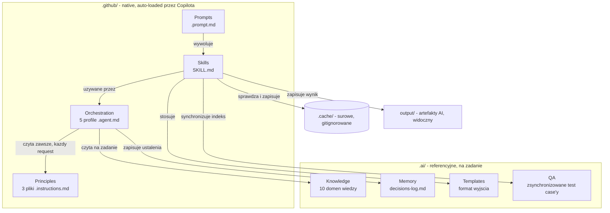

Hierarchia pierwszeństwa wewnątrz Principles:

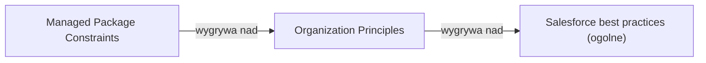

---

## 5. Struktura plików docelowych

```
<root repozytorium sfdx-project.json>
├── HARNESS_BLUEPRINT.md                        # ten dokument — zostaje w repo na stałe
├── .github/
│   ├── copilot-instructions.md                 # cienki plik: spis tresci + kolejnosc pierwszenstwa
│   ├── instructions/
│   │   ├── salesforce-best-practices.instructions.md      (applyTo: "**")
│   │   ├── organization-principles.instructions.md         (applyTo: "**")
│   │   └── managed-package-constraints.instructions.md     (applyTo: "**")
│   ├── agents/
│   │   ├── solution-designer.agent.md
│   │   ├── config-investigator.agent.md
│   │   ├── development-assistant.agent.md
│   │   ├── guardrail-reviewer.agent.md
│   │   └── test-strategist.agent.md
│   ├── skills/
│   │   ├── investigate-object/SKILL.md
│   │   ├── fetch-ado-item/SKILL.md
│   │   ├── check-against-principles/SKILL.md
│   │   ├── generate-technical-documentation/SKILL.md
│   │   ├── check-feature-coverage/SKILL.md
│   │   ├── generate-release-handover/SKILL.md
│   │   ├── sync-test-cases/SKILL.md
│   │   ├── fetch-test-case/SKILL.md
│   │   ├── suggest-test-cases/SKILL.md
│   │   ├── tune-test-case-keywords/SKILL.md
│   │   ├── generate-playwright-test/SKILL.md
│   │   └── update-knowledge-base/SKILL.md
│   └── prompts/
│       ├── fetch-ado-item.prompt.md
│       ├── document-metadata-change.prompt.md
│       ├── feature-health.prompt.md
│       ├── release-handover.prompt.md
│       ├── sync-test-cases.prompt.md
│       ├── tune-test-case-keywords.prompt.md      # admin, nie deweloperski
│       └── generate-playwright-test.prompt.md     # testCaseId= LUB kroki opisane w czacie
├── .ai/
│   ├── knowledge/
│   │   ├── README.md
│   │   ├── current-implementation.md
│   │   ├── business-processes.md
│   │   ├── object-relations.md
│   │   ├── object-descriptions.md
│   │   ├── field-descriptions.md
│   │   ├── automation-map.md
│   │   ├── integration-map.md
│   │   ├── glossary.md
│   │   ├── known-limitations.md
│   │   └── keyword-taxonomy.md
│   ├── memory/
│   │   └── decisions-log.md
│   ├── templates/
│   │   ├── technical-documentation.md
│   │   ├── feature-health-report.md
│   │   ├── knowledge-entry.md
│   │   └── release-handover.md
│   └── qa/
│       ├── test-cases/
│       │   └── <suiteId>-<nazwa>.md
│       ├── keywords-map.md                        # kuratorowane, osobno od auto-sync powyżej
│       └── ui-navigation-patterns.md              # quirki UI odkryte podczas automatyzacji
├── .cache/                                      # gitignorowane, patrz sekcja 13
│   ├── ado-items/
│   │   └── <id>.json
│   └── test-cases/
│       └── <id>.json
└── output/                                      # widoczny, patrz sekcja 13
    ├── documentation/
    │   └── <itemId>.md
    ├── feature-health/
    │   └── <featureId>.md
    ├── handover/
    │   └── <miesiac>.md                          # eksport do .docx/.pdf: ręczny, przez rozszerzenie VS Code
    └── generated-tests/
        └── <nazwa>.spec.ts                        # do przeglądu, zanim trafi do prawdziwego tests/
```

Świadomie brakuje (patrz sekcja 15): `.github/hooks/`, `.vscode/mcp.json` jako w pełni
skonfigurowany plik, cokolwiek związanego z git/deployment. `output/` będzie zyskiwać kolejne
subfoldery wraz z nowymi funkcjami generującymi artefakty — `generated-tests/` to czwarty z
nich, nie ostatni docelowo.

---

## 6. Ściągawka mechaniki VS Code / GitHub Copilot

Zebrane tu, żeby nie trzeba było tego ponownie odkrywać przy budowie.

| Mechanizm | Lokalizacja | Kluczowe pola frontmatter | Kiedy się ładuje |
|---|---|---|---|
| Główne instrukcje | `.github/copilot-instructions.md` | brak (czysty Markdown) | zawsze, każdy request w repo |
| Instrukcje scoped | `.github/instructions/*.instructions.md` | `applyTo: <glob>` | gdy glob pasuje; `"**"` = zawsze |
| Custom agent | `.github/agents/*.agent.md` | `name`, `description`, `tools`, `model`, `handoffs`, opcjonalnie `agents` (whitelist subagentów), `user-invocable`, `disable-model-invocation` | wybierany ręcznie albo przez handoff |
| Agent Skill | `.github/skills/<nazwa>/SKILL.md` | `name`, `description` | auto-discovery, ładowanie progresywne (nazwa+opis zawsze widoczne, pełna treść gdy dopasowana do zadania) |
| Prompt file | `.github/prompts/*.prompt.md` | `description`, `tools` | ręcznie, przez `/nazwa-pliku` w czacie |
| MCP servers | `.vscode/mcp.json` | `servers: { nazwa: { type, command/url, args } }` | przy starcie workspace'u |

**Ważny niuans dot. prompt files**: argumenty po nazwie komendy (np. `/fetch-ado-item
itemId=123 mode=single`) nie są parsowane przez sztywny schemat — model interpretuje wolny
tekst na podstawie `${input:variableName}` w treści pliku i instrukcji, jak go czytać. Konwencja
z oficjalnej dokumentacji to zapis `nazwa=wartość`. Istnieje otwarty issue w repo
`microsoft/vscode` (#310071) proszący o bardziej strukturalne sub-komendy — na dziś tego nie ma,
więc treść prompt file'a musi jawnie instruować model, jak czytać to, co przyjdzie po komendzie.

**Niepewność do zweryfikowania empirycznie po zbudowaniu**: czy `applyTo: "**"` w osobnym pliku
`.instructions.md` zachowuje się identycznie jak treść wklejona wprost do `copilot-instructions.md`
w każdym kontekście (włącznie z czysto konwersacyjnym pytaniem bez otwartego pliku). Jeśli nie —
plan B to przeniesienie treści trzech plików Principles jako sekcji do jednego pliku.

**Narzędzie do interaktywnego pytania wewnątrz prompt file**: dokumentacja wspomina o nim raz w
liczbie pojedynczej (`vscode/askQuestion`), raz w mnogiej (`vscode/askQuestions`) — dokładna nazwa
do zweryfikowania przy budowie (patrz sekcja 16). Używane przez skill
`generate-technical-documentation` do zapytania o manualne kroki wdrożeniowe (sekcja 11).

---

## 7. Warstwa Principles — specyfikacja

Wszystkie trzy pliki w `.github/instructions/`, `applyTo: "**"`.

### `salesforce-best-practices.instructions.md`
Źródło: branża, niezależne od firmy i vendora. Zawartość: bulkifikacja (nigdy SOQL/DML w
pętli), jeden trigger-handler na obiekt, `with sharing` jako domyślne, konwencje nazewnicze
ogólne (`PascalCase` klasy, `camelCase` + `__c` pola custom), governor limits, wzorce testowe
(`@TestSetup`, unikanie `SeeAllData`).

### `organization-principles.instructions.md`
Źródło: wewnętrzne standardy firmy. Do wypełnienia przez człowieka — szkielet sekcji:
konwencje nazewnicze specyficzne dla firmy, zasady code review, format dokumentowania decyzji,
zasada dot. pracy na współdzielonym Full Copy Sandbox (ryzyko kolizji dwóch deweloperów naraz).

### `managed-package-constraints.instructions.md`
Źródło: ograniczenia narzucone przez vendora pakietu. **Zostaje celowo cienki** — skoro ma
`applyTo: "**"`, ładuje się do każdego requestu; rosnący, granularny katalog nie powinien tu
mieszkać (patrz decyzja w sekcji 3 i nowa domena `known-limitations.md` w sekcji 8). Zawartość:
ogólna zasada ("szanuj odkryte ograniczenia zamkniętych powierzchni pakietu, sprawdź
`known-limitations.md` przed propozycją zmiany") + tylko nieliczne, szeroko obowiązujące wpisy
na poziomie obiektu, warte trzymania zawsze aktywnymi. Rejestr ryzyka per obiekt:

```
### ExampleManagedObject__c (synthetic fixture only)
- Ryzyko: <human-owned classification>
- Zakazane: <version-scoped, sourced constraint>
- Dozwolone: <verified extension point and conditions>
- Zrodlo reguly: <vendor source / approved observation / support decision>
```

Do uzupełnienia przez człowieka: realny, package-specific rejestr komponentów i ryzyka — patrz
sekcja 16. Ograniczenia węższe (konkretna strona, konkretna funkcja) trafiają do
`.ai/knowledge/known-limitations.md` (sekcja 8), nie tutaj.

Główny `copilot-instructions.md` jest cienki — spis treści + jawnie zapisana hierarchia
pierwszeństwa (sekcja 3) — nie duplikuje treści trzech plików powyżej.

---

## 8. Warstwa Knowledge — specyfikacja domen

Wszystkie w `.ai/knowledge/`. Zasada ogólna: fakty, nigdy reguły (reguły → Principles).

**`README.md`** — nawigacyjny indeks, jedno zdanie na plik, czytany przez agentów/skille przy
każdym użyciu (pełne uzasadnienie w decyzji w sekcji 3). Aktualizowany przez skill
`update-knowledge-base` (sekcja 11) przy każdym nowym pliku Knowledge albo zmianie zakresu
istniejącego.

| Plik | Zawartość |
|---|---|
| `current-implementation.md` | Feature catalog — co system robi funkcjonalnie, z grubsza jak |
| `business-processes.md` | Proces biznesowy ↔ system, z perspektywy użytkownika biznesowego |
| `object-relations.md` | ERD zweryfikowanych relacji; przykłady syntetyczne należą wyłącznie do fixtures. |
| `object-descriptions.md` | Czym jest każdy obiekt, kto jest właścicielem (pakiet / my) |
| `field-descriptions.md` | Co znaczy każde pole, szczególnie te bez oczywistej nazwy |
| `automation-map.md` | Co faktycznie jest podpięte pod dany obiekt — nasze Flow, nasz Apex, znane punkty wejścia automatyzacji pakietu. Fakt, nie reguła — kontekst do `managed-package-constraints.instructions.md` |
| `integration-map.md` | Zewnętrzne systemy połączone z orgiem, kierunek przepływu danych |
| `glossary.md` | Słownik biznes ↔ technika — jak nazywa to biznes vs jak nazywa się to technicznie |
| `known-limitations.md` | Rosnący katalog odkrytych ograniczeń managed package na poziomie konkretnej funkcji/strony (np. "Strona VF X jest zamknięta, tylko pola do dodania"). Fakt, nie reguła — konsultowany na żądanie przez `investigate-object`, `check-against-principles`, `check-feature-coverage`, w odróżnieniu od nielicznych, zawsze-aktywnych wpisów w `managed-package-constraints.instructions.md` (sekcja 7) |
| `keyword-taxonomy.md` | Kontrolowany słownik terminów — wspólny dla opisów obiektów i dla `.ai/qa/keywords-map.md` (sekcja 13). Rośnie wyłącznie przez jawne potwierdzenie człowieka, nigdy po cichu przez skill |

Format wpisu zdefiniowany w `.ai/templates/knowledge-entry.md` (sekcja 13) — jeden, spójny
format we wszystkich plikach domenowych, nie duplikowany tutaj.

**Plan skalowania (próg, nie budowa teraz — pełne uzasadnienie w decyzji w sekcji 3)**: gdy
`object-descriptions.md`, `field-descriptions.md` albo `automation-map.md` przekroczą ok. 15-20
opisanych obiektów, dzielimy na `.ai/knowledge/objects/<Nazwa>.md` — jeden plik per obiekt,
łączący wszystkie trzy domeny dla tego obiektu naraz. `object-relations.md` **nie** dzieli się
tym mechanizmem — zostaje jednym, cross-cutting plikiem, bo relacja z natury dotyczy dwóch
obiektów naraz.

---

## 9. Warstwa Memory

`.ai/memory/decisions-log.md` — trwały, wersjonowany log, w odróżnieniu od wbudowanego w
VS Code narzędzia Memory (lokalne, per-maszyna, nie trafia do repo) i Copilot Memory
(automatyczne, per-repozytorium, też nie jest czymś, co zespół świadomie kuratoruje).

Trafiają tu dwa rodzaje wpisów:
1. Odkrycia faktów o systemie z praktycznymi konsekwencjami (np. "ustaliliśmy, że pole X
   kontroluje Y — to zmienia plan dla Z").
2. **Notatki projektowe z fazy Solution Design** — to było niedomknięte we wcześniejszej wersji
   planu: notatka Projektanta musi trafiać tutaj w momencie powstania, nie tylko żyć w historii
   czatu, inaczej ginie po zakończeniu sesji.

Format wpisu:

```
## <data> - <krotki tytul>
- Kontekst: ...
- Ustalenie / decyzja: ...
- Wplyw: ...
- Zatwierdzil: <kto>
- Powiazane: <link do pliku w knowledge/ lub innego wpisu>
```

---

## 10. Warstwa Orchestration — pięć agentów

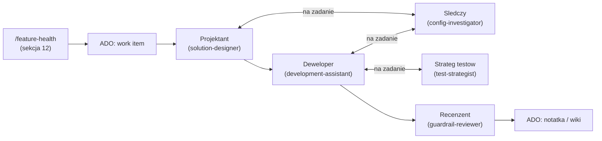

`/feature-health` (sekcja 12) to zalecana, wcześniejsza brama na poziomie Feature — sprawdza
kompletność rozbicia na Stories, zanim ktokolwiek zacznie pracę nad pojedynczą Story. Nie jest
częścią tego pipeline'u sensu stricto (inny poziom hierarchii ADO, inne pytanie), ale zasila go
na wejściu.

### Projektant — `solution-designer.agent.md`
**Faza**: Solution Design, zawsze pierwszy krok nowej zmiany. Zalecane, żeby `/feature-health`
(sekcja 12) na poziomie Feature już przeszedł bez blokujących luk, zanim Projektant zacznie
pracę nad konkretną Story.
**Wejście**: work item z ADO (przez `/fetch-ado-item`, patrz sekcja 12), pytanie od człowieka.
**Robi**: czyta Knowledge + wszystkie 3 pliki Principles w kolejności pierwszeństwa (sekcja 3),
identyfikuje które obiekty/pola są dotknięte, sprawdza konflikt z Managed Package Constraints
**zanim** ktokolwiek zacznie implementować.
**Wyjście**: notatka projektowa — co się zmienia, dlaczego, jakie ryzyka, otwarte pytania.
Notatka **musi** trafić do `.ai/memory/decisions-log.md` w momencie powstania (patrz sekcja 9).
**Handoff do**: Deweloper (po akceptacji notatki) albo Recenzent (opcjonalnie, wczesna
weryfikacja konfliktu z Principles przed rozpoczęciem implementacji).

### Śledczy configu — `config-investigator.agent.md`
**Faza**: narzędzie na żądanie, używane przez Projektanta i Dewelopera, nie osobny krok.
**Robi**: ustala fakty o systemie — zarówno o prawdziwych obiektach z polami, jak i o
wzorcu lookup-do-tabeli-referencyjnej (Reference Data). Używa skilla `investigate-object`.
Tylko odczyt — nigdy nie modyfikuje niczego w orgu.
**Wyjście**: ustalenie z poziomem pewności, dopisywane do odpowiedniego pliku w `.ai/knowledge/`.

### Deweloper — `development-assistant.agent.md`
**Faza**: Development, po akceptacji notatki projektowej.
**Robi**: implementuje w ramach notatki Projektanta, z Managed Package Constraints jako twardym
ograniczeniem (nie sugestią) — ale **w ramach tych ograniczeń ma realny osąd**: wybór wzorca
implementacji, sposób obsługi błędów, zgodność z Salesforce Best Practices (sekcja 7). To nie
mechaniczne przepisanie notatki Projektanta na konfigurację — notatka mówi *co* i *dlaczego*,
Deweloper decyduje *jak*. Może wywołać Śledczego, gdy natrafi na coś nieudokumentowanego, albo
Stratega testów, gdy chce ocenić potrzeby testowe przed uznaniem pracy za gotową.
**Handoff do**: Recenzent, zawsze przed uznaniem pracy za gotową.

### Recenzent — `guardrail-reviewer.agent.md`
**Faza**: ostatnie spojrzenie, na końcu Development (i opcjonalnie na końcu Design).
**Robi**: systematycznie zestawia zmianę z trzema plikami Principles w poprawnej kolejności
pierwszeństwa, używając skilla `check-against-principles`. Tylko odczyt i ocena, nigdy
implementacja.
**Wyjście**: werdykt (bezpieczne / wymaga poprawek / zatrzymaj) + opcjonalnie notatka/komentarz
zapisany w ADO (work item albo wiki) jako ślad decyzji — jedyny zaplanowany na razie output do ADO.

### Strateg testów — `test-strategist.agent.md`
**Faza**: na żądanie, nie faza SDLC — ta sama natura co Śledczy. Naturalne momenty wywołania:
po skończonym developmencie (Deweloper pyta "czy to jest wystarczająco przetestowane"), albo
proaktywnie, gdy ktoś chce ocenić stan pokrycia testowego bez konkretnego developmentu w tle.
**Wejście**: Story/Feature/obszar systemu do oceny.
**Robi**: ocenia stan warstwy QA i decyduje, co dalej — czy inwentarz `.ai/qa/` jest świeży
(decyzja: wywołać `sync-test-cases`?), czy istniejące pokrycie (`suggest-test-cases`, opcjonalnie
`check-feature-coverage`) wystarcza, czy potrzebna jest nowa automatyzacja
(`generate-playwright-test`). To realna, odrębna decyzja — nie mechaniczne wywoływanie tych
samych skilli w tej samej kolejności za każdym razem (sekcja 3).
**Wyjście**: ocena stanu pokrycia + ewentualnie wygenerowany test. Ocena **musi** trafić do
`.ai/memory/decisions-log.md` — decyzja o wystarczalności pokrycia jest warta śladu, ten sam
nawyk co notatka Projektanta.
**Uwaga o `check-feature-coverage`**: ten skill ma teraz dwóch autoryzowanych konsumentów —
Dewelopera (`/feature-health` jako brama przed Design, bez zmian) i Stratega testów (gdy własny
osąd wymaga sprawdzenia pokrycia Feature/BRD). Własność nie zmienia się, tylko dostępność
(sekcja 3).

**Poza tym pipeline'm** nadal żyją narzędzia niezależne od żadnego agenta: `/release-handover`
(cykliczny, comiesięczny) i `/tune-test-case-keywords` (admin, kuracja). `/sync-test-cases` i
`/generate-playwright-test` mogą być odpalane bezpośrednio przez człowieka **albo** orkiestrowane
przez Stratega testów, gdy potrzebny jest szerszy osąd o wystarczalności pokrycia — ten sam
wzorzec wielo-konsumencki co reszta skilli w tym projekcie. Pełna lista w sekcjach 11-12.

---

## 11. Warstwa Skills — specyfikacja

**Zasada reużywalności** (obowiązuje odtąd dla całego projektu, patrz decyzja w sekcji 3):
cokolwiek jest używane przez więcej niż jednego konsumenta — inny prompt, inny agent, inny
skill — staje się skillem. Prompty są zawsze cienkie: parsują argumenty, wywołują skill(e),
robią ewentualny handoff. Żadna logika biznesowa nie mieszka w treści `.prompt.md`.

**Zasada preferowania deklaratywnego wyjścia** (druga reguła obowiązująca od teraz, patrz
decyzja w sekcji 3): jeśli skill ma wyprodukować artefakt w innym formacie niż markdown, kończy
pracę na markdownie i deleguje konwersję formatu do istniejącego narzędzia/rozszerzenia, zamiast
pisać i uruchamiać własny skrypt (Python, PowerShell itd.) przez CLI. `generate-technical-
documentation` i `check-feature-coverage` już to robią poprawnie (kończą na `.md`);
`generate-release-handover` (poniżej) jest tego przykładem wprost.

### `investigate-object` (`.github/skills/investigate-object/SKILL.md`)
Uogólniona procedura badania nieznanego elementu systemu — pokrywa **oba** wzorce: prawdziwy
obiekt z polami (opisz schema, sprawdź relacje, testuj na sandboxie) i wzorzec
lookup-do-tabeli-referencyjnej (sprawdź rekordy referencyjne, ich znaczenie, zależności).
Używana przez Projektanta i Dewelopera przez Śledczego — jedna spójna procedura zamiast
zduplikowanej logiki w kilku plikach agentów. Kroki: (1) sprawdź czy już wiemy — zajrzyj do
`.ai/knowledge/README.md` (sekcja 8), potem do właściwego pliku, (2) opisz schema / opisz
rekordy referencyjne, (3) test kontrolowany na sandboxie jeśli ryzyko akceptowalne, (4) zapisz
wynik wg formatu `.ai/templates/knowledge-entry.md` (sekcja 13) — **opcjonalnie z polem "Słowa
kluczowe" z `keyword-taxonomy.md`** (sekcja 8), jeśli obiekt pasuje do istniejącego terminu; nie
blokuj zapisu, jeśli żaden termin nie pasuje — jeśli nie wiadomo, do którego pliku trafia
ustalenie, użyj `update-knowledge-base` (poniżej), (5) jeśli niejednoznaczne — zapytaj człowieka,
nie zgaduj.

### `fetch-ado-item` (`.github/skills/fetch-ado-item/SKILL.md`)
Pobiera work item z Azure DevOps, z cache i logiką dopasowania zakresu. Wywoływana przez prompt
`/fetch-ado-item` (sekcja 12) oraz przez skille `generate-technical-documentation` i
`generate-release-handover` (poniżej) — właśnie takie podwójne/potrójne użycie było powodem
wyciągnięcia tej logiki tutaj zamiast trzymania jej w treści prompta.

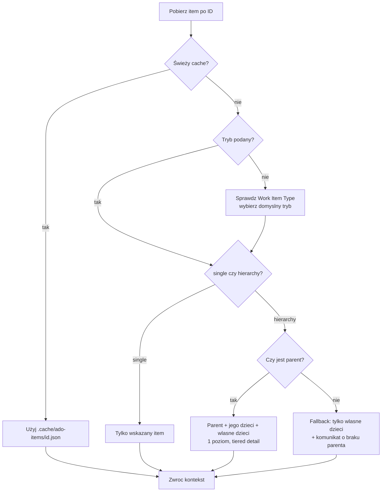

**Cache najpierw**: przed wywołaniem MCP sprawdź `.cache/ado-items/<itemId>.json` (pole
`_fetchedAt`) — świeży wpis oszczędza zapytanie. Po pobraniu zapisz osobno każdy item z drzewa,
nie jeden plik na całość (pełna mechanika cache w sekcji 13).

**Tryb `single`**: tylko wskazany item — pełny opis, komentarze, załączniki.

**Tryb `hierarchy`**: item + jego parent + wszystkie dzieci parenta (siblingi) + wszystkie
własne dzieci itemu. **Jeden poziom w dół, nie dwa** — świadomie nie schodzimy do dzieci dzieci
(np. Taski pod sibling-Story), bo to zwykle rozbicie wykonawcze bez istotnej treści dla fazy
design.

**Domyślny tryb, gdy nie podano**: sprawdź `Work Item Type`. Feature/Epic → `hierarchy`.
Task/Bug → `single`. User Story → domyślnie `single`, ale zasygnalizuj "ten Story ma N
sibling-story pod tym samym parentem — dociągnąć pełny kontekst?", zamiast zgadywać w ciemno.

**Poziom szczegółowości**: pełny opis + komentarze + załączniki zawsze dla wskazanego `itemId`.
Dla parenta/siblingów/dzieci w trybie `hierarchy` — kontrolowane parametrem
`childDetail=<summary|full>`, domyślnie `summary` (tylko tytuł, typ, stan, przypisana osoba —
zachowanie zaprojektowane pod kontekst dla Projektanta). `childDetail=full` daje pełną treść
każdego dziecka — potrzebne np. `check-feature-coverage` (poniżej), który musi faktycznie
porównać treść każdej User Story z Feature/BRD, nie tylko wiedzieć, że ta Story istnieje.

**`includeTestCases=<true|false>`, domyślnie `false`** — niezależny od `mode`/`childDetail`, bo
śledzi zupełnie inny typ relacji niż hierarchia. Test Case linkuje się do User Story/Buga przez
"Tested By/Tests", nie Parent/Child — Microsoft explicite potwierdza, że tej relacji nie da się
odpytać przez hierarchię. Zespół obserwuje to razem z resztą pod "Related" w UI, bez wizualnego
rozróżnienia typu, więc skill sprawdza **oba źródła i łączy wynik z deduplikacją**: formalną
relację "Tested By/Tests" oraz zwykłe linki "Related" odfiltrowane po
`Work Item Type = Test Case`. Zwraca tylko nazwy Test Case'ów, bez konkretnych stepów.

**Fallback bez parenta**: tryb `hierarchy` ogranicza się do "item + własne dzieci" i komunikuje
to wprost — nie cichy błąd, nie połowiczny wynik bez wyjaśnienia.

**Zwraca**: zbudowany kontekst (JSON/struktura, nie gotowa odpowiedź dla człowieka) —
konsument (prompt albo inny skill) decyduje, co z tym zrobić dalej.

### `check-against-principles` (`.github/skills/check-against-principles/SKILL.md`)
Systematyczne zestawienie proponowanej zmiany z trzema plikami Principles, w poprawnej
kolejności pierwszeństwa (Managed Package → Organization → Salesforce ogólne), **plus
sprawdzenie `.ai/knowledge/known-limitations.md`** pod kątem granularnych ograniczeń dotyczących
konkretnych obiektów/funkcji, które są dotknięte zmianą (sekcja 8). Kończy się jasnym werdyktem.
Rdzeń logiki Recenzenta, ale Projektant też może to odpalić wcześniej — żeby złapać konflikt z
ograniczeniami vendora, zanim ktokolwiek zacznie implementować, nie dopiero na samym końcu.

### `generate-technical-documentation` (`.github/skills/generate-technical-documentation/SKILL.md`)
Właściwa procedura za promptem `/document-metadata-change` (sekcja 12).

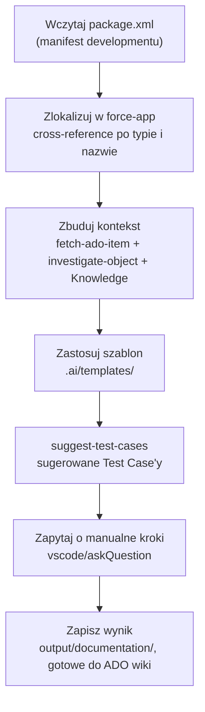

Kroki: (1) wczytaj `package.xml`, (2) dla każdego `<types><members>` zlokalizuj plik w
`force-app` po mapowaniu typ→folder (`CustomObject`→`objects/`, `Flow`→`flows/`,
`ApexClass`→`classes/`, itd.) — **jeśli coś z manifestu nie ma odpowiednika, zgłoś to wprost**,
nie pomijaj cicho, (3) zbuduj kontekst biznesowy — wywołaj skill `fetch-ado-item` po
tytuł/opis work itemu (do sekcji "Podsumowanie biznesowe"), wywołaj `investigate-object` dla
nieznanych elementów metadanych, przeczytaj `object-descriptions.md` / `field-descriptions.md`
/ `business-processes.md` / `automation-map.md` dla znanych, (4) zastosuj szablon
`technical-documentation.md`, (5) wywołaj skill `suggest-test-cases` (poniżej) z listą dotkniętych
artefaktów i kontekstem, wypełnij sekcję "Sugerowane Test Case'y", (6) zapytaj człowieka o
manualne kroki wdrożeniowe (narzędzie `vscode/askQuestion(s)` — dokładna nazwa do zweryfikowania,
patrz sekcja 16), (7) zapisz do `output/documentation/<itemId>.md`.

### `check-feature-coverage` (`.github/skills/check-feature-coverage/SKILL.md`)
Właściwa procedura za promptem `/feature-health` (sekcja 12) — analiza pokrycia Feature/BRD
przez jego dzieci (User Stories), odpalana przez Dewelopera **przed** fazą Solution Design.

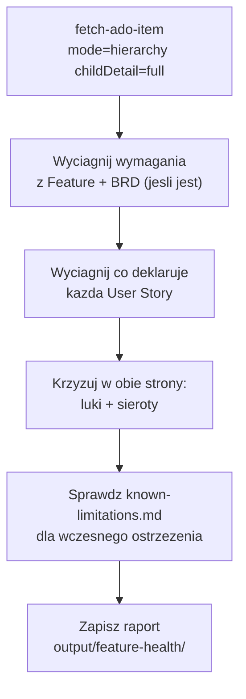

Kroki: (1) wywołaj `fetch-ado-item` z `mode=hierarchy childDetail=full` — Feature + wszystkie
Stories w pełnej treści; jeśli Feature ma dołączony BRD jako attachment, pobierz jego **pełną
zawartość** (jedyny świadomy wyjątek od zasady "attachmenty: metadane w cache, treść na
żądanie" z sekcji 13 — tu treść jest istotą analizy), (2) wyciągnij z Feature/BRD listę
wymagań/tematów (jawną, jeśli struktura na to pozwala, albo wywnioskowaną z treści), (3) dla
każdej Story wyciągnij, co faktycznie deklaruje (tytuł, opis, kryteria akceptacji jeśli są),
(4) krzyżuj w obie strony: **luki** (wymaganie bez żadnej pokrywającej Story) i **sieroty**
(Story bez jasnego związku z Feature/BRD — niekoniecznie źle, np. story techniczna/enabler, ale
warto nazwać), (5) sprawdź `known-limitations.md` (sekcja 8) pod kątem obiektów/funkcji, których
dotyczą Stories — złapanie konfliktu z ograniczeniem pakietu tutaj jest tańsze niż po fazie
designu, (6) zapisz raport do `output/feature-health/<featureId>.md`: pokrycie, luki, sieroty,
otwarte pytania, wczesne ostrzeżenia o ograniczeniach.

### `generate-release-handover` (`.github/skills/generate-release-handover/SKILL.md`)
Właściwa procedura za promptem `/release-handover` (sekcja 12) — comiesięczny handover dla
vendora. Przykład zasady preferowania deklaratywnego wyjścia wprost: kończy pracę na markdownie,
nigdy nie generuje ani nie uruchamia skryptu.

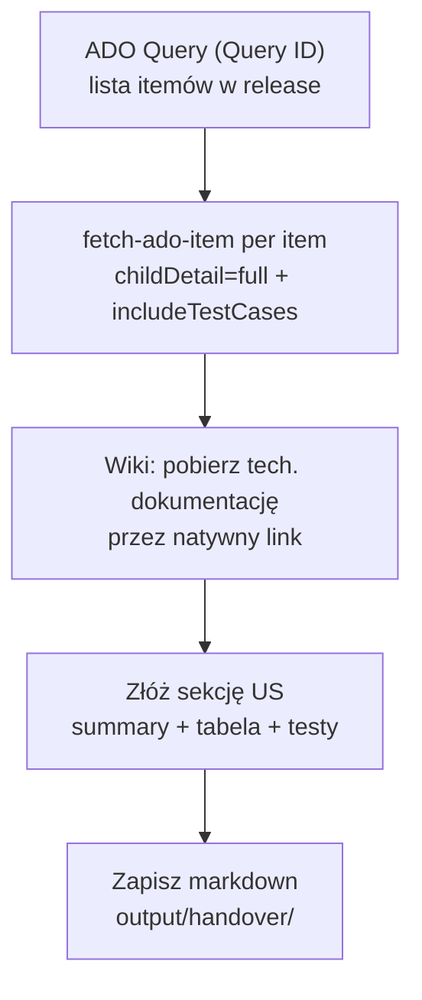

Kroki: (1) uruchom zapisany ADO Query po jego ID (sekcja 16 — placeholder do uzupełnienia) —
lista itemów wchodzących w release, (2) dla każdego itemu wywołaj `fetch-ado-item` z
`childDetail=full` (Description + Acceptance Criteria w pełnej treści) i
`includeTestCases=true`, (3) pobierz opublikowaną dokumentację techniczną z natywnie linkowanej
strony wiki (sekcja 3, decyzja o wiki-link) — wyciągnij z niej tabelę artefaktów (sekcja 13,
szablon `technical-documentation.md`) i sekcję manualnych kroków; **jeśli item nie ma linkowanej
strony, zgłoś to wprost** ("brak opublikowanej dokumentacji technicznej"), nie regeneruj i nie
zgaduj zawartości, (4) wygeneruj 2-3-zdaniowe podsumowanie z Description + Acceptance Criteria,
złóż pełną sekcję dla itemu wg `.ai/templates/release-handover.md` (sekcja 13) — jeśli brak
Test Case'ów, sekcja testów dostaje tekst *"Tested based on acceptance criteria"* zamiast pustego
miejsca, (5) zapisz całość do `output/handover/<miesiąc>.md`. Eksport do DOCX/PDF to osobny,
ręczny krok człowieka przez rozszerzenie VS Code (Markdown PDF, ewentualnie vscode-pandoc —
sekcja 3), świadomie poza zakresem tego skilla.

### `fetch-test-case` (`.github/skills/fetch-test-case/SKILL.md`)
Wyodrębniony z `sync-test-cases` (poniżej) — ten sam moment co przy `fetch-ado-item` (sekcja 3,
decyzja o zasadzie reużywalności). Pobiera **jeden, konkretny** Test Case: sprawdź
`.cache/test-cases/<id>.json` (pole `_fetchedAt`), jeśli nieaktualny lub brakujący — pobierz
przez Test Plans API, zapisz do cache, zwróć pełny detal (kroki, expected results). Wywoływana
przez `sync-test-cases` w pętli po całym suicie, i przez `generate-playwright-test` (poniżej)
wprost dla jednego ID.

### `sync-test-cases` (`.github/skills/sync-test-cases/SKILL.md`)
Właściwa procedura za promptem `/sync-test-cases` (sekcja 12) — warstwa QA. Przyjmuje link do
Azure Test Plans, Suite ID, albo Plan ID.

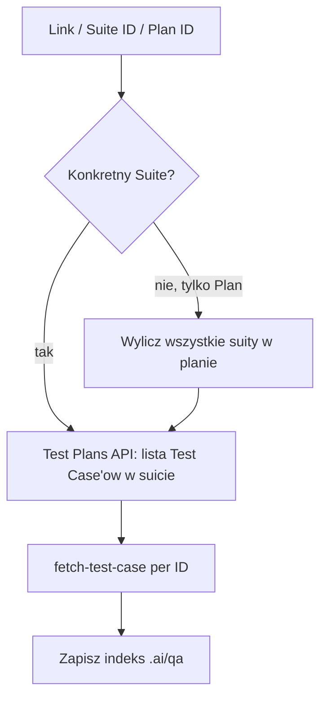

Kroki: (1) sparsuj input — jeśli to link, wyciągnij `suiteId`/`planId`; jeśli podano tylko
`planId` bez konkretnego suita, wylicz wszystkie suity w tym planie i powtórz resztę procedury
dla każdego z osobna, (2) dla wskazanego (albo każdego wyliczonego) suita, pobierz przez Test
Plans API listę ID Test Case'ów, (3) dla każdego ID wywołaj `fetch-test-case` (powyżej) —
cache się aktualizuje samo, (4) zapisz lekki wpis (ID, tytuł, priorytet/tagi jeśli dostępne, bez
pełnych kroków) do `.ai/qa/test-cases/<suiteId>-<nazwa>.md` (sekcja 13), (5) sprawdź
`.ai/qa/keywords-map.md` (sekcja 13) pod kątem wpisów wskazujących na Test Case'y, które już nie
istnieją w świeżo pobranej liście — **zgłoś takie osierocone wpisy wprost**, nie usuwaj ich
cicho ani nie ignoruj.

### `suggest-test-cases` (`.github/skills/suggest-test-cases/SKILL.md`)
Wywoływana przez `generate-technical-documentation` (powyżej), potencjalnie w przyszłości też
przez `check-feature-coverage`. Dopasowanie test case'ów do developmentu — zawsze jako sugestia
z jawnym uzasadnieniem, nigdy jako potwierdzone pokrycie.

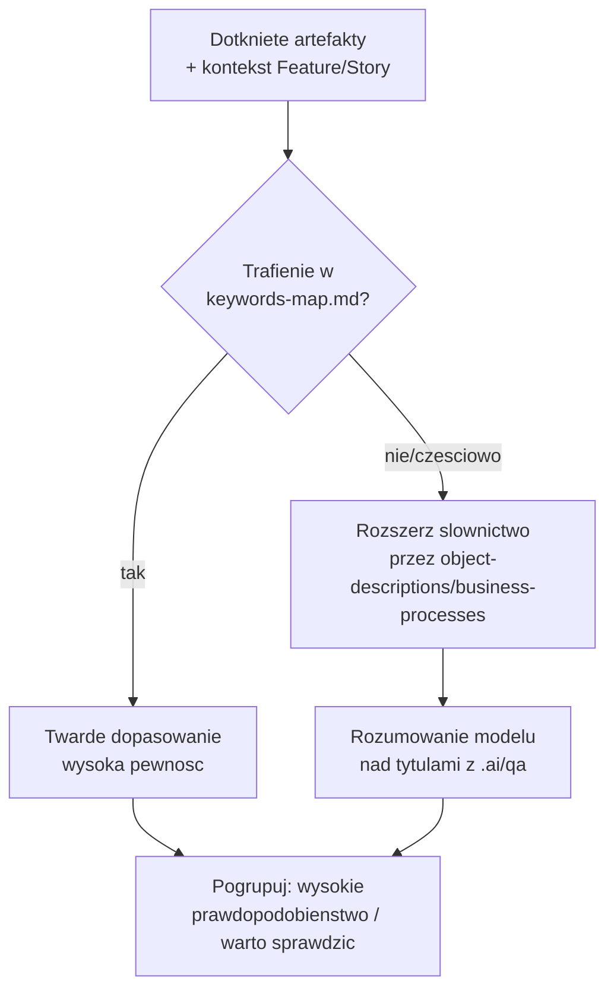

Kroki: (1) **sprawdź `.ai/qa/keywords-map.md` (sekcja 13) najpierw** — jeśli dotknięty artefakt
ma keywords w `keyword-taxonomy.md` (sekcja 8) i któryś Test Case ma te same keywords w mapie,
to twarde, wysokie dopasowanie bez dalszego rozumowania, (2) dla artefaktów bez trafienia w
mapie — rozszerz słownictwo techniczne na biznesowe przez `object-descriptions.md` /
`business-processes.md`, (3) na tak zebranym kontekście (artefakty + słownictwo biznesowe +
tytuł/opis Feature/Story) model ocenia trafność tytułów z `.ai/qa/test-cases/*.md` — rozumowaniem,
nie algorytmem string-matchingu, (4) pogrupuj wynik: "wysokie prawdopodobieństwo" (trafienie w
keywords-map albo w nazwę artefaktu wprost) vs "warto sprawdzić" (trafienie tylko przez kontekst
biznesowy/opis), z jawnym uzasadnieniem przy każdej sugestii, (5) **jeśli `.ai/qa/` nie ma nic
zsynchronizowanego dla dotkniętych obszarów — powiedz to wprost i zasugeruj `/sync-test-cases`**
dla odpowiedniego suita, zamiast cichej pustej sekcji.

### `tune-test-case-keywords` (`.github/skills/tune-test-case-keywords/SKILL.md`)
Właściwa procedura za promptem admin `/tune-test-case-keywords` (sekcja 12) — kuracja
`.ai/qa/keywords-map.md`, z człowiekiem zatwierdzającym każdą zmianę.

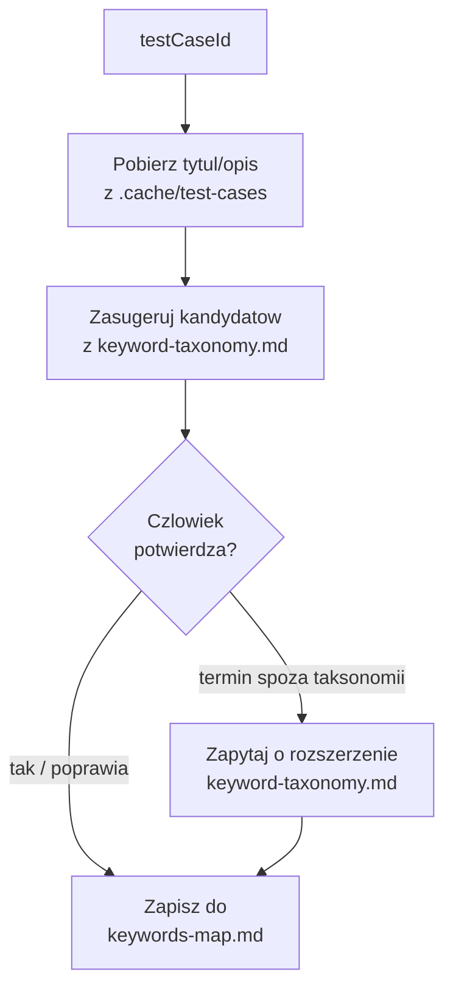

Kroki: (1) pobierz tytuł/opis Test Case'a z `.cache/test-cases/<id>.json`, (2) zasugeruj
kandydujące keywords z istniejącego `keyword-taxonomy.md` (to samo rozumowanie modelu co w
`suggest-test-cases`, tylko w drugą stronę — tekst → termin z taksonomii, nie termin → tekst),
(3) człowiek potwierdza, poprawia, albo odrzuca, (4) **jeśli człowiek chce terminu spoza
taksonomii — zapytaj wprost, czy rozszerzyć `keyword-taxonomy.md`, nigdy nie dopisuj nowego
terminu po cichu** (patrz decyzja w sekcji 3), (5) zapisz zatwierdzone keywords do
`keywords-map.md` (sekcja 13).

### `generate-playwright-test` (`.github/skills/generate-playwright-test/SKILL.md`)
Właściwa procedura za promptem `/generate-playwright-test` (sekcja 12). **Dwa równorzędne źródła
kroków testowych, obsłużone identycznie od tego miejsca dalej** (patrz decyzja w sekcji 3 —
zespół wprost zastrzegł, że tester będzie opisywał testy w czacie, nie tylko wskazywał istniejące
Test Case'y): (a) `testCaseId` — pobierz pełny detal przez `fetch-test-case` (powyżej), (b) brak
`testCaseId` — kroki opisane wprost przez testera w tej samej rozmowie, bez cache'u i bez
keywords do sprawdzenia, ale reszta procedury identyczna.

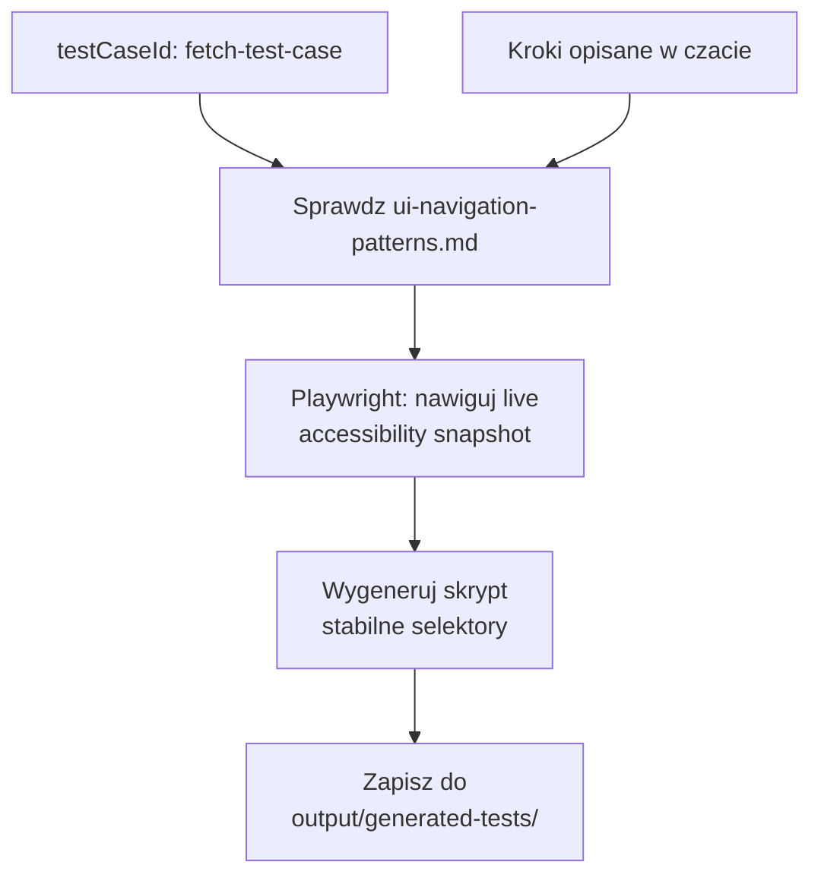

Kroki: (1) zbierz kroki testowe z jednego z dwóch źródeł powyżej, (2) sprawdź
`.ai/qa/ui-navigation-patterns.md` (sekcja 13) pod kątem znanych quirków UI dotyczących
obiektów/stron w tych krokach, (3) uruchom Playwright (CLI, sekcja 14) i **żywo przejdź przez
kroki na rzeczywistej aplikacji** — używając profilu z zachowaną sesją (nigdy nie loguj się
danymi przechodzącymi przez agenta, patrz decyzja w sekcji 3), zbierając accessibility snapshot
na każdym kroku zamiast zgadywać strukturę strony, (4) **jeśli podczas tego odkryjesz nowy quirk
UI nieudokumentowany w `ui-navigation-patterns.md` — zasugeruj jego dopisanie**, tym samym
mechanizmem co reszta Knowledge w tym projekcie, (5) wygeneruj skrypt Playwrighta, preferując
selektory oparte na roli/nazwie dostępności (stabilne) nad automatycznie generowanymi ID
(kruche) — zgodnie z rekomendacją samego Playwrighta, (6) zapisz do
`output/generated-tests/<nazwa>.spec.ts` (sekcja 13) do przeglądu przez człowieka — **nigdy
bezpośrednio do właściwego katalogu `tests/`** (patrz decyzja w sekcji 3).

### `update-knowledge-base` (`.github/skills/update-knowledge-base/SKILL.md`)
Dwa zadania naraz, bo się wzajemnie uzupełniają (patrz decyzja w sekcji 3): (1) routing —
decyduje, do którego pliku w `.ai/knowledge/` trafia dane ustalenie, konsultując
`README.md` (sekcja 8) zamiast zgadywać albo tworzyć duplikat w niewłaściwym miejscu;
(2) utrzymanie — aktualizuje `README.md` przy każdym nowym pliku Knowledge albo zmianie zakresu
istniejącego. Wywoływana przez `investigate-object` i każdy inny skill piszący do Knowledge,
gdy docelowy plik nie jest oczywisty.

**Świadomie odrzucone**: `org-diff-check` (porównywanie środowisk pod migrację) — to wchodzi w
temat deployment, więc zaparkowane razem z resztą tego wątku (sekcja 15).

---

## 12. Prompt files — cienkie wrappery

Zgodnie z zasadą reużywalności (sekcja 11) — wszystkich siedem promptów poniżej wyłącznie parsuje
argumenty i wywołuje odpowiedni skill. Żadnej logiki tutaj.

### `/fetch-ado-item itemId=<ID> mode=<single|hierarchy>`
Nazwa celowo nie zawiera "US"/"feature" — item może być dowolnego typu (Story, Bug, Task,
Feature, Epic). Parsuje `itemId=` i opcjonalny `mode=` (konwencja `nazwa=wartość` — niuans
techniczny nt. parsowania argumentów w sekcji 6), wywołuje skill `fetch-ado-item` (sekcja 11),
i po otrzymaniu kontekstu robi handoff do Projektanta (`solution-designer`) — punkt wejścia do
reszty pipeline'u z sekcji 10, nie ślepa uliczka zostawiająca dane same w czacie.

### `/document-metadata-change itemId=<ID>`
Zawiera jawny **precondition note**: *ten prompt zakłada, że wskazany `package.xml` zawiera
komplet metadanych dla dokumentowanego developmentu (i tylko jego) — jeśli manifest jest
niekompletny albo miesza więcej niż jedną zmianę, dokumentacja będzie tego odzwierciedleniem.*
To świadomie nie jest walidowane w kodzie (patrz decyzja w sekcji 3). Wywołuje skill
`generate-technical-documentation` (sekcja 11).

### `/feature-health itemId=<ID>`
Odpalany przez Dewelopera **przed** fazą Solution Design (sekcja 10), na poziomie Feature, nie
pojedynczej Story. Parsuje `itemId=`, wywołuje skill `check-feature-coverage` (sekcja 11).
Nazwa robocza — jeśli znajdziesz lepszą, to czysto kosmetyczna zmiana, logika zostaje ta sama.

### `/release-handover`
Odpalany raz w miesiącu przez osobę odpowiedzialną za release (opisaną jako "release manager").
Bez argumentu itemId — zamiast tego korzysta z Query ID skonfigurowanego jako placeholder
(sekcja 16). Wywołuje skill `generate-release-handover` (sekcja 11). Kończy na komunikacie,
gdzie znaleźć wynikowy markdown i jak go wyeksportować do DOCX/PDF (sekcja 13) — nie robi tego
sam.

### `/sync-test-cases link=<URL> | suiteId=<ID> | planId=<ID>`
Trzy równoważne sposoby wskazania zakresu — link do Azure Test Plans, bezpośredni Suite ID, albo
Plan ID (gdy chcemy zsynchronizować wszystkie suity w planie naraz). Wywołuje skill
`sync-test-cases` (sekcja 11).

### `/tune-test-case-keywords testCaseId=<ID>` — admin, nie deweloperski
Osobna kategoria od pozostałych — narzędzie kuratorskie z człowiekiem zatwierdzającym każdą
zmianę, nie coś odpalane w ramach codziennej pracy dewelopera. Wywołuje skill
`tune-test-case-keywords` (sekcja 11). `suggest-test-cases` (sekcja 11) nie wymaga, żeby ten
prompt był kiedykolwiek uruchomiony — działa bez kuracji od pierwszego dnia, tylko z niższą
pewnością dopasowania.

### `/generate-playwright-test testCaseId=<ID>` — LUB kroki opisane wprost w czacie
Jedyny prompt z dwoma równorzędnymi sposobami użycia, nie jednym z opcjonalnym parametrem
traktowanym jako drugorzędny: albo `testCaseId=` wskazujący istniejący Test Case, albo brak tego
parametru i kroki testowe opisane przez testera w tej samej wiadomości/rozmowie — oba prowadzą
do identycznej dalszej procedury w skillu `generate-playwright-test` (sekcja 11). Odpalany przez
QA testera albo Dewelopera po skończonym developmencie.

---

## 13. Cache, Templates, Output i QA — konwencje przechowywania

Cztery top-level foldery/subfoldery, każdy z jedną, jasną naturą — konsekwentnie z zasadą z
sekcji 3 ("jeden folder = jedna polityka").

| Folder | Natura | Git | Widoczność |
|---|---|---|---|
| `.cache/` | surowe dane z fetchy (np. ADO items, pełny detal Test Case'ów) | gitignorowane | ukryty |
| `.ai/templates/` | szablony formatu wyjścia (nie fakty, nie reguły) | commitowane | ukryty (część `.ai/`) |
| `output/` | artefakty generowane przez AI, do ręcznego wykorzystania przez człowieka | zależy od subfolderu | **widoczny**, bez kropki |
| `.ai/qa/` | zsynchronizowany, lekki indeks Test Case'ów z Azure Test Plans — inny rytm niż Knowledge | commitowane | ukryty (część `.ai/`) |

**Uzasadnienie podziału** (skrót — pełne w sekcji 3): `.ai/` miało dotąd jedną regułę —
wszystko commitowane, kuratorowane przez ludzi. Cache jest inny (surowy, zmienia się co fetch,
bywa wrażliwy) — osobny folder, gitignorowany. `output/` jest widoczny bez kropki, bo to rzeczy,
które człowiek ma otworzyć w eksploratorze plików, w odróżnieniu od configu narzędziowego.
`.ai/templates/` zostaje wewnątrz `.ai/`, bo dzieli jego naturę — referencyjne, na żądanie —
tylko inny rodzaj treści (konwencja formatu, nie fakt o systemie). `.ai/qa/` też zostaje w
`.ai/` (commitowany, współdzielony), ale to masowy sync z ADO, nie indywidualnie badany fakt —
inny rytm pracy niż `.ai/knowledge/`, stąd osobny folder zamiast kolejnej domeny Knowledge.

### Mechanika cache

Używana przez skille `fetch-ado-item` i `sync-test-cases` (sekcja 11):

- **Cache per-item, nie per-drzewo/suite.** `fetch-ado-item` w trybie `hierarchy` zapisuje
  każdy pobrany item osobno jako `.cache/ado-items/<id>.json`; `sync-test-cases` analogicznie
  zapisuje każdy Test Case osobno jako `.cache/test-cases/<id>.json`. Nigdy jeden plik na całe
  drzewo/suite — element pobrany raz jest cache-hitem, gdy ktoś później zapyta o niego wprost.
- **Timestamp wewnątrz pliku.** Każdy zapisany JSON ma pole `_fetchedAt` — nie polegamy na mtime
  systemu plików. Jeśli cache jest stary, skill mówi to wprost i pyta o odświeżenie, zamiast
  cicho serwować nieaktualne dane albo budować osobną logikę TTL.
- **Attachmenty: metadane w cache, treść na żądanie — z jednym świadomym wyjątkiem.** Nazwa,
  typ, rozmiar pliku — tak, zawsze. Sama zawartość załącznika — pobierana dopiero gdy ktoś
  faktycznie chce ją otworzyć, **poza przypadkiem BRD w `check-feature-coverage`** (sekcja 11),
  gdzie treść załącznika jest istotą analizy i pobierana jest zawsze.

### Zawartość `.ai/qa/`

**`test-cases/<suiteId>-<nazwa>.md`** — jeden plik per suite (nie próg jak przy obiektach w
Knowledge, tu suite to gotowa granica od startu), zapisywany przez skill `sync-test-cases`
(sekcja 11). Lekki indeks, bez pełnych kroków (te zostają w `.cache/test-cases/`):

```
### <Test Case ID> - <Tytul>
- Priorytet / tagi: <jesli dostepne w ADO>
- Ostatnia synchronizacja: <_fetchedAt z cache>
```

**`keywords-map.md`** — kuratorowane, osobno od auto-syncu powyżej (patrz decyzja w sekcji 3),
utrzymywane przez skill `tune-test-case-keywords` (sekcja 11), konsultowane jako sygnał
pierwszeństwa przez `suggest-test-cases` (sekcja 11):

```
### <Test Case ID>
- Keywords: <lista terminow z keyword-taxonomy.md, sekcja 8>
- Ostatnia kuracja: <data>, zatwierdzil: <kto>
```

**`ui-navigation-patterns.md`** — quirki UI odkryte podczas automatyzacji testów przez
`generate-playwright-test` (sekcja 11), zapobiegające ponownemu odkrywaniu tego samego za każdym
razem od nowa:

```
### <Obiekt / strona>
- Quirk: <np. "domyslny filtr na liscie to Recently Viewed, trzeba zmienic na All">
- Poprawna procedura: <konkretne kroki obejscia>
- Odkryto: <data>, podczas testu: <ktory Test Case / rozmowa>
```

### Zawartość `.ai/templates/`

**`technical-documentation.md`** — używany przez skill `generate-technical-documentation`
(sekcja 11). Sekcje:

1. Nagłówek — tytuł, ID work itemu, typ, data wygenerowania
2. Podsumowanie biznesowe — 2-3 zdania, język biznesowy
3. Zakres zmiany — lista komponentów z `package.xml` (typ + nazwa), każdy z jednym zdaniem po co
4. Szczegóły techniczne per komponent
5. Wpływ na istniejący system — odniesienie do `managed-package-constraints.instructions.md` i
   `object-relations.md`, jeśli dotyczy
6. Sposób weryfikacji
7. **Manualne kroki wdrożeniowe** — wypełniane odpowiedzią człowieka na pytanie zadane pod koniec
   flow; jeśli odpowiedź to "brak", sekcja zostaje z jawnym "brak", nie znika.
8. Znane ograniczenia / otwarte pytania
9. **Sugerowane Test Case'y** — wynik `suggest-test-cases` (sekcja 11): ID, tytuł, uzasadnienie
   dopasowania, poziom pewności ("wysokie prawdopodobieństwo" / "warto sprawdzić"); jeśli brak
   trafień, jawna notatka o braku i sugestia `/sync-test-cases` dla właściwego suita zamiast
   pustej sekcji. **Różni się od sekcji "Testy" w `release-handover.md`** (poniżej) — tamta
   pokazuje formalnie zlinkowane Test Case'y (potwierdzone), ta pokazuje sugestie do przeglądu
   (niepotwierdzone). Nie mieszać tych dwóch mechanizmów.

**`feature-health-report.md`** — używany przez skill `check-feature-coverage` (sekcja 11),
zapisywany do `output/feature-health/<featureId>.md`. Sekcje:

1. Nagłówek — Feature ID, tytuł, czy dołączono BRD, data wygenerowania
2. Podsumowanie pokrycia — jednym zdaniem: pełne / częściowe / poważne luki
3. Luki — wymagania z Feature/BRD bez pokrywającej Story
4. Sieroty — Stories bez jasnego związku z Feature/BRD (z zaznaczeniem, że to sygnał do
   sprawdzenia, nie automatycznie błąd)
5. Otwarte pytania — niejednoznaczności po obu stronach
6. Wczesne ostrzeżenia — konflikty z `known-limitations.md`, jeśli któraś Story ich dotyczy

**`knowledge-entry.md`** — jedyny format wpisu we wszystkich plikach `.ai/knowledge/*.md`
(sekcja 8), używany przez `investigate-object` i każdy inny skill piszący do Knowledge:

```
### <Nazwa>
- Opis: ...
- Poziom pewności: pewne / prawdopodobne / do zweryfikowania
- Jak ustalono: describe / SOQL / test na sandboxie / dokumentacja vendora / rozmowa z <kto>
- Data ustalenia: <data>
- Powiązane: <inne wpisy/pliki Knowledge, jeśli dotyczy>
```

Pole "Powiązane" dopisane na wzór `decisions-log.md` — przy dużych obiektach z dużą
automatyzacją, powiązania między wpisami będą częste i warte jawnego zapisania.

**`release-handover.md`** — używany przez skill `generate-release-handover` (sekcja 11),
zapisywany jako `output/handover/<miesiąc>.md`:

1. Nagłówek — okres release, data wygenerowania
2. Opis handoveru — ogólne wprowadzenie, co obejmuje ten release
3. Spis treści — lista `<User Story ID> - <Title>`, jedna linia na item
4. Per item (sekcja powtarzana dla każdego z release'u):
   - Tytuł
   - Podsumowanie — AI-generated, 2-3 zdania, z Description + Acceptance Criteria
   - Tabela techniczna — artefakty + manualne kroki, wyciągnięte z linkowanej strony wiki
     (format zdefiniowany w `technical-documentation.md` powyżej — te same 4 kolumny)
   - Testy — nazwy Test Case'ów; jeśli brak, tekst *"Tested based on acceptance criteria"*

**Eksport do DOCX/PDF** — ręczny krok po wygenerowaniu markdowna, przez rozszerzenie VS Code
(nie przez skill — patrz zasada w sekcji 11 i decyzja w sekcji 3): rozszerzenie **Markdown PDF**
(`yzane.markdown-pdf`) eksportuje do PDF natywnie, do DOCX gdy doinstalowany jest Pandoc jako
backend. Jeśli jakość DOCX-a z tej ścieżki będzie niewystarczająca, alternatywa to
**vscode-pandoc**, z obsługą własnego reference-doc (szablon stylów Worda) i metadanych przez
YAML front matter w markdownie.

Jedna wersja każdego z czterech szablonów na start (nie osobna per typ work itemu) —
rozdzielimy tylko jeśli się okaże za wąskie.

---

## 14. MCP i zależności CLI — konfiguracja docelowa (deklaratywna, nie skrypt)

Nie budujemy tego jeszcze fizycznie (patrz sekcja 15), ale docelowy kształt do zapamiętania:

- **Salesforce DX MCP Server** — osobne wpisy per środowisko (dev/qa/uat), **bez wpisu dla
  prod domyślnie** (obrona w głąb, patrz sekcja 3). Toolsety zawężone do potrzeb — zweryfikować
  dokładne nazwy przez `npx @salesforce/mcp --help`, bo mogły się zmienić między wersjami.
- **Azure DevOps MCP Server** — domeny `core` (zawsze) + `work-items` + `wiki` + `test-plans`
  (dołączona wraz z warstwą QA, sekcja 3 — inny model API niż work itemy, potrzebny do listowania
  Test Case'ów w Test Suite). Rekomendacja z oficjalnej dokumentacji: zawsze włączać `core`, żeby
  mieć dostęp do informacji o projekcie. Wersja zdalna (hostowana) pozwala dodatkowo wymusić tryb
  tylko-do-odczytu przez nagłówek `X-MCP-Readonly` — warto rozważyć dla Recenzenta, żeby fizycznie
  nie mógł niczego zmienić w ADO, nawet przez pomyłkę. Dokładne nazwy narzędzi w domenie
  `test-plans` do zweryfikowania przy budowie, podobnie jak toolsety Salesforce powyżej.
- **`@playwright/cli`** (nie serwer MCP — narzędzie CLI wywoływane przez skill
  `generate-playwright-test`, sekcja 11; patrz decyzja w sekcji 3 dlaczego CLI zamiast
  `@playwright/mcp`). Wymaga trwałego profilu przeglądarki z zachowaną sesją logowania do
  środowiska dev/QA — **nigdy do prod** (to samo obrona-w-głąb co przy `mcp.json` powyżej),
  ustawionego ręcznie przez człowieka, nigdy przez dane logowania przechodzące przez agenta.
  `@playwright/mcp` jako fallback, jeśli środowisko nie pozwala na CLI + dostęp do systemu
  plików. Dokładna składnia wywołań CLI do zweryfikowania przy budowie — to nowszy, wciąż
  ewoluujący komponent.

---

## 15. Parking lot — świadomie odłożone tematy

Nic poniżej nie jest zapomniane — to świadome decyzje o kolejności pracy.

| Temat | Dlaczego odłożony | Kiedy wrócić |
|---|---|---|
| Git (intDev bez gita, UAT→Prod z gitem) | Zespół określił to jako "ciężki, bardzo specyficzny" temat | Osobna, dedykowana sesja |
| Mechanika Salesforce DevOps Center | Wchodzi w temat deployment, wymaga osobnego zrozumienia procesu | Po ustabilizowaniu warstwy .md |
| Domeny ADO: `repositories`, `pipelines`, `advanced-security` | Zespół nie pracuje na PR/pipeline przez ten kanał; `test-plans` dołączona wraz z warstwą QA (sekcja 3) | Jeśli sposób pracy się zmieni |
| Hooki (`.github/hooks/*.json`) i skrypty egzekwujące | Sens hooków zależy od dojrzałych, przetestowanych w praktyce Principles | Po tym, jak Principles przejdą praktyczną weryfikację |
| `.vscode/mcp.json` w pełni skonfigurowany | Część "harnessu wykonawczego", nie samej struktury .md | Razem z hookami |
| Skill `org-diff-check` | Dotyczy porównywania środowisk pod migrację — to deployment | Razem z tematem git/deployment |
| Ryzyko refreshu sandboxa | Ustalono, że nie jest to realny problem przy obecnej częstotliwości | Nie planuje się powrotu, chyba że częstotliwość się zmieni |
| Dodatkowe subfoldery `output/` poza `documentation/`, `feature-health/`, `handover/` i `generated-tests/` | Zespół zapowiedział, że będzie ich więcej — cztery konkretne już mamy, czekamy na kolejne przypadki użycia | Kolejna sesja planistyczna |
| Podział `object-descriptions.md`/`field-descriptions.md`/`automation-map.md` na `.ai/knowledge/objects/<Nazwa>.md` | Dzielenie pustego jeszcze pliku to koszt bez korzyści | Próg: ~15-20 opisanych obiektów w jednym pliku (sekcja 8) |
| Skrypt indeksacji/wyszukiwania Knowledge | Inny rodzaj "później" niż hooki — czeka na to, żeby Knowledge urosło na tyle, że samo README przestanie wystarczać do nawigacji | Naturalnie ten sam moment co próg podziału powyżej |

---

## 16. Otwarte pytania / placeholdery do uzupełnienia przez człowieka

- `<TU_WSTAW_NAMESPACE_PAKIETU>` — namespace managed package.
- Dokładne aliasy `sf` CLI dla Full Copy Sandbox (dev), QA, UAT, Production.
- Rzeczywisty, version-scoped rejestr ownership, ryzyka i wspieranych extension points dla
  komponentów pakietu. Repo nie zawiera żadnego potwierdzonego przykładu package-specific.
- Konkretne konwencje nazewnicze firmy do `organization-principles.instructions.md`.
- Nazwa organizacji i projektu Azure DevOps do konfiguracji MCP.
- Czy Recenzent powinien mieć dostęp zapisu do ADO (komentarz/wiki), czy tylko odczyt z
  ręcznym zatwierdzeniem publikacji notatki przez człowieka?
- Dokładna nazwa/pisownia narzędzia interaktywnego pytania w prompt files —
  `vscode/askQuestion` czy `vscode/askQuestions` (używane przez skill
  `generate-technical-documentation`, sekcja 11).
- Dalsze subfoldery `output/` poza `documentation/`, `feature-health/`, `handover/` i
  `generated-tests/` — zespół zapowiedział, że będzie ich więcej, konkretne przypadki jeszcze
  nieustalone.
- Nazwa `/feature-health` jest robocza — jeśli znajdzie się lepsza, to kosmetyczna zmiana nazwy
  pliku, nie zmiana logiki opisanej w sekcji 11/12.
- `<TU_WSTAW_QUERY_ID>` — ID zapisanego Azure DevOps Query definiującego zakres miesięcznego
  release'u dla `/release-handover` (sekcja 11/12).
- Ostateczny wybór rozszerzenia VS Code do eksportu markdown → DOCX/PDF: domyślnie **Markdown
  PDF** (`yzane.markdown-pdf`), alternatywa **vscode-pandoc** jeśli jakość DOCX-a wymaga
  dokładniejszej kontroli stylów (sekcja 13).
- Dokładna składnia wywołań `@playwright/cli` do zweryfikowania przy budowie (sekcja 14) — to
  nowszy, wciąż ewoluujący komponent, w odróżnieniu od stabilnego `@playwright/mcp`.
- Docelowy katalog `tests/` w projekcie, do którego człowiek ręcznie przenosi zweryfikowane
  skrypty z `output/generated-tests/` (sekcja 13) — konwencja nazewnicza/struktura zależy od
  istniejącej organizacji testów w repo, jeśli już jakaś istnieje.

---

## 17. Instrukcja budowy — co zrobić teraz

Zbuduj strukturę z sekcji 5 w tym repozytorium. Dla każdego pliku użyj specyfikacji z sekcji
7 (Principles), 8 (Knowledge), 9 (Memory), 10 (Agents), 11 (Skills), 12 i 13 (prompt files,
skille, cache, templates, output). Tam, gdzie brakuje konkretnych danych (sekcja 16), zostaw
czytelny placeholder w formacie `<TU_WSTAW_...>` zamiast zgadywać albo pomijać sekcję milczeniem.

**Nie twórz** `.github/hooks/`, w pełni skonfigurowanego `.vscode/mcp.json`, ani niczego
związanego z git/deployment — to jest świadomie poza zakresem (sekcja 15), dopóki człowiek
wprost nie poprosi o powrót do tego tematu.

**`.cache/` i `output/` to struktura, nie zawartość.** Utwórz same foldery (i `.gitignore`
wpis dla `.cache/`), ale nie generuj fikcyjnych plików JSON ani przykładowej dokumentacji do
środka — te powstają dopiero przy realnym użyciu promptów, nie przy initialnym buildzie.

Po zbudowaniu — zaktualizuj sekcję 0 tego dokumentu, zmieniając status z "specyfikacja do
zbudowania" na opis tego, co faktycznie powstało, i gdzie się różni od pierwotnego planu.
