# Harness Diagrams — Architecture & Process Flows

This file is a diagram-only companion to `HARNESS_BLUEPRINT.md`. It contains no rationale or
decision history — for the "why" behind any diagram here, see the corresponding section in the
blueprint (referenced under each diagram). All diagrams are Mermaid, renderable natively in
GitHub, VS Code preview, and most markdown viewers.

## Table of contents

1. Architecture overview
2. Orchestration
3. Skill process flows

---

## 1. Architecture overview

### 1.1 Brain-core layer map

*Blueprint section 4.*

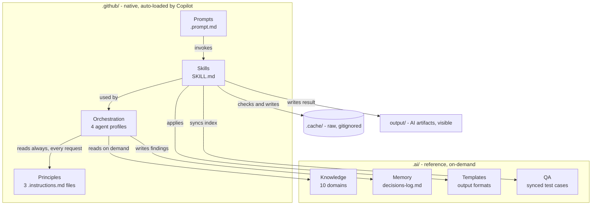

### 1.2 Principles precedence

*Blueprint section 4 and section 7.*

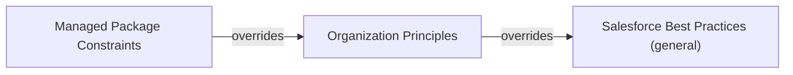

### 1.3 Workspace structure — `.github/`

*Blueprint section 5.*

```mermaid
graph TD
    GH[".github/"]
    GH --> CI["copilot-instructions.md"]
    GH --> INSTR["instructions/"]
    GH --> AGENTS["agents/"]
    GH --> SKILLS["skills/"]
    GH --> PROMPTS["prompts/"]

    INSTR --> I1["salesforce-best-practices<br/>.instructions.md"]
    INSTR --> I2["organization-principles<br/>.instructions.md"]
    INSTR --> I3["managed-package-constraints<br/>.instructions.md"]

    AGENTS --> A1["solution-designer.agent.md"]
    AGENTS --> A2["config-investigator.agent.md"]
    AGENTS --> A3["development-assistant.agent.md"]
    AGENTS --> A4["guardrail-reviewer.agent.md"]

    SKILLS --> S1["investigate-object/"]
    SKILLS --> S2["fetch-ado-item/"]
    SKILLS --> S3["check-against-principles/"]
    SKILLS --> S4["generate-technical-documentation/"]
    SKILLS --> S5["check-feature-coverage/"]
    SKILLS --> S6["generate-release-handover/"]
    SKILLS --> S7["fetch-test-case/"]
    SKILLS --> S8["sync-test-cases/"]
    SKILLS --> S9["suggest-test-cases/"]
    SKILLS --> S10["tune-test-case-keywords/"]
    SKILLS --> S11["generate-playwright-test/"]
    SKILLS --> S12["update-knowledge-base/"]

    PROMPTS --> P1["fetch-ado-item.prompt.md"]
    PROMPTS --> P2["document-metadata-change.prompt.md"]
    PROMPTS --> P3["feature-health.prompt.md"]
    PROMPTS --> P4["release-handover.prompt.md"]
    PROMPTS --> P5["sync-test-cases.prompt.md"]
    PROMPTS --> P6["tune-test-case-keywords.prompt.md"]
    PROMPTS --> P7["generate-playwright-test.prompt.md"]
```

### 1.4 Workspace structure — `.ai/`

*Blueprint section 5.*

```mermaid
graph TD
    AI[".ai/"]
    AI --> KNOW["knowledge/"]
    AI --> MEM["memory/"]
    AI --> TEMPL["templates/"]
    AI --> QAD["qa/"]

    KNOW --> K0["README.md<br/>(navigational index)"]
    KNOW --> K1["current-implementation.md"]
    KNOW --> K2["business-processes.md"]
    KNOW --> K3["object-relations.md"]
    KNOW --> K4["object-descriptions.md"]
    KNOW --> K5["field-descriptions.md"]
    KNOW --> K6["automation-map.md"]
    KNOW --> K7["integration-map.md"]
    KNOW --> K8["glossary.md"]
    KNOW --> K9["known-limitations.md"]
    KNOW --> K10["keyword-taxonomy.md"]

    MEM --> M1["decisions-log.md"]

    TEMPL --> T1["technical-documentation.md"]
    TEMPL --> T2["feature-health-report.md"]
    TEMPL --> T3["knowledge-entry.md"]
    TEMPL --> T4["release-handover.md"]

    QAD --> Q1["test-cases/&lt;suiteId&gt;-&lt;name&gt;.md"]
    QAD --> Q2["keywords-map.md"]
    QAD --> Q3["ui-navigation-patterns.md"]
```

### 1.5 Workspace structure — `.cache/` and `output/`

*Blueprint section 13.*

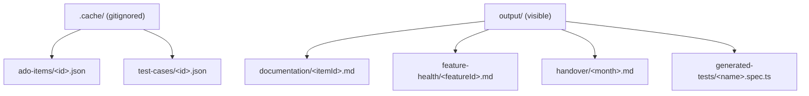

---

## 2. Orchestration

### 2.1 Five-agent SDLC pipeline

*Blueprint section 10.*

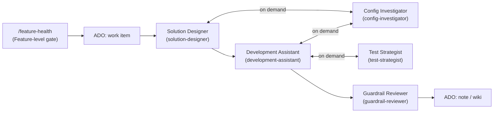

*Test Strategist is on-demand, not phase-locked (same nature as Config Investigator). Its
distinct decision: assess whether the QA inventory is fresh, whether existing coverage
suffices, or whether new Playwright automation is needed — see blueprint section 3.*

### 2.2 Standalone tools — entry points

*Blueprint section 10 (closing note) and section 12. `/release-handover` and
`/tune-test-case-keywords` remain independent of any agent. `/sync-test-cases` and
`/generate-playwright-test` are multi-consumer: triggered directly by a human, or orchestrated
by Test Strategist when broader judgment about coverage sufficiency is needed.*

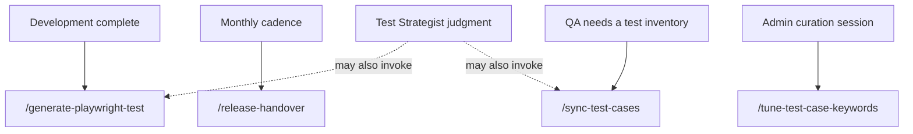

---

## 3. Skill process flows

### 3.1 `fetch-ado-item`

*Blueprint section 11. Also accepts `childDetail=<summary|full>` and
`includeTestCases=<true|false>` — not shown as branches here to keep the core flow readable;
see blueprint section 11 for both parameters.*

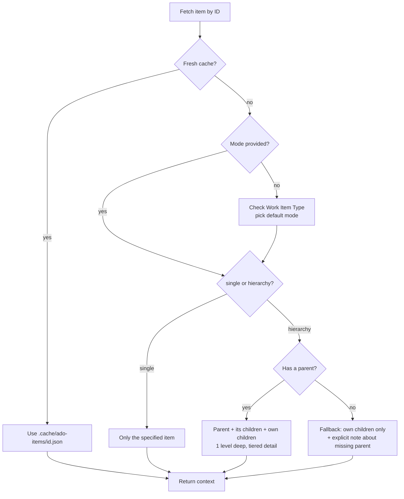

### 3.2 `investigate-object`

*Blueprint section 11.*

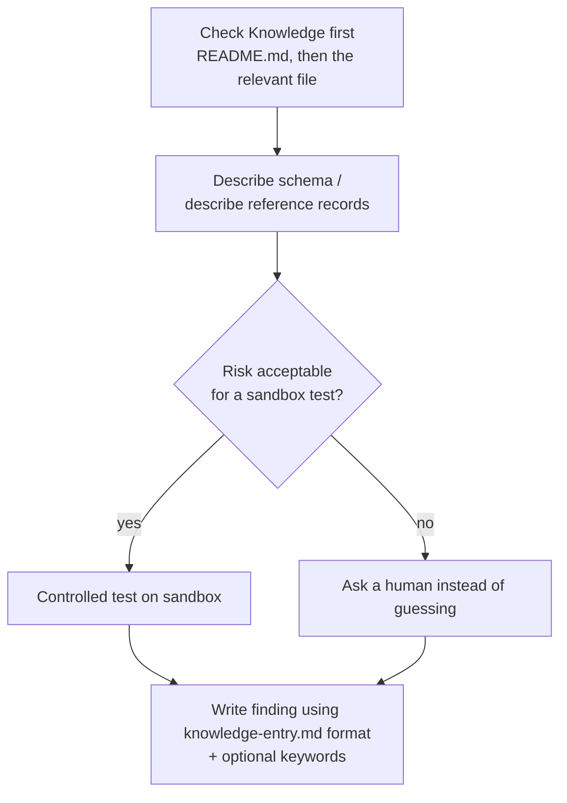

### 3.3 `check-against-principles`

*Blueprint section 11.*

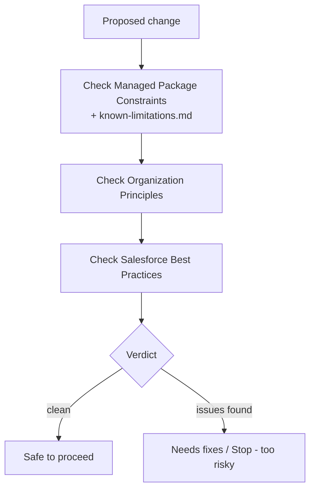

### 3.4 `generate-technical-documentation`

*Blueprint section 11.*

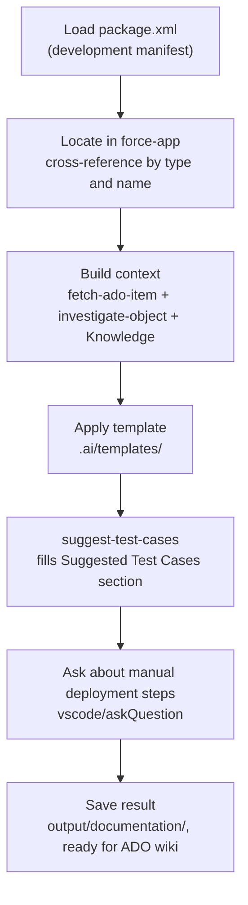

### 3.5 `check-feature-coverage`

*Blueprint section 11.*

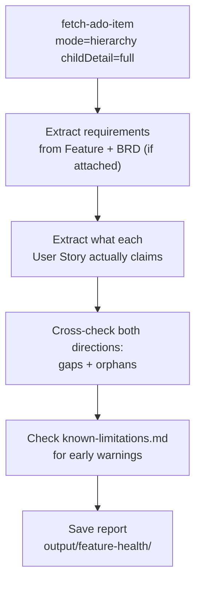

### 3.6 `generate-release-handover`

*Blueprint section 11.*

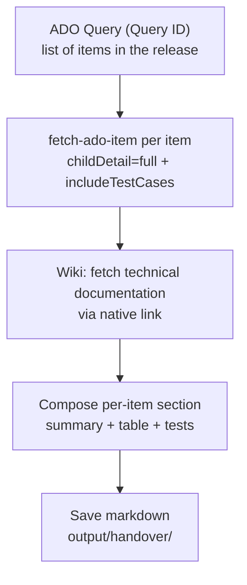

*Note: DOCX/PDF export happens afterward as a manual, human-triggered step via a VS Code
extension — intentionally not part of this skill (see blueprint section 3, declarative-output
decision).*

### 3.7 `fetch-test-case`

*Blueprint section 11. Extracted from `sync-test-cases` for reuse — same pattern as
`fetch-ado-item`.*

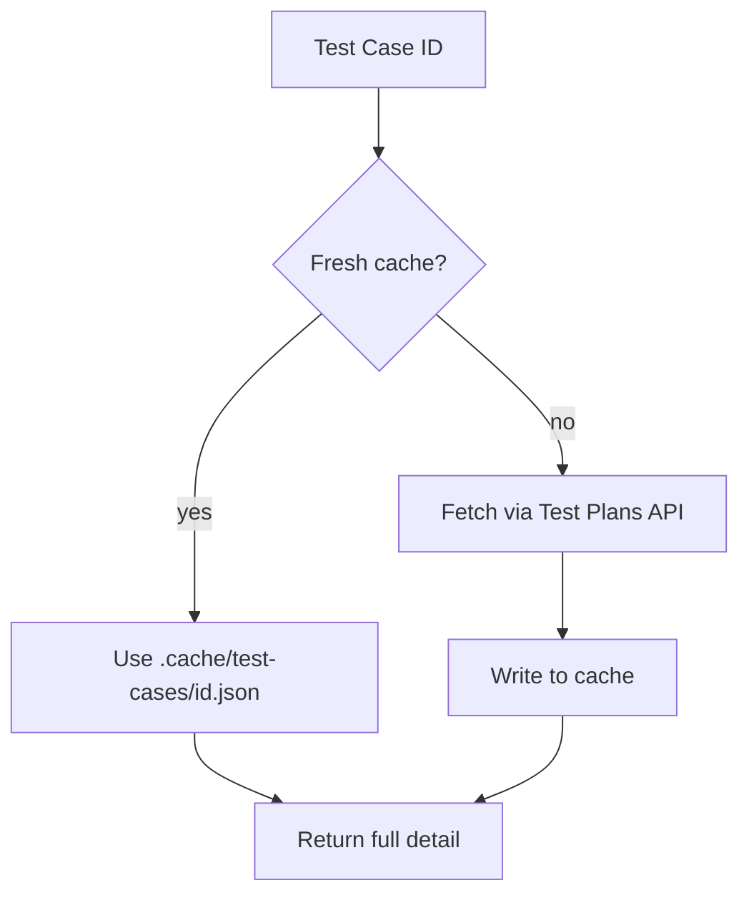

### 3.8 `sync-test-cases`

*Blueprint section 11.*

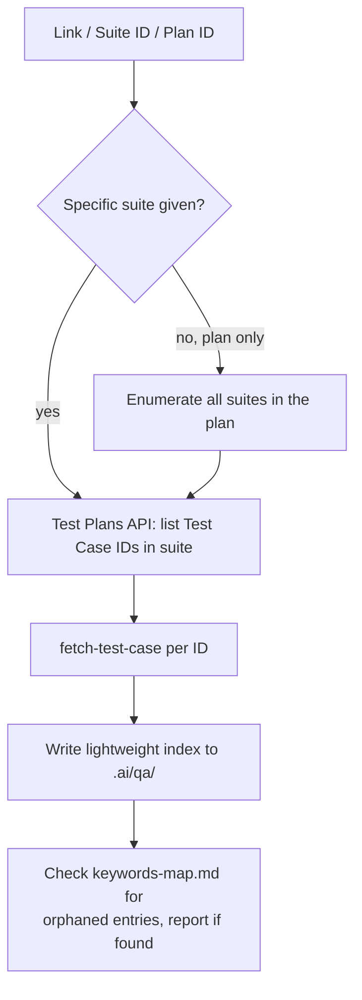

### 3.9 `suggest-test-cases`

*Blueprint section 11.*

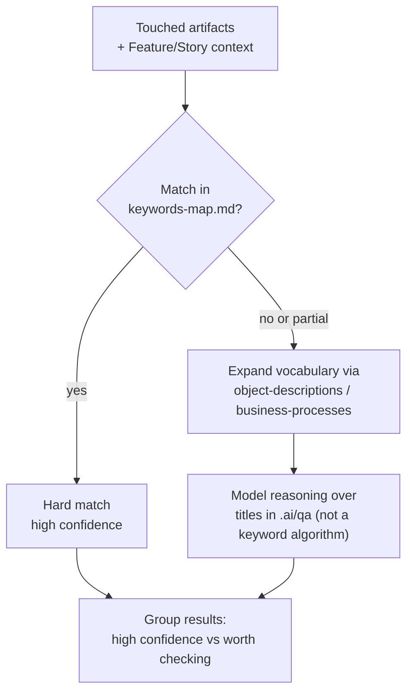

### 3.10 `tune-test-case-keywords`

*Blueprint section 11. Admin tool, human-in-the-loop.*

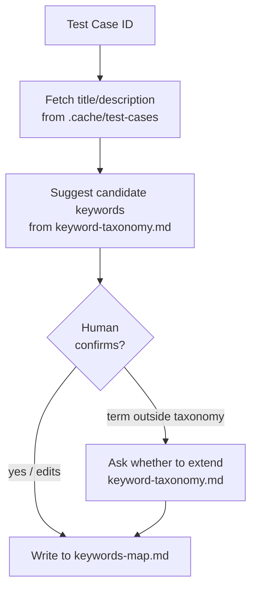

### 3.11 `generate-playwright-test`

*Blueprint section 11. Two equally-supported input sources — an existing Test Case, or steps
described directly by a tester in chat.*

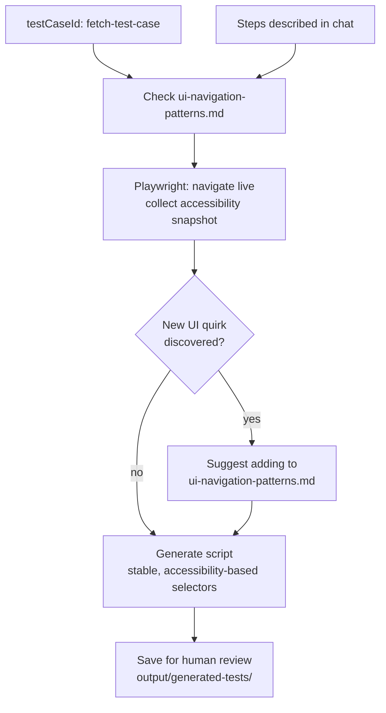

### 3.12 `update-knowledge-base`

*Blueprint section 11.*

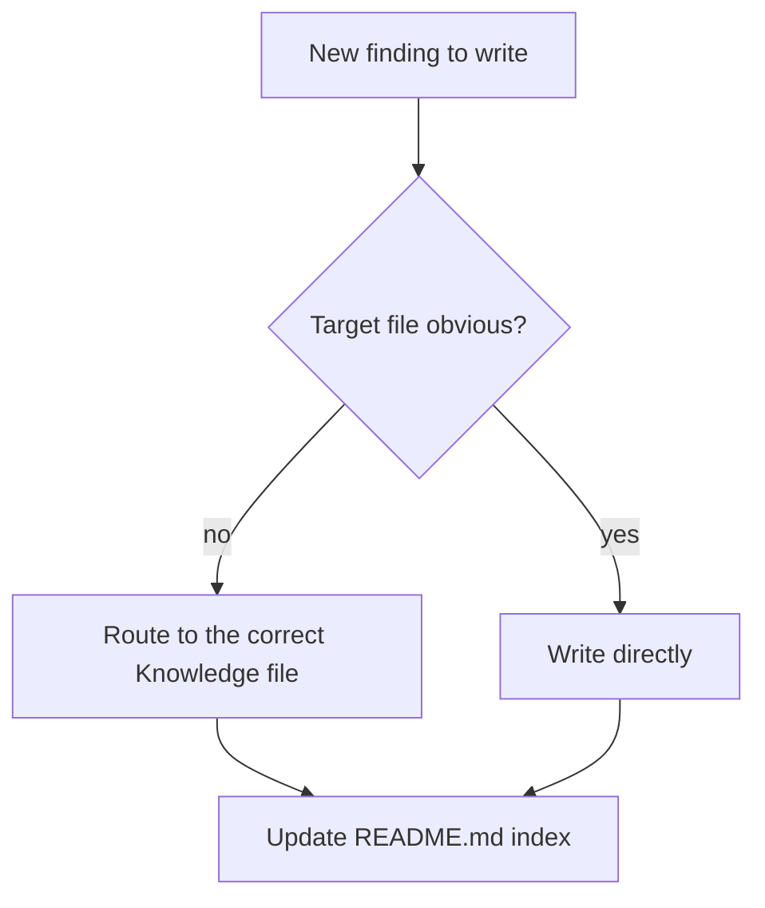
