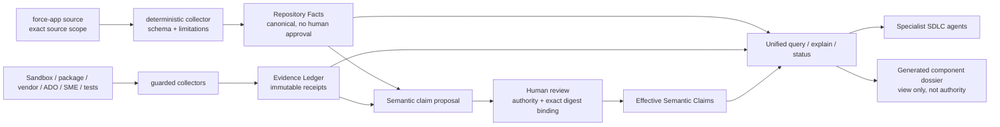

# Evidence to analyse — AI-agentic Salesforce SDLC target state

## Status dokumentu

- **Cel:** zebrać evidence, wnioski i propozycje dotyczące dalszego rozwoju workspace tak, aby
  niezależny agent mógł później wykonać krytyczny review rekomendowanych zmian.
- **Charakter:** dokument roboczy i review input. Nie jest zatwierdzonym planem implementacji,
  work recordem, zmianą polityki ani autoryzacją do rozszerzenia uprawnień agentów.
- **Data snapshotu:** 2026-07-24.
- **Repozytorium:** `sf-harness-brain-core`.
- **Zweryfikowany commit:** `c19131b`.
- **Gałąź podczas analizy:** `main`, zgodna z `origin/main`.
- **Zakres analizy:** struktura workspace, custom agents, prompty, skille, handoffy, work-record
  state machine, Git/terminal enforcement, Knowledge, QA oraz luka managed-package release.
- **Poza zakresem:** implementacja zmian, modyfikacja istniejących polityk, org mutation, deploy,
  package build, package promotion i publikacja.
- **Stan danych pilota:** poza plikami `.gitkeep` nie ma obecnie rzeczywistych Salesforce metadata
  w `force-app/main/default`, canonical Knowledge claims/evidence ani aktywnych work records.
  Wnioski architektoniczne nie są więc jeszcze potwierdzone na realnym projekcie pakietowym.

### Jak czytać dokument

Każde istotne stwierdzenie należy interpretować według poniższych oznaczeń:

- **OBSERVATION** — stan bezpośrednio potwierdzony w aktualnych plikach.
- **INFERENCE** — wniosek wynikający z kilku observations; wymaga oceny reviewera.
- **PROPOSAL** — proponowany target state; nie jest jeszcze decyzją.
- **DECISION REQUIRED** — rozgałęzienie, którego nie wolno rozstrzygnąć automatycznie.

---

## 1. Executive conclusion

**OBSERVATION:** workspace ma solidny fundament governance:

- jeden root repozytorium i jeden SFDX root,
- custom agents z rozdzielonymi rolami,
- proceduralne skille,
- publiczne prompty,
- persisted work records i hashowane handoffy,
- niezależny reviewer,
- globalny safety hook i role-specific guard,
- schema-governed Knowledge,
- CI i deterministyczne testy guardów.

**INFERENCE:** nie ma powodu przebudowywać workspace od zera. Jest to wartościowy governance
harness, ale jeszcze nie tworzy spójnego end-to-end Salesforce managed-package SDLC.

Największy problem nie brzmi:

> „23 prompty to za dużo”.

Największy problem brzmi:

> **23 prompty nie odpowiadają 23 jednoznacznym czynnościom ani etapom.**

Publiczne menu miesza:

1. etapy lifecycle zmiany,
2. techniczne operacje evidence/investigation,
3. administrację Knowledge,
4. administrację QA,
5. dokumentację i raportowanie.

Jednocześnie brakuje publicznych wejść do najważniejszych formalnych etapów: zwykłego Development,
formalnego QA, formalnego Review zgodnego z handoff contract oraz package release readiness.

**PROPOSAL:** docelowy model powinien wyglądać następująco:

> bezpośrednio dostępny agent dla każdego etapu + stabilny prompt dla każdego etapu +
> opcjonalny read-only SDLC Navigator.

Navigator nie powinien wykonywać SDLC w ukryciu. Work record i state machine pozostają źródłem
prawdy. Handoff zmienia właściciela etapu. Subagent wykonuje jedynie ograniczone zadanie pomocnicze.

```text
Developer
  ├── bezpośrednio → Intake / Design / Development / QA / Review / Package Release
  └── opcjonalnie → SDLC Navigator
                         └── read-only status + właściwy handoff send:false

Change lifecycle:
Intake → Design → Development → QA → Review → Ready for Release

Package lifecycle:
Scope Lock → Build → Install/Upgrade Verification → Human Promotion → Released
```

---

## 2. Główna zasada: szeroki agent, wąski executor

## 2.1. Definicja

**PROPOSAL:** agent powinien mieć szeroką powierzchnię rozumowania i wykonywania normalnej pracy
developerskiej. Executor powinien ograniczać konkretne skutki uboczne na granicy ich wykonania.

Inaczej:

- nie ograniczamy modelowi możliwości zrozumienia problemu,
- nie próbujemy opisać każdej poprawnej komendy,
- blokujemy konkretne klasy ryzyka,
- decyzja bezpieczeństwa zależy od efektu działania, a nie od tego, czy komenda znalazła się na
  długiej liście dozwolonych wariantów składni.

Szeroki agent nie oznacza nieograniczonego agenta. Oznacza, że:

- może swobodnie orientować się w repo,
- może zebrać evidence,
- może wykonać zwykły development loop,
- nie traci czasu na zgadywanie jednej dozwolonej formy polecenia,
- nadal nie może przekroczyć granic roli, środowiska, approval ani protected resources.

Wąski executor nie oznacza allowlisty każdej komendy. Oznacza egzekwowanie:

- dozwolonego targetu,
- dozwolonego środowiska,
- dozwolonego zakresu plików,
- dozwolonego rodzaju skutku ubocznego,
- właściwej roli,
- aktualnego work recordu i handoffu,
- wymaganej zgody człowieka.

## 2.2. Co otrzymuje agent

### Odczyt i orientacja

Agent powinien mieć:

- pełny odczyt wszystkich **wersjonowanych** plików workspace,
- pełne wyszukiwanie tekstowe i semantyczne,
- możliwość przeglądania historii, diffów, blame, branchy i commitów,
- odczyt repo state, test results, static-analysis results i generated receipts,
- możliwość odczytu właściwego work recordu, handoffu oraz scope.

„Pełny odczyt workspace” nie powinien obejmować plaintext secret material. Executor lub sandbox
powinien niezależnie chronić:

- `.env`,
- credential stores,
- tokeny i cookies,
- SSH/private keys,
- Salesforce auth files,
- installation keys,
- local config fields oznaczone jako secret.

Agent może wiedzieć, że sekret jest skonfigurowany oraz otrzymać jego non-sensitive identity lub
receipt. Nie powinien otrzymać wartości sekretu.

### Git

Agent powinien mieć większość normalnego Git:

- `status`, `diff`, `log`, `show`, `blame`, `grep`, `ls-files`,
- tworzenie i przełączanie zwykłej gałęzi roboczej,
- `add` i scoped staging,
- tworzenie lokalnych commitów,
- `fetch`,
- porównywanie z upstream,
- zwykły push bieżącej, niechronionej gałęzi do jej własnego upstreamu,
- przygotowanie PR.

Executor powinien blokować lub wymagać osobnej zgody dla operacji, które mogą usuwać pracę,
przepisać historię lub dotknąć protected refs.

| Klasa Git | Docelowa decyzja | Przykłady |
|---|---|---|
| Odczyt | allow | status, diff, log, show, blame, grep |
| Lokalna praca na autoryzowanej branch | allow | switch/create branch, add, commit |
| Zwykły push własnej feature branch | allow lub policy-bound ask | push bez force do exact upstream |
| Integracja lokalna | allow z kontrolą dirty tree | merge, bez kasowania cudzej pracy |
| Historia i odzyskiwanie | ask lub deny | rebase, cherry-pick, restore, stash drop |
| Destrukcyjne | deny | reset --hard, clean -f, branch -D |
| Protected refs | deny | direct push do main/release/protected branch |
| Przepisywanie remote | deny | force push, force-with-lease |
| Release refs | release-role + human gate | tag, release branch, package release ref |

Gałąź `main` nie powinna być traktowana jako zwykła „bieżąca gałąź robocza”. Autoryzowaną gałęzią
do edycji jest bieżąca non-protected work branch związana ze scope zmiany.

### Terminal, testy i analizatory

Agent powinien móc:

- uruchamiać standardowe komendy powłoki,
- korzystać z języków i package managerów wymaganych przez repo,
- uruchamiać testy jednostkowe, integracyjne i statyczne,
- uruchamiać lintery, format check, code analyzer i schema validation,
- uruchamiać repo-local scripts,
- tworzyć bounded temporary artifacts,
- wykorzystywać receipts poprzednich, identycznych kontroli.

Ograniczenie powinno dotyczyć skutku, nie nazwy programu. Przykładowo:

- `python` nie jest sam w sobie ryzykowny,
- ryzykowne może być dopiero odczytanie sekretu, połączenie z niedozwolonym hostem albo zapis
  poza workspace,
- `git` nie jest sam w sobie ryzykowny,
- ryzykowne jest `push main`, force push albo usunięcie historii,
- `sf` nie jest sam w sobie jedną klasą ryzyka,
- inne zasady obowiązują dla read-only query facade, retrieve, deploy, package build i production.

### Edycja

Agent implementacyjny powinien mieć możliwość edycji w ramach:

- zaakceptowanego scope,
- autoryzowanej work branch,
- root workspace,
- dozwolonych source/test/docs paths,
- swojej roli.

Szeroki odczyt nie oznacza szerokiego prawa zapisu. Przykładowo:

- Solution Designer może czytać całe repo, ale nie edytuje Salesforce metadata,
- Development Assistant może edytować metadata i testy w scope,
- Test Strategist może edytować test artifacts, lecz nie business metadata,
- Guardrail Reviewer pozostaje read-only,
- policy/governance files mogą być zmieniane wyłącznie przez właściwą rolę/tryb,
- żaden agent nie zatwierdza swojej własnej pracy.

### Delegowanie

Agent powinien móc delegować ograniczone zadania:

- wyszukanie zależności,
- analizę konkretnego komponentu,
- porównanie wzorców,
- zebranie evidence,
- sugestię testów,
- równoległy specialized review.

Delegacja nie powinna zastępować formalnego ownership etapu. Formalne Development, QA i Review
powinny działać przez persisted handoff i osobną interakcję z użytkownikiem.

## 2.3. Co blokuje hook/executor

Hook powinien blokować konkretne klasy ryzyka:

1. **Produkcję**
   - customer production data plane,
   - produkcyjne deploye,
   - produkcyjne testy mutujące dane,
   - niezweryfikowane production-like targety.

2. **Sekrety i credential material**
   - odczyt i wyświetlenie wartości,
   - zapis do repo/chat/logów,
   - przesyłanie do narzędzi niespełniających secret-handling contract.

3. **Destrukcyjne Git i filesystem**
   - hard reset,
   - clean/delete,
   - kasowanie branchy,
   - nadpisanie niepowiązanych zmian,
   - wyjście poza workspace.

4. **Protected Git operations**
   - force push,
   - direct push do `main`,
   - nieautoryzowane tagi/release refs,
   - modyfikacja cudzej branch lub upstreamu.

5. **Naruszenie ownership polityk**
   - zmiana Principles, hooków, agent policies, schemas lub approval records przez niewłaściwą rolę,
   - zmiana guarded executorów przez zwykłego agenta implementacyjnego.

6. **Salesforce poza allowlistą**
   - nieznany org,
   - default org bez jawnego targetu,
   - nieallowlistowany object/component,
   - broad/raw query poza guarded facade,
   - write poza autoryzowanym source path.

7. **Nieautoryzowane deploye i package operations**
   - deploy bez odpowiedniego release recordu,
   - package version creation poza release executorem,
   - promote bez exact artifact binding i human approval,
   - `--skip-validation` lub podobne osłabienie release gate.

8. **Samodzielne zatwierdzanie własnej pracy**
   - work-record approval,
   - QA/review przez autora zmiany,
   - Knowledge verification bez wymaganej zgody,
   - package promotion przez agenta, który przygotował build.

## 2.4. Trzystopniowy wynik executora

Nie każda operacja powinna kończyć się binarnym allow/deny.

| Decyzja | Znaczenie | Przykład |
|---|---|---|
| `ALLOW` | zwykła, scope-bound operacja | testy, commit na work branch, read-only evidence |
| `ASK` | operacja dozwolona, ale wymagająca jawnej zgody | bounded retrieve, zwykły push zgodny z policy, state-changing sandbox test |
| `DENY` | operacja zakazana niezależnie od promptu | production deploy, force push, self-approval |

`ASK` powinno być stosowane oszczędnie. Jeżeli człowiek zatwierdził dokładny plan lub exact
operation digest, świeży receipt może zastąpić kolejne identyczne potwierdzenia, ale nie może
odblokować klasy działań zakazanych.

## 2.5. Jak executor powinien podejmować decyzję

Executor powinien analizować znormalizowaną operację:

```text
role
recordId / handoffId
operation class
resolved cwd
resolved input paths
resolved output paths
current Git branch
Git target ref/upstream
external target identity
environment classification
scope hash
approval/receipt binding
expected side effect
```

Ocena nie powinna bazować wyłącznie na regexie komendy. Regex może być szybkim prefilterem, ale
ważne operacje powinny być parsowane do argv/structured request, a następnie porównywane z policy.

## 2.6. Stan obecny kontra ta zasada

**OBSERVATION:** obecny role guard jest nadal szczegółowym command allowlist.

`scripts/copilot_role_guard.py:717-769` dopuszcza wspólny zestaw odczytowy:

- `ls`, `cat`, `head`, `tail`, `wc`, `grep`, `rg`, `find`,
- read-only Git: `status`, `diff`, `log`, `show`, `blame`, `describe`, `shortlog`, `rev-parse`,
  `ls-files`, `grep`, listowanie branch i remote.

`scripts/copilot_role_guard.py:772-857` odrzuca pozostałe executables, z wyjątkiem szczegółowo
obsłużonych repo-local Python scripts i jednego wariantu Salesforce retrieve dla Development
Assistant.

Test `tests/test_safety_hooks.py:658-683` wprost oczekuje odmowy dla:

- `git push origin main`,
- `git commit -m x`,
- `git checkout -b new-branch`,
- `git branch new-branch`,
- `curl`,
- dowolnego `python -c`.

Komentarz w guardzie sam dokumentuje wcześniejsze „agent flailing” po zbyt wąskich ograniczeniach
preflight (`scripts/copilot_role_guard.py:55-58`).

**INFERENCE:** obecna implementacja częściowo rozpoznała problem, rozszerzając read-only
orientation, ale nadal zatrzymuje normalny development loop na poziomie command allowlist.

**PROPOSAL:** zastąpić centralną allowlistę „każdej poprawnej komendy” modelem:

1. szeroki sandboxed terminal,
2. klasyfikacja ryzyka,
3. role/path/environment checks na granicy side effect,
4. dedykowane guarded executors dla Salesforce, release i approvals,
5. receipts oraz observability.

### Ważne zastrzeżenie

Samo usunięcie allowlisty byłoby niebezpieczne. Szeroki terminal wymaga skutecznej izolacji:

- filesystem boundary,
- secret boundary,
- network/egress boundary,
- process boundary,
- target identity validation.

Jeżeli host nie zapewnia sandboxingu, należy utrzymać guarded executors dla zewnętrznych systemów
i operacji mutujących. „Szeroki agent” nie może oznaczać, że dowolny subprocess automatycznie
dziedziczy credentials i nieograniczony network.

---

## 3. Aktualna architektura workspace

## 3.1. Potwierdzony inventory

Aktualny validator deklaruje w `scripts/validate_harness.py:25`:

| Typ | Liczba |
|---|---:|
| Custom agents | 6 |
| Public prompt files | 23 |
| Internal skills | 24 |
| Scoped instruction files | 3 |

Wszystkie 24 skille mają `user-invocable: false`. Publiczną powierzchnię slash commands tworzą
prompty. Prompty odwołują się bezpośrednio do 21 unikalnych skilli. Pozostałe trzy skille są
wewnętrznymi elementami innych workflow:

- `curate-knowledge-keywords`,
- `fetch-test-case`,
- `update-knowledge-base`.

Rozkład promptów:

| Agent | Prompty | Udział |
|---|---:|---:|
| Config Investigator | 10 | 43.5% |
| Test Strategist | 6 | 26.1% |
| Solution Designer | 3 | 13.0% |
| Development Assistant | 2 | 8.7% |
| Guardrail Reviewer | 1 | 4.3% |
| Knowledge Curator | 1 | 4.3% |

**INFERENCE:** publiczna powierzchnia jest zdominowana przez Knowledge/evidence i QA utilities.
Core delivery stages są mniej widoczne niż operacje pomocnicze.

## 3.2. Co jest dobrze zaprojektowane

### Jeden root

`AGENTS.md` oraz `.github/copilot-instructions.md` definiują `brain-core` jako jedyny workspace i
jedyny SFDX root. Ogranicza to ryzyko skanowania lub zapisu do drugiego checkoutu.

### Role

Istnieje sensowny separation of duties:

- Solution Designer projektuje, ale nie implementuje,
- Config Investigator zbiera evidence, ale nie mutuje orga,
- Development Assistant implementuje zaakceptowany design,
- Test Strategist ocenia QA,
- Guardrail Reviewer nie naprawia znalezionych problemów,
- Knowledge Curator utrzymuje Knowledge bez dostępu do orga.

### Persisted workflow truth

`.ai/contracts/workflow-state-machine.md:6-8` wskazuje `record.json` i handoff envelopes jako
authoritative state. Chat jest tylko nawigacją. Record posiada revision/hash checks, approval
binding i stale-handoff rejection.

### Handoff z kontrolą użytkownika

Handoffy mają `send: false`, więc developer może przejść do kolejnego agenta, zobaczyć przygotowany
prompt, dodać kontekst albo zakwestionować etap przed rozpoczęciem.

### Human approval

Agent nie może uruchomić work-record approval. Globalny hook blokuje taką próbę
(`scripts/copilot_safety_hook.py:748-758`).

### Knowledge provenance

Knowledge ma osobne claims, immutable evidence i reviews. Model może proponować, ale nie może
samodzielnie ustanowić prawdy.

### Najlepiej rozwinięty klaster: Knowledge

Inventory, worklist, batch, refresh, relation health, investigation i promotion tworzą bogaty
zestaw. Szczególnie wartościowy jest resumable worklist wyprowadzany z registry i source state,
a nie z pamięci czatu.

---

## 4. Szczegółowa mapa obecnych promptów

Legenda:

- **Stage** — kandydat na publiczny etap SDLC.
- **Utility** — bounded funkcja pomocnicza.
- **Admin** — utrzymanie indeksów, Knowledge lub QA.
- **Reporting** — dokument, nie release execution.

| Prompt | Agent | Typ | Faktyczny rezultat | Główna uwaga |
|---|---|---|---|---|
| `/search-ado` | Solution Designer | Utility | read-only ADO search | Discovery, nie stage |
| `/fetch-ado-item` | Solution Designer | Utility/Stage | fetch context i rozpoczęcie design | Nakłada się z `/solution-design` |
| `/solution-design` | Solution Designer | Stage | design draft lub governed design | Najbardziej kompletne wejście stage |
| `/adhoc-fix` | Development Assistant | Stage exception | mała lokalna poprawka bez normalnego recordu | Review path jest niespójny |
| `/document-metadata-change` | Development Assistant | Reporting | techniczna dokumentacja zaakceptowanej zmiany | Nie zastępuje Development |
| `/feature-health` | Test Strategist | Gate/Utility | pre-design coverage assessment | Nie jest egzekwowany przez design flow |
| `/suggest-test-cases` | Test Strategist | Utility | ranking istniejących test cases | Nie jest formalnym QA |
| `/sync-test-cases` | Test Strategist | Admin | synchronizacja QA index | Operacja administracyjna |
| `/tune-test-case-keywords` | Test Strategist | Admin | kontrolowana zmiana taxonomy | Operacja administracyjna |
| `/generate-playwright-test` | Test Strategist | Utility | draft testu i browser evidence | Brak promotion/execution lifecycle |
| `/release-handover` | Test Strategist | Reporting | miesięczny draft ADO handover | Nazwa sugeruje więcej niż wykonuje |
| `/check-against-principles` | Guardrail Reviewer | Utility/Stage | principles verdict | Miesza advisory lint i formalny review |
| `/search-knowledge` | Config Investigator | Utility | read-only Knowledge query | Wspólna capability, nie pełna investigation |
| `/inventory-force-app` | Config Investigator | Utility | sanitized metadata inventory | Building block |
| `/investigate-object` | Config Investigator | Utility | evidence i proposed claim | Prompt i skill mają inne input gates |
| `/investigate-config-records` | Config Investigator | Utility | bounded reference-data evidence | Standalone kontra role record gate |
| `/propose-force-app-knowledge` | Config Investigator | Admin | draft/propose Knowledge | Prompt i skill różnią się promotion policy |
| `/batch-knowledge` | Config Investigator | Admin | batch conversion jednej metadata type | Dublowane przez curator mode |
| `/refresh-force-app-knowledge` | Config Investigator | Admin | refresh stale/drifted claims | Dublowane przez curator mode |
| `/feature-documentor` | Config Investigator | Utility/Reporting | feature crawl, claims i dossier | Duży composite prompt |
| `/update-relations` | Config Investigator | Admin | incremental relation proposals | Specjalizowany Knowledge workflow |
| `/relation-health` | Config Investigator | Admin | orphan relation report | Wchodzi też w curate health |
| `/curate-knowledge` | Knowledge Curator | Admin cockpit | health, refresh lub batch | Dubluje kilka bezpośrednich promptów |

---

## 5. Findings z analizy

## F-01 — Current role guard jest command allowlist, a nie narrow side-effect executor

**Severity:** High dla produktywności, Medium dla correctness.

**Evidence:**

- `scripts/copilot_role_guard.py:717-769` — zamknięta lista read-only commands.
- `scripts/copilot_role_guard.py:772-857` — pozostałe executables są odrzucane poza
  szczegółowymi wyjątkami.
- `tests/test_safety_hooks.py:658-683` — `git commit`, branch creation, push i ogólny Python są
  oczekiwane jako denied.
- `scripts/copilot_role_guard.py:55-58` — zapisany przypadek 5–8 denied preflight attempts i
  „live agent flailing”.

**Impact:**

- agent traci czas na odkrywanie składni akceptowanej przez guard,
- normalny Git loop jest poza capability role,
- każdy nowy poprawny wariant komendy wymaga kodowania w parserze,
- role instructions mogą obiecywać więcej niż executor faktycznie pozwala.

**Proposal:**

- capability policy na poziomie skutków ubocznych,
- broad sandboxed terminal,
- osobne guarded executors dla external systems,
- exact target/path/branch/role checks,
- structured receipts zamiast command-by-command allowlist.

## F-02 — 18 z 23 promptów deklaruje własne `tools`

**Severity:** High dla spójności zachowania.

**Evidence:**

Prompt-level `tools:` posiadają:

`adhoc-fix`, `batch-knowledge`, `check-against-principles`, `curate-knowledge`,
`document-metadata-change`, `feature-documentor`, `inventory-force-app`,
`investigate-config-records`, `investigate-object`, `propose-force-app-knowledge`,
`refresh-force-app-knowledge`, `relation-health`, `release-handover`, `search-ado`,
`search-knowledge`, `solution-design`, `suggest-test-cases`, `update-relations`.

Bez prompt-level `tools:` pozostają:

`feature-health`, `fetch-ado-item`, `generate-playwright-test`, `sync-test-cases`,
`tune-test-case-keywords`.

Aktualna dokumentacja VS Code podaje priorytet:

1. tools promptu,
2. tools agenta wskazanego przez prompt,
3. default tools wybranego agenta.

Źródło: [VS Code — prompt tool list priority](https://code.visualstudio.com/docs/agent-customization/prompt-files#_tool-list-priority).

**Impact:**

Ten sam custom agent może otrzymać inny tool surface zależnie od tego, czy:

- użytkownik wybrał go bezpośrednio,
- uruchomił prompt z `tools`,
- uruchomił prompt bez `tools`.

Przykład: Development Assistant ma `agent` i może delegować do Config Investigator/Test
Strategist, lecz `/document-metadata-change` nadpisuje tools i nie zawiera `agent`, mimo że
linked skill wymaga obu konsultacji.

**Caveat:** precedence wynika z aktualnej dokumentacji hosta, lecz repo nie zawiera live
cross-version testu tej semantyki. Powinna wejść do compatibility/eval matrix.

**Proposal:**

- prompty etapowe domyślnie nie deklarują `tools`,
- tool surface należy do custom agenta,
- prompt-level narrowing pozostaje wyłącznie świadomym profilem, np. read-only status,
- CI wykrywa przypadkowy override.

## F-03 — Brak publicznego wejścia do normalnego Development

**Severity:** Critical dla kompletności SDLC.

**Evidence:**

- Development Assistant ma tylko `/adhoc-fix` i `/document-metadata-change`.
- Normalna procedura implementacji znajduje się w
  `.github/agents/development-assistant.agent.md:39-72`.
- Nie istnieje `/develop`, `/implement` ani skill realizujący normalną implementację
  zaakceptowanego designu.

**Impact:**

- jeden z głównych etapów jest mniej dostępny niż utilities,
- developer musi znać ręczny agent selection albo znaleźć handoff,
- nie ma osobnego, testowalnego contractu stage promptu.

**Proposal:**

`/sdlc-develop recordId=<ID> handoffId=<ID>` z jednoznacznym wejściem, wynikiem i handoffem.

## F-04 — State machine nie obsługuje `Development → QA → Review`

**Severity:** Critical.

**Evidence:**

`.ai/contracts/workflow-state-machine.md:54-64` definiuje:

```text
design/accepted
  -> development/in_progress | qa/in_progress
  -> review/ready
```

`scripts/work_record.py:101-123` implementuje:

- `design/accepted → development/in_progress`,
- `design/accepted → qa/in_progress`,
- `development/in_progress → review/ready`,
- `qa/in_progress → review/ready`,
- brak `development/in_progress → qa/in_progress`.

**Impact:**

- Development i QA są alternatywnymi ścieżkami,
- formalny QA po implementacji nie jest reprezentowany,
- osobna interakcja z każdym etapem jest niemożliwa w standardowym flow,
- fix po review może wrócić do Development, a następnie ponownie ominąć QA.

**Proposal:**

Domyślna ścieżka:

```text
Design → Development → QA → Review
```

Jawne warianty:

- test-only: `Design → QA → Review`,
- QA waiver: tylko z persisted rationale i approval,
- fix po QA/review: `Development → QA → Review`.

Zmiana implementation commit lub scope unieważnia downstream QA/review receipts.

## F-05 — Brak incoming handoff UX do Test Strategist

**Severity:** High.

**Evidence:**

`scripts/work_record.py:2155-2168` dopuszcza handoff do Test Strategist z design/development/qa.

Jednocześnie:

- Solution Designer oferuje tylko Development i Early Guardrail Review,
- Development Assistant oferuje tylko Guardrail Review i Resolve Design Conflict,
- Test Strategist ma handoffy wyjściowe, ale nie ma normalnej ścieżki wejściowej z Development.

Development może uruchomić Test Strategist jako subagenta, ale subagent zwraca wynik do rodzica.
To nie jest osobna rozmowa ani formalna zmiana ownership.

Źródła semantyki hosta:

- [VS Code custom-agent handoffs](https://code.visualstudio.com/docs/agent-customization/custom-agents#_handoffs),
- [VS Code subagents](https://code.visualstudio.com/docs/agents/subagents).

**Proposal:**

- formalny QA zawsze przez persisted handoff,
- Test Strategist bezpośrednio user-invocable,
- subagent QA tylko do konsultacji lub bounded research,
- subagent output nie może zamknąć formalnej fazy QA.

## F-06 — Sprzeczne wymagania work record

**Severity:** Critical dla przewidywalności promptów.

### Solution Designer

Agent wymaga utworzenia lub walidacji recordu:

- `.github/agents/solution-designer.agent.md:41-55`.

Prompty dopuszczają standalone:

- `/fetch-ado-item`: `.github/prompts/fetch-ado-item.prompt.md:14-17`,
- `/solution-design`: `.github/prompts/solution-design.prompt.md:11-14`,
- skill solution-design: `.github/skills/solution-design/SKILL.md:20-25`.

### Config Investigator

Agent zawsze wymaga `recordId`, claim question/type, scope i evidence policy:

- `.github/agents/config-investigator.agent.md:33-38`.

Kilka promptów dopuszcza standalone operation:

- inventory,
- investigate-config-records,
- relation health/update,
- Knowledge utilities.

### Test Strategist

Agent wymaga `recordId` i appenduje assessment:

- `.github/agents/test-strategist.agent.md:34-48`.

Jednocześnie bez recordu mogą być wywołane:

- `/feature-health`,
- `/suggest-test-cases`,
- `/sync-test-cases`,
- `/release-handover`,
- `/tune-test-case-keywords`.

**Impact:**

Agent dostaje dwie równocześnie prawdziwe instrukcje:

- prompt mówi „działaj standalone”,
- role contract mówi „stop bez recordu”.

To jest bezpośrednia przyczyna zatrzymań, zbędnych pytań i zmiennego zachowania.

**Proposal:**

Każdy entrypoint deklaruje dokładnie jeden tryb:

```text
standalone-read
governed-stage
admin-maintenance
```

Agent posiada odpowiadającą macierz entry gates. Skill metadata i CI weryfikują zgodność.

## F-07 — `/investigate-object` ma dwa różne input contracty

**Severity:** High.

Prompt wymaga tylko:

- `objectApiName`,
- opcjonalnego `recordId`.

Dowód: `.github/prompts/investigate-object.prompt.md:3-18`.

Skill wymaga:

- `recordId`,
- exact claim question/type,
- normalized subject,
- environment,
- criticality,
- minimum evidence policy,
- uzasadnienia, dlaczego Knowledge/repository są niewystarczające.

Dowód: `.github/skills/investigate-object/SKILL.md:14-19`.

**Proposal:** rozdzielić:

- `evidence-inspect-object` — bounded standalone read, bez claim mutation,
- `knowledge-investigate-claim` — governed claim workflow z pełnym contractem.

## F-08 — Advisory principles check i formalny Review są połączone

**Severity:** High.

Prompt `/check-against-principles`:

- wymaga recordu,
- opisuje ad-hoc read-only review,
- nie wymaga handoffu.

Skill:

- traktuje handoff jako opcjonalny,
- kończy informacją, że nic nie zmieniono.

Guardrail Reviewer:

- wymaga formalnego review handoffu,
- konsumuje go,
- appenduje verdict do work recordu.

Dowody:

- `.github/prompts/check-against-principles.prompt.md:11-18`,
- `.github/skills/check-against-principles/SKILL.md:14-18,42-52`,
- `.github/agents/guardrail-reviewer.agent.md:36-46`.

**Proposal:** dwa oddzielne kontrakty:

1. `/principles-check` — advisory, read-only lint dowolnego draftu, bez formalnego `SAFE`,
2. `/sdlc-review` — record + handoff + independent persisted verdict.

Formalny reviewer powinien być direct/handoff-only. Nie powinien zostać uruchomiony jako subagent
autora i zwrócić formalnego approval.

## F-09 — `/adhoc-fix` nie ma egzekwowalnej ścieżki formalnego Review

**Severity:** High.

Decision log określa ad-hoc fix jako standalone bez work recordu i rekomenduje after-the-fact
guardrail review (`.ai/memory/decisions-log.md:33-57`).

Guardrail Reviewer i `/check-against-principles` wymagają work recordu, a formalny reviewer wymaga
również handoffu.

**Proposal:** wybrać jedno:

- ad-hoc fix tworzy lekki review record/handoff,
- albo pozostaje poza formalnym `SAFE` i zwraca wyłącznie „local fix prepared; formal review
  unavailable in express lane”.

Rekomendowany jest lekki record, ponieważ inaczej rekomendowany review nie ma wykonującej go ścieżki.

## F-10 — Knowledge Curator ładuje skille wymagające Config Investigator

**Severity:** High dla Knowledge maintenance.

Knowledge Curator ma wykonywać batch i proposal:

- `.github/agents/knowledge-curator.agent.md:20-46`.

Linked skille mówią jednak:

- batch wymaga `config-investigator`:
  `.github/skills/batch-knowledge/SKILL.md:14`,
- inventory wymaga `config-investigator`:
  `.github/skills/inventory-force-app/SKILL.md:15`,
- proposal wymaga `config-investigator`:
  `.github/skills/propose-force-app-knowledge/SKILL.md:16`.

Runtime role guard jednocześnie dopuszcza Knowledge Curator do odpowiednich repo-source commands:

- `scripts/copilot_role_guard.py:145-151`,
- `scripts/copilot_role_guard.py:207-218`.

**INFERENCE:** role guard został rozszerzony, lecz treść skilli nie została zaktualizowana.

**Proposal:** skille powinny deklarować capability/allowed roles, np.:

```yaml
allowedRoles:
  - config-investigator
  - knowledge-curator
```

Org-facing steps pozostają wyłącznie dla Config Investigator.

## F-11 — `/propose-force-app-knowledge` ma sprzeczną promotion policy

**Severity:** Medium/High.

Prompt zakazuje review/verify/promote:

- `.github/prompts/propose-force-app-knowledge.prompt.md:11-14`.

Skill po proposal:

- oferuje chat-approved promotion,
- uruchamia `approve-claim`,
- może zwrócić `VERIFIED` lub `REJECTED`.

Dowód: `.github/skills/propose-force-app-knowledge/SKILL.md:58-74`.

**Proposal:** jednoznacznie rozdzielić:

- `knowledge-propose` — kończy na PROPOSED,
- `knowledge-review` — osobna human-confirmed operacja.

Alternatywnie prompt musi jawnie deklarować, że „request approval” jest częścią workflow, ale sama
promocja nadal jest decyzją człowieka. Obie interpretacje nie mogą pozostać równocześnie.

## F-12 — Feature Health jest nazwany gate, ale nie jest gate

**Severity:** Medium.

`/feature-health` jest opisany jako coverage gate przed Solution Design. `/solution-design` nie
wymaga jednak receipt tego kroku ani jawnego waiver.

**Proposal:**

- Intake ustala, czy feature health jest required,
- Design weryfikuje receipt lub persisted waiver,
- brak required receipt daje `INCOMPLETE`, nie ciche pominięcie.

## F-13 — Prompt bodies duplikują procedury skilli

**Severity:** Medium, drift risk.

Istniejący audit F-05 potwierdza duplikację między promptem i skillem dla:

- batch-knowledge,
- solution-design,
- refresh-force-app-knowledge,
- feature-documentor.

Dowód: `audit/findings.md:128-155`.

**Proposal:** prompt zawiera wyłącznie:

- agent,
- input parsing,
- tryb,
- skill invocation,
- oczekiwany outcome/envelope.

Skill posiada:

- procedurę,
- kolejność kroków,
- limity,
- retry/resume,
- stop rules,
- domain logic.

## F-14 — Publiczne wejścia nakładają się

**Severity:** Medium dla UX.

Przykłady:

- `/fetch-ado-item` robi fetch i zaczyna Solution Design,
- `/curate-knowledge batch` pokrywa `/batch-knowledge`,
- `/curate-knowledge refresh` pokrywa `/refresh-force-app-knowledge`,
- `/curate-knowledge health` częściowo pokrywa `/relation-health`,
- `/release-handover` brzmi jak etap release, ale jest raportem.

**Proposal:** każdy prompt ma jeden jasny terminal outcome. Composite cockpit może istnieć, ale
powinien jawnie nazywać składające go operacje i nie udawać formalnego stage, którego nie zamyka.

## F-15 — Niejednolity input grammar

**Severity:** Medium.

Większość promptów używa `name=value`, część free text, część positional modes.

Dokument pierwszego uruchomienia pokazuje:

```text
/fetch-ado-item 12345
```

Prompt wymaga parsowania:

```text
/fetch-ado-item itemId=12345
```

Dowody:

- `docs/setup-zero-to-first-prompt.md:232-239`,
- `.github/prompts/fetch-ado-item.prompt.md:10-12`.

**Proposal:** wszystkie stage prompts przyjmują `name=value` plus jeden jasno zdefiniowany free-text
fallback. Admin prompts używają spójnego mode contract.

## F-16 — Dokumentacja inventory jest już nieaktualna

**Severity:** Medium, sygnał maintainability.

Aktualny stan: 6 agentów, 23 prompty, 24 skille.

Niespójne miejsca:

- `README.md:3-6` — pięciu agentów, 20 promptów, 22 skille,
- `README.md:29-35` — 20/22,
- `SETUP.md:147-149` — pięciu agentów, 20 promptów, 22 skille,
- `.ai/repo-map.md` nazywa katalog „Five role agents”, lecz listuje sześciu,
- starsze setup/compatibility materiały zawierają kolejne historyczne liczby.

**INFERENCE:** ręczne liczby w prose regularnie dryfują.

**Proposal:** liczby generować w jednym atlasie/validatorze. Dokumentacja odsyła do wygenerowanego
inventory zamiast kopiować wartości.

## F-17 — Evale nie certyfikują rzeczywistego zachowania agentów

**Severity:** High przed zwiększeniem autonomii.

`evals/agent-scenarios.yaml:1-4` wprost mówi:

- scenariusze są manual behavioral scenarios,
- `scripts/run_evals.py` ich nie wykonuje,
- nie ma certified model/version/VS Code host matrix.

Brakuje pełnego scenariusza:

```text
Intake → Design → Approval → Development → QA → Review → Complete
```

Brakuje też porównania:

- direct agent entry,
- stage prompt entry,
- Navigator entry.

**Proposal:** challenge promptów powinien stać się formalnym eval corpus, nie wyłącznie coraz
większym publicznym menu slash commands.

## F-18 — Brak rzeczywistego package-release pipeline

**Severity:** Critical dla celu managed-package SDLC.

Obecny `/release-handover`:

- pobiera dane ADO,
- składa miesięczny dokument,
- pozostawia publikację człowiekowi.

Nie:

- tworzy package version,
- wiąże release z exact commit/ancestor/dependencies,
- wykonuje clean install,
- wykonuje upgrade test,
- przeprowadza package validation,
- przygotowuje exact artifact do promotion.

**Proposal:** nie rozszerzać Test Strategist ani obecnego handover promptu o release execution.
Utworzyć osobny Package Release Manager i osobny release record/state machine.

## F-19 — Nieustalony model produktu: closed-package extension czy owned managed 2GP

**Severity:** Critical decision blocker.

README opisuje repo jako development „around any configured closed managed package”
(`README.md:3-7`).

SFDX scaffold:

- ma pusty `namespace`,
- nie posiada package aliases/version/ancestry,
- validator wymusza pusty namespace.

Dowody:

- `sfdx-project.json:1-11`,
- `scripts/validate_harness.py:194-225`.

To jest spójne z generic harness wokół cudzego zamkniętego pakietu. Nie jest jeszcze konfiguracją
repo własnego managed 2GP.

**DECISION REQUIRED:** wybrać jawny operating mode:

1. `closed-package-extension`
   - repo utrzymuje subscriber-owned extensions/configuration wokół zewnętrznego pakietu,
   - package identity jest evidence,
   - release dotyczy customer-owned metadata, nie tworzenia nowej wersji cudzego pakietu.

2. `owned-managed-2gp`
   - repo jest źródłem własnego managed package,
   - wymaga namespace, package identity, aliases, version lineage, ancestor/dependencies i Dev Hub,
   - wymaga osobnego package release control plane.

3. Dwa jawne profile
   - dozwolone tylko jeżeli każdy profile ma odrębne contracts, executors i tests,
   - agent nigdy nie zgaduje trybu na podstawie samego tekstu zadania.

Salesforce CLI wymaga `--target-dev-hub` do utworzenia pakietu; opcja bez namespace jest dostępna
dla unlocked packages, nie managed package:

- [Salesforce CLI — package create](https://developer.salesforce.com/docs/platform/salesforce-cli-reference/guide/cli_reference_package_create.html).

Dev Hub jest odrębnym control-plane orgiem używanym do scratch orgów i packaging. Oficjalne
materiały wskazują Production lub Developer Edition dla Dev Hub:

- [Salesforce — configure Dev Hub](https://developer.salesforce.com/docs/platform/functions/guide/configure_your_org).

To tworzy napięcie z bezwarunkowym `SAFE-ENV-001 — no production access`.

**PROPOSAL:** dla `owned-managed-2gp` preferować dedykowany, pozbawiony danych biznesowych
Developer Edition/PBO Dev Hub i dedykowany package executor. Jeżeli organizacja musi użyć
produkcyjnego/PBO Dev Hub, potrzebna jest formalna, wąska polityka rozróżniająca:

- customer production data plane — nadal absolutnie zabroniony,
- package control plane — tylko exact packaging APIs, osobna tożsamość, brak business-data access,
  osobny approval i pełny audit.

Nie wolno ukryć tej różnicy przez dodanie zwykłego produkcyjnego aliasu do allowlisty.

## F-20 — Brak realnego pilot evidence

**Severity:** High dla confidence, nie jest sam w sobie błędem struktury.

W aktualnym snapshot:

- `force-app/main/default` zawiera tylko directory skeleton i `.gitkeep`,
- `.ai/knowledge/claims` nie zawiera rzeczywistych claims,
- `.ai/knowledge/evidence` nie zawiera rzeczywistego evidence,
- `.ai/change-records` nie zawiera aktywnego recordu.

**Impact:**

- nie potwierdzono zachowania na dużej metadata base,
- nie zmierzono liczby denied/retried calls w realnej pracy,
- nie potwierdzono resume across chats na rzeczywistym change,
- nie wykonano package/release scenario.

**Proposal:** target state wdrażać najpierw na synthetic fixture, potem na jednej realnej,
niekrytycznej zmianie, z zapisanymi metrykami.

---

## 6. Rekomendowany model promptów i agentów

## 6.1. Zasada odpowiedzialności warstw

| Warstwa | Jedna odpowiedzialność |
|---|---|
| Always-on kernel | nienaruszalne zasady bezpieczeństwa i grounding |
| Custom agent | rola, ownership, entry gates, szeroki tool surface |
| Prompt | publiczne wejście, argumenty, tryb i oczekiwany outcome |
| Skill | proceduralne know-how, stop/resume/retry i domain logic |
| Work record | authoritative state pojedynczej zmiany |
| Handoff | formalna zmiana ownership etapu |
| Subagent | bounded pomocnicza analiza, nie formalny stage |
| Executor | wykonanie konkretnej, zwalidowanej operacji |
| Hook/policy | klasyfikacja side effect i allow/ask/deny |
| Eval/CI | spójność kontraktów i zachowania host/model |

Żadna warstwa nie powinna kopiować odpowiedzialności innej:

- prompt nie kopiuje całej procedury skilla,
- Navigator nie kopiuje workflow state,
- chat nie kopiuje work recordu,
- agent policy nie staje się command-by-command parserem,
- reviewer nie implementuje,
- executor nie podejmuje decyzji biznesowej.

## 6.2. Podstawowa publiczna powierzchnia

| Prompt | Agent | Tryb | Wymagane wejście | Terminal outcome |
|---|---|---|---|---|
| `/sdlc-status` | SDLC Navigator | standalone-read | `recordId` | stan, blockers, valid next actions |
| `/sdlc-intake` | Solution Designer | governed-stage | `itemId` lub requirement | normalized intake + record |
| `/sdlc-design` | Solution Designer | governed-stage | `recordId` | design awaiting human |
| `/sdlc-develop` | Development Assistant | governed-stage | `recordId`, `handoffId` | implementation + dev receipt |
| `/sdlc-qa` | Test Strategist | governed-stage | `recordId`, `handoffId` | QA verdict + receipt |
| `/sdlc-review` | Guardrail Reviewer | governed-stage | `recordId`, `handoffId` | independent persisted verdict |
| `/sdlc-hotfix` | Development Assistant | governed exception | diagnosis + bounded scope | reviewed express-lane artifact |
| `/package-release-readiness` | Package Release Manager | release-stage | `releaseId` | readiness/blocker verdict |

Nazwa może być inna, ale semantyka powinna pozostać stabilna.

## 6.3. Expert/admin surface

Istniejące szczegółowe prompty nadal są wartościowe dla ekspertów i challenge/evals. Powinny być
uporządkowane w płaskim menu przez prefiksy:

```text
evidence-*       search, fetch, investigate, inventory
knowledge-*      propose, review, batch, refresh, relations
qa-*             sync, suggest, Playwright, taxonomy
docs-*           metadata documentation, feature dossier
release-*        handover/reporting
```

Nie trzeba usuwać 23 promptów tylko dlatego, że powstanie warstwa stage. Należy natomiast:

- usunąć niejasne overlap,
- rozróżnić production UX od eval corpus,
- nadać każdemu promptowi jeden tryb,
- jasno opisać, czy prompt jest read-only, governed czy admin.

## 6.4. SDLC Navigator, nie supervisor

Navigator powinien:

- odczytać schema-valid work record,
- zweryfikować current handoff,
- pokazać phase/status/owner,
- wskazać blockers,
- wskazać dozwolone next transitions,
- zaoferować `send: false` handoff do właściwego agenta,
- umożliwić resume w świeżym chacie.

Navigator nie powinien:

- edytować repo,
- implementować,
- zmieniać work-record state,
- konsumować handoffu innej roli,
- wykonywać formalnego QA lub Review jako subagent,
- tworzyć approval,
- dokonywać package operations,
- streszczać chat jako evidence.

### Navigator acceptance criteria

- `NAV-001` — tylko read-only tools.
- `NAV-002` — trasa wyłącznie ze zwalidowanego recordu/handoffu.
- `NAV-003` — brak lub stale state daje `INCOMPLETE`, bez zgadywania.
- `NAV-004` — wszystkie handoffy `send: false`.
- `NAV-005` — docelowy agent ponownie waliduje record/handoff.
- `NAV-006` — Navigator jest opcjonalny; każdy stage działa bez niego.
- `NAV-007` — Navigator nie deleguje całych formalnych etapów.

## 6.5. Skill metadata

**PROPOSAL:** skille otrzymują maszynowo walidowany contract:

```yaml
mode: standalone-read | governed-stage | admin-maintenance | release-stage
allowedRoles: [...]
recordRequirement: none | optional | required
handoffRequirement: none | optional | required
allowedStates: [...]
producesState: ...
requiredCapabilities: [...]
sideEffects:
  repo: read | scoped-write
  salesforce: none | guarded-read | release-executor
nextRoles: [...]
```

CI porównuje:

```text
prompt → agent → skill → role guard → state machine → handoff graph
```

Przykładowe błędy wykrywane automatycznie:

- prompt mówi optional record, skill mówi required,
- prompt wskazuje agenta nieobecnego w `allowedRoles`,
- skill wymaga delegation, prompt odbiera `agent` tool,
- state transition nie istnieje,
- handoff target jest legalny w skrypcie, ale niedostępny w agent UX,
- prompt deklaruje outcome, którego agent nie może zapisać.

## 6.6. Wspólny output envelope

Obecnie używane są różne słowniki wyników: `PASS/WARN/BLOCKED`, `COMPLETE/PARTIAL`,
`SAFE/NEEDS FIXES`, `DRAFTED/PROPOSED/VERIFIED`.

Domain-specific verdicty mogą pozostać, ale każdy stage powinien zwracać wspólną kopertę:

```yaml
stage:
outcome:
recordId:
recordRevision:
handoffId:
scopeHash:
sourceCommit:
artifacts:
evidence:
checks:
blockers:
nextActions:
domainResult:
```

---

## 7. Docelowe maszyny stanów

## 7.1. Lifecycle pojedynczej zmiany

```text
intake/draft
  → design/draft
  → design/awaiting_human
  → design/accepted
  → development/in_progress
  → qa/in_progress
  → review/ready
  → review/safe
  → ready_for_release/ready
```

Ścieżki dodatkowe:

```text
design/accepted → qa/in_progress                 # test-only change
review/needs_fixes → development/in_progress
development/in_progress → qa/in_progress         # również po poprawce
qa/incomplete → qa/in_progress
review/incomplete → właściwy etap źródłowy
```

Invariants:

- zmiana designu unieważnia approval, development, QA i review,
- zmiana implementation commit unieważnia QA i review,
- zmiana test artifact po QA wymaga nowego QA receipt,
- formalny verdict pochodzi tylko od właściciela etapu,
- subagent output jest evidence/advice, nie stage verdict,
- równoległe records dotykające tego samego komponentu generują visible conflict.

## 7.2. Lifecycle wersji/release

Release agreguje wiele zakończonych zmian. Nie powinien być dopisany do
`.ai/change-records/<ADO-item>`.

Proponowany osobny record:

```text
.ai/releases/<release-id>/record.json
```

Proponowany state machine dla `owned-managed-2gp`:

```text
draft
  → scope_locked
  → build_requested
  → beta_created
  → verification_in_progress
  → verification_passed
  → awaiting_human_promotion
  → released
  → handover_ready
```

Stany błędów:

```text
incomplete
blocked
build_failed
verification_failed
promotion_rejected
```

Release record wiąże:

- exact Git commit,
- package directory,
- namespace,
- package ID,
- version number,
- ancestor,
- dependencies,
- Dev Hub identity,
- build request ID,
- Subscriber Package Version ID,
- included work-record IDs,
- clean-install receipts,
- upgrade-test receipts,
- code/test evidence,
- exact artifact zaakceptowany do promotion.

Timeout package build nie może automatycznie tworzyć kolejnego buildu. Należy zachować request ID i
odpytać status. Zmiana źródła po `scope_locked` unieważnia release candidate.

## 7.3. Package Release Manager

Package Release Manager powinien być osobnym, bezpośrednio dostępnym agentem.

Powinien:

- agregować tylko zakończone i reviewed work records,
- przygotować i zablokować scope,
- zlecić bounded package executorowi build/status/install/verify,
- zebrać receipts,
- zatrzymać się przed promotion,
- przygotować human-reviewable promotion request.

Nie powinien:

- posiadać secret values,
- rozszerzać scope bez nowego lock,
- samodzielnie promować,
- instalować na customer production,
- wykonywać AppExchange publication,
- wykonywać push upgrade.

Package executor powinien być znacznie węższy niż standardowy development executor.

### Package release acceptance criteria

- `REL-001` — operating mode jest jawny.
- `REL-002` — release scope wiąże exact commit i wskazane work records.
- `REL-003` — wszystkie included changes spełniają wymagany QA/Review gate.
- `REL-004` — package ID/namespace/version/ancestor/dependencies są zablokowane przed buildem.
- `REL-005` — Dev Hub identity jest sprawdzana przez osobny executor.
- `REL-006` — stage agents i Navigator nie mają package credentials.
- `REL-007` — package version create jest idempotentne względem release recordu.
- `REL-008` — releasable candidate nie może użyć validation/ancestor bypass.
- `REL-009` — wykonano clean install w subscriber-style test org.
- `REL-010` — wykonano upgrade ze wszystkich wspieranych wersji bazowych.
- `REL-011` — test matrix odpowiada rzeczywistej zawartości pakietu.
- `REL-012` — wymagane Salesforce coverage jest spełnione albo `N/A` ma evidence.
- `REL-013` — sprawdzono scripts/permissions/namespace behavior, jeśli występują.
- `REL-014` — dokładnie ten sam artifact, który przeszedł testy, trafia do promotion request.
- `REL-015` — promotion wymaga named human approval związanego z artifactem i evidence digest.
- `REL-016` — installation key i credentials nie pojawiają się w chat/log/artifacts.
- `REL-017` — production install, AppExchange publication i push upgrade są poza zakresem agenta.
- `REL-018` — handover jest dokumentacją, nie dowodem wydania pakietu.

---

## 8. Proponowana kolejność zmian

## Phase 0 — decyzje przed implementacją

1. Ustalić operating mode:
   - `closed-package-extension`,
   - `owned-managed-2gp`,
   - albo formalnie rozdzielone oba.
2. Ustalić Git autonomy:
   - czy normalny push feature branch jest `ALLOW` czy `ASK`,
   - które branche są protected,
   - czy agent może tworzyć branch,
   - jakie operacje history-rewriting są zawsze denied.
3. Ustalić, czy QA jest:
   - obowiązkowe po każdym Development,
   - risk-profile dependent z persisted waiver.
4. Ustalić formalny model ad-hoc fix review.
5. Ustalić Package Release authority i Dev Hub model.

Bez tych decyzji nie należy rozszerzać executora.

## Phase 1 — naprawa kontraktów bez zwiększania uprawnień

1. Nadać każdemu promptowi tryb.
2. Ujednolicić record/handoff requirements.
3. Rozdzielić advisory principles check od formal Review.
4. Naprawić `investigate-object` contract.
5. Naprawić Knowledge Curator allowed roles.
6. Rozstrzygnąć Knowledge proposal/promotion contract.
7. Usunąć proceduralną duplikację prompt/skill.
8. Ujednolicić argument grammar i output envelope.
9. Usunąć ręcznie kopiowane inventory counts z prose.

Ta faza powinna zmniejszyć agent flailing nawet bez zmiany permission model.

## Phase 2 — szeroki agent, wąski executor

1. Zdefiniować capability/risk taxonomy.
2. Dodać branch/protected-ref resolver.
3. Dodać secret/path/network boundaries.
4. Rozszerzyć normalny Git i test loop na work branch.
5. Zachować role-specific write boundaries.
6. Zachować guarded external executors.
7. Dodać decision/denial telemetry bez sensitive payload.
8. Dodać tests dla bypass attempts.

Nie usuwać starego guard modelu jednorazowo. Uruchomić porównawczy shadow/audit mode i dopiero po
evidence przełączyć enforcement.

## Phase 3 — kompletne stage UX

1. Dodać `/sdlc-develop`.
2. Dodać `/sdlc-qa`.
3. Dodać `/sdlc-review`.
4. Naprawić state machine `Development → QA → Review`.
5. Dodać incoming handoff UX do Test Strategist.
6. Dodać invalidation downstream receipts.
7. Dodać opcjonalny `/sdlc-status` i read-only Navigator.
8. Zachować direct entry do każdego specjalisty.

## Phase 4 — package lifecycle

Tylko po decyzji o operating mode.

1. Dodać release record/schema/state machine.
2. Dodać Package Release Manager.
3. Dodać narrow package executor.
4. Dodać exact artifact/commit/ancestor/dependency binding.
5. Dodać install i upgrade verification matrix.
6. Dodać human-only promotion gate.
7. Przemianować lub jednoznacznie opisać obecny `release-handover`.

## Phase 5 — evals i pilot

1. Uruchomić synthetic golden path.
2. Uruchomić jedną niekrytyczną rzeczywistą zmianę.
3. Porównać direct agent, stage prompt i Navigator.
4. Zmierzyć:
   - denied/retried tool calls,
   - czas do pierwszej poprawnej akcji,
   - stage-to-stage time,
   - błędne handoffy,
   - liczbę pytań wynikających ze sprzecznych contracts,
   - token/tool cost,
   - resume success w świeżym chacie.
5. Rozszerzać scope dopiero po zapisanym review wyników.

---

## 9. Evale wymagane przed rolloutem

### Stage behavior

- `EVAL-STAGE-001` — Intake → Design → human approval → Development → QA → Review.
- `EVAL-STAGE-002` — test-only Design → QA → Review.
- `EVAL-STAGE-003` — QA failure → Development fix → ponowne QA → Review.
- `EVAL-STAGE-004` — zmiana implementation commit unieważnia downstream receipts.
- `EVAL-STAGE-005` — stale/wrong-role handoff jest rejected.
- `EVAL-STAGE-006` — fresh chat odtwarza stan wyłącznie z recordId/handoffId.
- `EVAL-STAGE-007` — bezpośredni agent i stage prompt mają równoważny entry gate.
- `EVAL-STAGE-008` — Navigator nie jest wymagany.

### Executor security

- `EVAL-EXEC-001` — standardowe testy i local commit na work branch przechodzą.
- `EVAL-EXEC-002` — direct push do main jest denied.
- `EVAL-EXEC-003` — force push jest denied.
- `EVAL-EXEC-004` — hard reset/clean/delete są denied.
- `EVAL-EXEC-005` — policy file write niewłaściwej roli jest denied.
- `EVAL-EXEC-006` — secret read/exfiltration jest denied.
- `EVAL-EXEC-007` — Salesforce target poza allowlistą jest denied.
- `EVAL-EXEC-008` — zwykły broad terminal nie omija external executor.
- `EVAL-EXEC-009` — agent nie może approve własnego recordu/review/release.
- `EVAL-EXEC-010` — command syntax variants dają tę samą semantic decision.

### Package release

- `EVAL-REL-001` — scope lock → beta build → clean install → upgrade test → human promotion.
- `EVAL-REL-002` — timeout build używa status request, nie tworzy drugiej wersji.
- `EVAL-REL-003` — Dev Hub mismatch blokuje.
- `EVAL-REL-004` — source drift po scope lock blokuje.
- `EVAL-REL-005` — clean install pass + upgrade fail daje verification failed.
- `EVAL-REL-006` — promote innego artifact ID niż testowany jest denied.
- `EVAL-REL-007` — skip validation/ancestor bypass jest denied.
- `EVAL-REL-008` — secret nigdy nie trafia do transcriptu/receipt.
- `EVAL-REL-009` — fixtures/challenge prompts nie tworzą prawdziwych package versions.

Każdy behavioral eval powinien rejestrować:

- model,
- VS Code/Copilot host version,
- OS,
- Salesforce CLI/plugin versions,
- commit,
- prompt/agent entry mode,
- real tool receipts,
- outcome,
- denied/retried calls.

---

## 10. Ryzyka proponowanego target state

| Ryzyko | Mitigacja |
|---|---|
| Broad terminal omija guarded tools | sandbox + egress/secret boundary + semantic hook |
| Agent edytuje na main | protected-branch write guard lub obowiązkowa work branch |
| Prompt nadal nadpisuje agent tools | CI contract + prompt tools tylko dla explicit reduced mode |
| Navigator staje się autorytetem | read-only, no state mutation, target agent revalidation |
| QA jako subagent zamyka etap | formal verdict wyłącznie po handoffie |
| Reviewer traci niezależność | direct/handoff-only formal Review, brak self-review |
| Równoległe records kolidują | component ownership/conflict detection |
| Stary receipt użyty po zmianie | commit/scope/hash binding + automatic invalidation |
| Fail-closed ponownie powoduje flailing | obserwowalność, actionable reason, capability-based policy |
| Dwa package operating modes mieszają się | explicit profile in record/config, no inference |
| Dev Hub rozszerza production surface | dedicated control-plane identity/executor, no business-data access |
| Package build retry tworzy wiele wersji | request-ID idempotency |
| Publiczne menu znowu rośnie | stage UX oddzielony od expert/admin/eval corpus |

---

## 11. Pytania dla niezależnego reviewera

Niezależny agent powinien odpowiedzieć co najmniej na poniższe pytania:

1. Czy observations są zgodne z aktualnym repo i czy którekolwiek evidence zostało źle
   zinterpretowane?
2. Czy zasada „szeroki agent, wąski executor” jest wykonalna na docelowym host/OS bez osłabienia
   secret i network boundary?
3. Które aktualne ograniczenia są realnym security control, a które jedynie command-shape friction?
4. Czy proposed Git autonomy nadal gwarantuje brak utraty cudzej pracy i brak protected-branch
   mutation?
5. Czy `Development → QA → Review` powinno być obowiązkowe, czy risk-profile dependent?
6. Czy advisory principles check i formal Review rzeczywiście wymagają osobnych agentów/skilli,
   czy wystarczą dwa tryby jednego skilla?
7. Czy formalny Test Strategist musi być `disable-model-invocation: true` dla stage verdictów?
8. Czy Navigator może bezpiecznie posiadać jakiekolwiek state mutation, czy powinien pozostać
   absolutnie read-only?
9. Czy direct agent entry i prompt entry da się utrzymać jako równoważne bez dublowania instrukcji?
10. Czy Knowledge Curator powinien współdzielić repo-source skille z Config Investigator, czy mieć
    własne wrapper skills?
11. Czy ad-hoc fix powinien tworzyć lekki record, czy pozostać poza formalnym SAFE lifecycle?
12. Czy produkt jest `closed-package-extension`, `owned-managed-2gp`, czy potrzebuje dwóch profili?
13. Jak odseparować Dev Hub control plane od zakazu production data-plane access?
14. Czy Package Release Manager powinien być jednym agentem, czy Release Builder + Release Reviewer?
15. Czy release record powinien agregować work records dopiero po merge, czy wcześniej podczas
    release candidate planning?
16. Jakie minimalne eval evidence jest wymagane przed rozszerzeniem Git/terminal autonomy?
17. Które rekomendacje można wdrożyć mechanicznie, a które wymagają formalnej decyzji właściciela?
18. Czy proponowana kolejność zmian minimalizuje ryzyko, czy należy najpierw zbudować eval harness?

Reviewer powinien rozdzielić odpowiedź na:

- confirmed findings,
- rejected findings,
- missing evidence,
- security objections,
- alternative target state,
- decisions required from owner,
- recommended implementation order.

---

## 12. Źródła evidence

### Normative/local

- `AGENTS.md`
- `.github/copilot-instructions.md`
- `.ai/repo-map.md`
- `.ai/contracts/workflow-state-machine.md`
- `.ai/contracts/execution-contract.md`
- `.ai/contracts/tool-capabilities.md`
- `.ai/contracts/source-authority.md`
- `.ai/contracts/knowledge-lifecycle.md`
- `.github/agents/*.agent.md`
- `.github/prompts/*.prompt.md`
- `.github/skills/*/SKILL.md`
- `.github/hooks/safety.json`
- `scripts/copilot_safety_hook.py`
- `scripts/copilot_role_guard.py`
- `scripts/work_record.py`
- `scripts/validate_harness.py`
- `tests/test_safety_hooks.py`
- `evals/agent-scenarios.yaml`
- `audit/findings.md`
- `.ai/memory/decisions-log.md`
- `sfdx-project.json`

### External primary documentation

- [VS Code prompt files and tool priority](https://code.visualstudio.com/docs/agent-customization/prompt-files)
- [VS Code custom agents and handoffs](https://code.visualstudio.com/docs/agent-customization/custom-agents)
- [VS Code subagents](https://code.visualstudio.com/docs/agents/subagents)
- [Salesforce CLI package create](https://developer.salesforce.com/docs/platform/salesforce-cli-reference/guide/cli_reference_package_create.html)
- [Salesforce CLI package version create](https://developer.salesforce.com/docs/platform/salesforce-cli-reference/guide/cli_reference_package_version_create.html)
- [Salesforce Dev Hub guidance](https://developer.salesforce.com/docs/platform/functions/guide/configure_your_org)

---

## 13. Ograniczenia tej analizy

1. Nie wykonano live behavioral matrix na różnych modelach i wersjach VS Code/Copilot.
2. Próba uruchomienia `python3 scripts/validate_harness.py` w bieżącej sesji zakończyła się przed
   walidacją z powodu braku modułu `yaml` w systemowym Python 3.9.6. Jest to brak przygotowanego
   runtime w tej sesji, nie wynik FAIL samego harnessu.
3. Nie wykonano żadnej operacji Salesforce, ADO mutation, package build ani deploy.
4. Nie istnieje realny metadata/Knowledge/work-record dataset, na którym można zmierzyć zachowanie.
5. Semantyka prompt-tool precedence jest oparta na aktualnej oficjalnej dokumentacji VS Code, nie
   na wykonanym tutaj cross-version host test.
6. Package-release część jest warunkowa i zależy od decyzji o operating mode.
7. Dokument zawiera propozycje. Nie zastępuje human approval ani niezależnego security review.

---

## 14. Decyzja rekomendowana na tym etapie

Rekomendowane jest zatwierdzenie wyłącznie kierunku do dalszego review:

1. zachować specjalistycznych agentów,
2. zachować bezpośrednią interakcję z każdym etapem,
3. nie budować monolitycznego supervisora wykonującego całe SDLC przez subagentów,
4. zaprojektować read-only Navigator,
5. naprawić kontrakty prompt/agent/skill/state przed rozszerzeniem uprawnień,
6. przesunąć enforcement z command allowlist w kierunku side-effect policy,
7. rozdzielić lifecycle zmiany od lifecycle package release,
8. ustalić, jaki managed-package operating mode jest rzeczywistym celem,
9. poddać cały dokument niezależnemu review przed implementacją.

Nie należy jeszcze zatwierdzać konkretnych zmian executora, state machine ani package policy bez
odpowiedzi na pytania z sekcji 11.

---

## 15. Uproszczenie Knowledge — iteracyjna analiza DISCOVER → PLAN → ITERATE → VERIFY

### 15.1. Cel i sposób prowadzenia tej analizy

Ta część analizuje wyłącznie uproszczenie warstwy Knowledge. Nie proponuje zastąpienia
specjalistycznych agentów SDLC jednym agentem ani odebrania developerowi możliwości bezpośredniej
interakcji z etapami Discovery, Solution Design, Development, Test i Release.

Pytanie brzmi:

> Jak zachować mocne provenance, source authority, human review i fail-closed retrieval, a
> jednocześnie przestać przepuszczać dziesiątki tysięcy mechanicznie wyekstrahowanych elementów
> repozytorium przez taki sam lifecycle jak business meaning, package limitation albo obserwację
> runtime?

Analiza została wykonana jako pętla, a nie jako liniowa rekomendacja:

```text
DISCOVER
   ↓
PLAN — wariant początkowy
   ↓
ITERATE — krytyka wariantu
   ↓
VERIFY
   ├─ FAIL → wróć do właściwego punktu DISCOVER / PLAN
   └─ PASS → plan gotowy do niezależnego review
```

W tej analizie wystąpił rzeczywisty restart pętli:

1. pierwszy plan oparty na `Facts Lockfile + Attested Overlay + dormant registry` nie przeszedł
   weryfikacji;
2. wykonano dodatkowy discovery powierzchni promptów, typów assurance, review provenance i
   deterministyczności;
3. plan został uproszczony do `Repository Facts + sparse existing registry + generated dossier +
   unified query`;
4. poprawiony plan przeszedł weryfikację projektową warunkowo, z wyszczególnionymi owner gates.

Nie wykonano implementacji ani testów nowego runtime. `PASS` w tej sekcji oznacza wyłącznie:
spójny plan gotowy do niezależnego review. Nie oznacza gotowości produkcyjnej.

### 15.2. Status źródeł użytych w analizie

Obecny, zaimplementowany stan należy odróżnić od projektu przyszłego stanu:

| Źródło | Status w bieżącym snapshotcie | Jak zostało użyte |
|---|---|---|
| `.github/copilot-instructions.md` | tracked, normative kernel | granice SAFE-CLAIM, SAFE-EVID, SAFE-HUMAN i SAFE-PROV |
| `.ai/contracts/knowledge-lifecycle.md` | tracked, normative | obecny claim/evidence/review lifecycle |
| `.ai/contracts/source-authority.md` | tracked, normative | co może, a czego nie może ustanowić dany typ źródła |
| `scripts/knowledge_registry.py` | tracked, implemented | aktualne registry, query, review, promotion i citations |
| `scripts/force_app_knowledge.py` | tracked, implemented | inventory, extraction, relations, batches, refresh i feature crawl |
| `.github/prompts/*knowledge*` i powiązane skille | tracked, implemented interface | aktualna powierzchnia użytkownika i agentów |
| `docs/knowledge-facts-overlay-architecture.md` | untracked; opisuje „approved design, not yet implemented” | mocny input projektowy, ale nie potwierdzony stan runtime ani trwałe repo truth |

W szczególności liczby target-scale z `docs/knowledge-facts-overlay-architecture.md:8-20` są
pomiarami zapisanymi w tym projekcie, nie zostały odtworzone podczas tej analizy. Obecny canonical
store jest pusty, więc bieżący workspace nie zawiera datasetu, na którym można ponownie zmierzyć
30–40 tysięcy rekordów.

---

## 16. CYCLE 1 — DISCOVER

### 16.1. Obecny model jest epistemicznie mocny

Canonical Knowledge składa się obecnie z trzech typów:

1. Claim — wersjonowane, scoped twierdzenie.
2. Evidence — niezmienny, sanitizowany receipt obserwacji.
3. Review — niezmienna decyzja człowieka związana z konkretną rewizją.

To rozdzielenie rozwiązuje realne problemy:

- model nie może uznać własnego tekstu za evidence;
- claim może być `proposed`, `verified`, `stale`, `contested`, `superseded` albo `rejected`;
- `verified` nie oznacza jedynie „ktoś kliknął”, lecz wymaga applicable evidence, scope i review;
- konflikt nie jest nadpisywany;
- package version, repository revision, environment, completeness i freshness pozostają częścią
  skuteczności twierdzenia;
- negatywne twierdzenie wymaga kompletności, permission proof i pełnej enumeracji;
- generated Markdown indexes nie są source of truth.

Tych właściwości nie należy usuwać. To nie sam model governance jest błędem. Błędem jest
zastosowanie jego najcięższej ścieżki do całego wolumenu mechanicznej ekstrakcji source.

### 16.2. Obecny store nie ma kosztu migracji danych

W bieżącym snapshotcie:

- `.ai/knowledge/claims/` zawiera tylko `.gitkeep`;
- `.ai/knowledge/evidence/` zawiera tylko `.gitkeep`;
- `.ai/knowledge/reviews/` zawiera tylko `.gitkeep`;
- `claims-index.json` wskazuje `claimCount: 0`;
- generated domain views są puste.

To ważna przewaga: architekturę można skorygować przed utworzeniem realnego długu migracyjnego.
Nie oznacza to jednak, że można bez review usunąć kontrakty. Są już konsumentami dla promptów,
skilli, role guarda, hooków i przyszłych obserwacji org.

### 16.3. Wolumen kodu i operacji

Aktualne dwa główne skrypty Knowledge mają razem 8 935 linii:

| Skrypt | Linie | Publiczne subcommands |
|---|---:|---:|
| `scripts/knowledge_registry.py` | 2 477 | 12 |
| `scripts/force_app_knowledge.py` | 6 458 | 11 |
| **Razem** | **8 935** | **23** |

Registry wystawia:

```text
validate
propose
review
promote
approve-claim
reconcile
query
explain
render-indexes
keyword-report
stale-report
verify-citations
```

Force-app collector wystawia:

```text
inventory
draft
worklist
coverage
relations-worklist
relations-draft
refresh
dashboard
relation-health
feature-crawl
feature-draft
```

Sama liczba subcommands nie jest automatycznie problemem. Problem pojawia się, gdy techniczne
operacje storage stają się publicznym menu użytkownika i są dublowane w kilku promptach.

### 16.4. Powierzchnia promptów i skilli

Bezpośrednio z Knowledge związanych jest 11 z 23 promptów, czyli około 47,8% publicznego menu:

| Prompt | Rzeczywisty outcome |
|---|---|
| `/search-knowledge` | wyszukiwanie i dependency lookup |
| `/inventory-force-app` | zbudowanie repository inventory |
| `/propose-force-app-knowledge` | draft/propose repo-derived claims |
| `/batch-knowledge` | inventory → plan → draft → propose → approve |
| `/refresh-force-app-knowledge` | refresh drifted/expired claims |
| `/update-relations` | wykrycie i zaproponowanie relation claims |
| `/relation-health` | raport osieroconych relation claims |
| `/investigate-object` | repo/org evidence i proposed claim |
| `/investigate-config-records` | reference-data evidence i proposed claim |
| `/feature-documentor` | crawl, claims i dossier |
| `/curate-knowledge` | health, refresh albo batch |

Istnieje 11 core skilli budowania/utrzymania Knowledge oraz co najmniej 6 dalszych skilli, które
Knowledge konsumują. Przekrojowość Knowledge jest prawidłowa; publiczna granularność nie jest.

Najważniejsze duplikacje:

1. `/batch-knowledge` i `/curate-knowledge batch` wykonują ten sam workflow.
2. `/refresh-force-app-knowledge` i `/curate-knowledge refresh` wykonują ten sam workflow.
3. `/relation-health` jest także częścią `/curate-knowledge health`.
4. Inventory jest osobnym promptem i obowiązkowym krokiem batch, refresh, curate, feature i propose.
5. Propose jest osobnym promptem i krokiem batch, refresh, relation i feature.
6. Istniejący `dashboard` agreguje health, ale publiczny curator nadal składa raport z kilku
   oddzielnych wywołań.

To potwierdza wcześniejszy wniosek z całego workspace:

> Publiczne prompty powinny reprezentować intencje i outcomes developera, a nie każdą wewnętrzną
> subcommandę executora.

Nie jest to argument za jednym monolitycznym agentem SDLC. Jest to argument za ukryciem mechaniki
storage wewnątrz właściwej roli.

### 16.5. Dwie opisane ścieżki są obecnie niespójne z egzekucją

Discovery wykrył dwa konkretne przypadki:

1. `feature-documentor` wymaga `feature-crawl` i `feature-draft`, ale obie komendy są oznaczone jako
   `human-terminal-only` i nie występują w allowliście roli. Publiczny prompt nie może więc wykonać
   swojej głównej procedury agentowej.
2. Skill keyword curation wymaga zapisu `.ai/knowledge/keyword-taxonomy.md`, ale Knowledge Curator
   może edytować bezpośrednio wyłącznie ignored drafts w `.cache/knowledge-proposals/`. Nie ma
   deterministycznego executora `taxonomy propose/approve`, a `/curate-knowledge` nie wystawia trybu
   `keywords`.

To nie jest problem samego modelu Facts. To dowód, że przed dodaniem kolejnych commandów trzeba
zmniejszyć i kontraktowo wyrównać publiczną powierzchnię.

### 16.6. Obecny query path nie skaluje się z płaskim YAML store

`knowledge_registry.records()` używa płaskiego `glob("*.yaml")`. `query()` wykonuje pełną walidację
i skanuje claim files. Przy dużej liczbie rekordów każdy query ponosi koszt odczytu i parsowania
całego zbioru, a część effectiveness checks może ponownie przechodzić po claims.

Projekt `knowledge-facts-overlay-architecture.md` zapisuje następujące target-scale obserwacje:

- około 30–40 tysięcy YAML;
- około 50–70 MB;
- koszt query liczony w dziesiątkach sekund lub minutach;
- około 1 200 kliknięć approval przy chunku 25;
- globalna fala stale po zmianie collector version.

Ponieważ dataset nie istnieje w obecnym store, należy traktować te liczby jako recorded design
evidence i koniecznie powtórzyć benchmark na fixture przed architektonicznym cutover.

### 16.7. Repozytorium już zawiera lżejszy model danych

Collector już wytwarza inventory, w którym pojedynczy component ma:

- stabilną tożsamość komponentu;
- `metadataType`;
- name i path;
- `sha256`;
- `facts`;
- `references`;
- `sourceTreeDigest`;
- coverage i limitations.

Drafting następnie rozwija ten zwarty rekord w claim/evidence YAML, a relation drafting może
dodatkowo utworzyć claim dla każdej krawędzi. Największa multiplikacja nie pochodzi więc z
konieczności ekstrakcji. Pochodzi z mapowania każdego elementu zwartych, regenerowalnych danych na
pełny human-governed lifecycle.

### 16.8. Repository source ma ograniczoną authority

Zgodnie z `.ai/contracts/source-authority.md:9-21` repository metadata może ustanowić:

- customer-owned intended metadata;
- przy dokładnym, wskazanym stanie źródła.

Nie może sama ustanowić:

- deployed org state;
- runtime behavior;
- business meaning;
- closed package internals;
- vendor guarantee albo supported extension point;
- kompletnej nieobecności bez completeness proof.

Dlatego lekki store nie może spłaszczyć wszystkich wyników do jednego typu „verified fact”.

### 16.9. Deterministyczność nie jest assurance

Collector zawiera także deterministic-but-heuristic extraction, na przykład część referencji Apex,
dynamicznych targetów i połączeń UI. Ten sam parser może za każdym razem zwrócić identyczny, lecz
niepełny albo błędny wynik.

Należy zachować rozróżnienie:

```text
repeatable output  ≠  observed fact
repeatable output  ≠  complete enumeration
repeatable output  ≠  runtime truth
```

Każdy wynik powinien przenosić `assurance`, `heuristic`, parser coverage i limitations. Brak
wykrytej krawędzi oznacza najwyżej „collector nie wykrył jej w zdefiniowanym source scope”, nie
„krawędź nie istnieje w systemie”.

### 16.10. Obecny top-level safety kernel nie dopuszcza jeszcze osobnego `repoFactRef`

`SAFE-CLAIM-001` wymaga dziś, aby materialny system/package fact odwoływał się do schema-valid
claim i jego evidence. Jeśli repository facts mają być cytowalne bez human promotion, nie wystarczy
zmienić skryptu i prompty. Trzeba jawnie zmienić Tier 1 contract.

To jest owner-reviewed safety decision. Nie wolno ukryć jej jako „optymalizacji storage”.

---

## 17. CYCLE 1 — PLAN

### 17.1. Wariant A — zachować schema-v3, dodać tylko szybszy indeks

Model:

```text
repo extraction
  → claim + evidence per component/fact/relation
  → human promotion
  → generated JSON index for faster query
```

Zalety:

- najmniejsza zmiana kontraktów;
- jeden rodzaj canonical citation;
- najmniejsze ryzyko regresji SAFE-CLAIM.

Wady:

- nie usuwa 30–40 tysięcy potencjalnych YAML;
- nie usuwa około 1 200 approval clicks;
- nie usuwa globalnych refresh waves;
- przyspiesza retrieval, ale nie poprawia governance throughput;
- indeks staje się kolejnym generated artifact nad nadal ciężkim modelem.

Werdykt: **odrzucony**. Rozwiązuje objaw query latency, ale nie root cause.

### 17.2. Wariant B — Facts Lockfile + approved Markdown overlay + dormant registry

Jest to kierunek z `docs/knowledge-facts-overlay-architecture.md`:

```text
Layer 1: generated JSONL repository facts
Layer 2: one approved Markdown overlay per component/object
Layer 3: search/index/citations
Legacy claims registry: dormant, przyszłe org observations
```

Zalety:

- usuwa approval z mechanicznych facts;
- znacznie zmniejsza liczbę rekordów i koszt query;
- daje człowiekowi czytelny dossier per component;
- zachowuje możliwość przyszłych obserwacji org.

W początkowym planie był to wariant preferowany, ale został przekazany do ITERATE i VERIFY.

### 17.3. Wariant C — Repository Facts + sparse existing registry + generated dossier

Model:

```text
1. Repository Facts
   schema-valid, deterministic, regenerowalne, bez human approval

2. Existing Evidence + Semantic Claims + Reviews
   rzadkie, tylko dla twierdzeń niedających się mechanicznie ustanowić

3. Unified query/effectiveness engine
   jeden interfejs, różne authority i trust labels

4. Generated Component Dossier
   wygodny widok 1 + 2, nigdy canonical source of truth
```

Operationally są dwa aktywne stores:

- facts store;
- istniejący governed registry.

Logicznie pozostają trzy canonical record kinds:

- repository fact;
- external evidence;
- semantic claim wraz z immutable review.

Dossier i index są projekcjami, nie czwartym governance lifecycle.

Zalety:

- usuwa human approval z mechanicznej ekstrakcji;
- nie tworzy nowego overlay approval system obok istniejącego review system;
- ponownie wykorzystuje reconciliation, immutable evidence i review receipts;
- ogranicza claims do faktów, które naprawdę wymagają semantyki albo zewnętrznego źródła;
- daje agentom jeden query surface bez spłaszczania authority;
- pozwala generować dossier na żądanie.

Wady:

- wymaga jawnego rozszerzenia SAFE-CLAIM o `repoFactRef`;
- query engine musi rozumieć dwa stores i kilka klas authority;
- collector staje się częścią Trusted Computing Base;
- istniejące consumers trzeba przepiąć bez cichej reinterpretacji starych `claimRef`;
- potrzebny jest backward-compatibility i parity rollout.

Wariant C przeszedł do drugiego cyklu jako rekomendowany.

---

## 18. CYCLE 1 — ITERATE I VERIFY

### 18.1. Dlaczego wariant B nie przeszedł weryfikacji

#### FAIL-1 — self-referential commit

Projekt umieszcza `repositoryCommit` w facts header, a jednocześnie wymaga, aby committed lockfile
byte-matchował regeneration at `HEAD`.

Commit zawierający własny lockfile nie może wcześniej znać swojego końcowego SHA. Powstaje
zależność cykliczna:

```text
lockfile bytes depend on commit SHA
commit SHA depends on lockfile bytes
```

To jest nierozwiązywalne przez „jeszcze jeden rebuild”. Canonical payload musi być związany z
digestem analizowanego source scope, nie z SHA commita, który zawiera ten payload.

#### FAIL-2 — niedeterministyczny timestamp

`generatedAt` w byte-deterministic payload powoduje inne bajty przy każdym buildzie. Timestamp może
trafić do zewnętrznego receipt/logu wykonania, ale nie do payloadu porównywanego przez
`facts build --check`.

#### FAIL-3 — nowy lifecycle zamiast uproszczenia

`status: proposed | approved`, `reviewedBy`, `reviewedAt`, `reviewBy`, `overlay approve` i drift
tworzą nowy approval lifecycle w Markdown. Jednocześnie istniejący claim/evidence/review lifecycle
pozostaje w repo.

W rezultacie workspace miałby:

1. facts validity;
2. overlay approval;
3. claims registry approval.

To upraszcza wolumen, lecz komplikuje model mentalny i narzędzia.

#### FAIL-4 — mutable approval provenance

Stamp `status: approved` we frontmatter edytowalnego Markdown nie zachowuje tej samej gwarancji co
immutable review receipt związany z:

- exact semantic body digest;
- exact revision;
- scope;
- facts/evidence dependency manifest;
- reviewer identity i mechanism.

Po zmianie body stary `approved` może pozostać widoczny. Git pokaże diff, ale sam frontmatter nie
udowadnia, że bieżąca treść jest dokładnie zatwierdzoną treścią.

#### FAIL-5 — generated block i semantic body mają wspólny status

Jeśli generated facts block jest automatycznie aktualizowany w pliku oznaczonym `approved`, człowiek
widzi nową treść pod starym statusem. Approval powinien dotyczyć semantycznego twierdzenia i
konkretnego dependency manifestu, a nie przyszłych regeneracji widoku.

#### FAIL-6 — sourceDigest nie wykrywa collector drift

Ten sam source może dać inny wynik po:

- zmianie collectora;
- naprawie parsera;
- zmianie sanitizer policy;
- zmianie extraction config;
- wykryciu, że dana wersja collectora była wadliwa.

Porównanie wyłącznie `sourceDigest` nie wystarcza. Potrzebne są co najmniej:

- `sourceTreeDigest`;
- per-component `sourceDigest`;
- `collectorVersion`;
- `extractorConfigDigest`;
- `sanitizerVersion`;
- record/assertion digest;
- supported/revoked collector status.

#### FAIL-7 — registry nie może być „dormant”

`/investigate-object` i `/investigate-config-records` już modelują org evidence oraz reference-data
observations. Managed-package SDLC potrzebuje również:

- installed package receipts;
- build/version receipts;
- sandbox test evidence;
- vendor documentation/support evidence;
- ADO approved artifacts;
- SME attestations.

Registry pozostaje aktywną częścią Knowledge, nawet jeśli repository facts opuszczą jego ciężką
ścieżkę.

### 18.2. Wynik pierwszego VERIFY

| Kryterium | Wariant B | Wynik |
|---|---|---|
| redukcja YAML i clicks | tak | PASS |
| deterministyczny payload | `generatedAt` i self commit | FAIL |
| jednoznaczne source of truth | facts + overlay + registry | FAIL |
| immutable approval provenance | status w mutable Markdown | FAIL |
| collector drift | tylko source digest | FAIL |
| external/org Knowledge | registry nazwany dormant | FAIL |
| łatwy human reading | tak | PASS |

Werdykt: **FAIL — wrócić do DISCOVER i PLAN**.

### 18.3. Zakres restartu

Nie było potrzeby powtarzać całego discovery workspace. Pętla wróciła do czterech konkretnych
pytań:

1. które repo-derived wyniki są exact, a które heuristic;
2. czy istniejący evidence/review model można zachować dla semantyki;
3. które prompty są outcomes, a które tylko storage operations;
4. jak zbudować deterministyczny fact identity bez commit self-reference.

---

## 19. CYCLE 2 — DISCOVER

### 19.1. Rozdzielenie typów prawdy

Poprawiony model musi rozdzielać cztery rzeczy:

| Klasa | Przykład | Canonical? | Human approval |
|---|---|---:|---:|
| Repository Fact | Flow deklaruje start object w XML przy tree digest X | tak | nie |
| External Evidence | sandbox describe, installed package record, controlled test | tak, jako receipt | nie jako „truth”; receipt jest obserwacją |
| Semantic Claim | „pole oznacza zaakceptowany etap procesu” | tak | tak, właściwa authority |
| Generated Dossier | złożony widok facts + evidence + claims | nie | nie |

External evidence samo nie jest semantic truth. Jest źródłem, które właściwy claim interpretuje w
określonym scope.

### 19.2. Dokładne i heurystyczne repository facts

W facts store powinny znaleźć się co najmniej dwie klasy:

1. `source-exact` — wartość lub relacja bezpośrednio odczytana z konkretnego elementu source;
2. `source-derived-heuristic` — deterministyczny wynik analizy, który może być niepełny.

Przykładowa odpowiedź nie może wyglądać tak:

```text
Flow X nie odwołuje się do obiektu Y.
```

jeżeli parser jedynie nie znalazł referencji. Poprawna odpowiedź:

```text
W kompletnym skanie repo source przy tree digest X collector C nie wykrył referencji Flow X → Y.
Parser oznacza ten rodzaj analizy jako heuristic; wynik nie ustanawia runtime absence.
```

### 19.3. Collector jest metodą, nie samodzielnym dowodem

Sformułowanie „collector is the evidence” jest zbyt mocne. Pełny provenance repository fact to:

```text
source bytes
+ source scope i sourceTreeDigest
+ collector implementation/version
+ extraction config digest
+ sanitizer version
+ parser coverage/limitations
+ wynik i jego digest
```

Potrzebny jest mechanizm supported/revoked collector versions. Jeśli wykryty zostanie krytyczny bug,
`verify-citations` musi umieć zwrócić `collector-revoked` bez udawania, że source się zmienił.

### 19.4. Dwa różne digests ograniczają niepotrzebne reapproval

Jeżeli każdy semantic claim zostanie związany z pełnym record digest zawierającym collector version,
każdy bump collectora znów wywoła globalną falę reapproval, nawet gdy merytoryczny fakt nie zmienił
się.

Rekord powinien rozróżniać:

- `recordDigest` — digest całego fact record wraz z provenance;
- `assertionDigest` — digest konkretnej wartości/relacji, assurance i materialnych limitations.

Semantic claim może zależeć od konkretnych `factId + assertionDigest`. Zmiana collector version przy
identycznym assertion, tej samej authority i wspieranej wersji nie musi automatycznie unieważniać
semantyki. Zmiana wartości, assurance, completeness albo material limitation musi ją unieważnić.

Dla high-risk claim reviewer może nadal wymagać exact full-record binding. Reguła powinna być
policy-driven, nie domyślana przez model.

### 19.5. Stable identity nie może zależeć od folderu widoku

Proponowana ścieżka `flows/<startObject>/<Flow>.md` jest dobra jako generated navigation, ale zła
jako canonical identity. Zmiana triggering object przenosiłaby plik i łamała citations.

Canonical IDs powinny być stabilne względem:

- namespace;
- metadata type;
- full name;
- ewentualnie package ownership scope.

Grupowanie po obiekcie, feature albo domenie powinno być generowanym indeksem/dossier.

Na Windows należy testować:

- case-insensitive collisions;
- Unicode normalization;
- namespace collisions;
- znaki specjalne w full names;
- maksymalną długość ścieżki.

### 19.6. Reviewer identity nie oznacza reviewer authority

Jedna wartość `knowledge.chatReviewer` identyfikuje osobę, ale nie ustanawia, że ta osoba ma
właściwą authority dla każdego claim type.

Minimalna macierz:

| Claim type | Minimalna authority |
|---|---|
| source-derived component description | component/code owner |
| business meaning, process, glossary | accountable SME/business owner |
| package limitation lub extension point | applicable vendor evidence + package/solution owner |
| integration behavior | integration owner + technical evidence |
| access/security semantics | security/access owner |
| reference-data meaning | business/config owner |
| runtime behavior | controlled test evidence + QA/technical reviewer |

Chat approval może pozostać mechanizmem pilotowym. Nie powinien być przedstawiany jako
provider-verified identity albo podpis kryptograficzny, dopóki taki receipt nie istnieje.

### 19.7. Managed-package truth potrzebuje osobnych powiązań

#### Closed vendor package

Repo facts mogą ustanowić lokalne, subscriber-owned source i jego referencję do namespaced
component. Nie mogą ustanowić:

- internals zamkniętego pakietu;
- supported extension point;
- vendor guarantee;
- runtime behavior;
- kompletności niewidocznych komponentów.

#### Własny managed 2GP

Source fact może ustanowić intended package source przy exact tree digest. Nie ustanawia, że source:

- został zbudowany do konkretnego `04t`;
- został zainstalowany;
- przeszedł upgrade;
- zachowuje się poprawnie runtime.

Potrzebny jest łańcuch:

```text
sourceTreeDigest
  → package build receipt
  → exact package version ID
  → installation receipt
  → controlled validation/test receipts
```

Package upgrade jest event invalidatorem dla wersjozależnych evidence i semantic claims.

---

## 20. CYCLE 2 — POPRAWIONY PLAN

### 20.1. Rekomendowana architektura: Facts + Governed Semantics, One Search

Rekomenduję odejście od osobnego canonical „attested overlay” jako nowego lifecycle.

Docelowy model:



Najkrótsze określenie:

> Mechanika source jest regenerowalnym factem. Obserwacja zewnętrzna jest receiptem. Znaczenie i
> interpretacja są małym, zatwierdzanym claimem. Dossier jest tylko widokiem.

### 20.2. Repository Facts

Format może pozostać files-only i JSONL per metadata type:

```text
.ai/knowledge/facts/<MetadataType>.jsonl
```

Deterministyczny header nie powinien zawierać bieżącego timestampu ani SHA commita, który zawiera
sam lockfile. Powinien zawierać co najmniej:

```json
{
  "kind": "knowledge-facts-header",
  "schemaVersion": "...",
  "metadataType": "...",
  "sourceRoot": "force-app",
  "sourceTreeDigest": "...",
  "collectorVersion": "...",
  "extractorConfigDigest": "...",
  "sanitizerVersion": "...",
  "componentCount": 0,
  "recordCount": 0
}
```

Każdy record powinien zawierać:

- stable `factId`;
- subject identity z namespace/ownership scope;
- `sourcePath` i `sourceDigest`;
- `sourceTreeDigest`;
- `collectorVersion`, config i sanitizer version;
- facts i references;
- `assurance`;
- `heuristic`;
- completeness/parser coverage;
- limitations;
- `recordDigest`;
- per-assertion ID/digest umożliwiający precyzyjne citation.

Facts są effective tylko wtedy, gdy:

```text
schema valid
AND requested source scope matches
AND sourceTreeDigest matches
AND collector version is supported
AND shard set is complete and atomic
AND relevant parser coverage is sufficient for the assertion
AND no material limitation invalidates the intended use
```

Facts nie otrzymują statusu `verified`, ponieważ nie przeszły human review. Powinny być
user-facing oznaczane jako:

- `repository-source-exact`;
- `repository-source-heuristic`;
- `historically-valid`;
- `scope-mismatch`;
- `collector-revoked`;
- `partial` / `unsupported`.

Dirty albo untracked `force-app` może wygenerować preview dla bieżącej sesji, ale nie może tworzyć
durable citation wspierającego SAFE verdict. Canonical facts wymagają czystego, jednoznacznego
source scope.

### 20.3. Existing Evidence Ledger pozostaje aktywny

Obecne immutable Evidence YAML należy zachować dla:

- org describe/tooling observations;
- installed package records;
- configuration/reference-data samples;
- controlled sandbox tests;
- vendor documentation/support cases;
- Salesforce documentation ze wskazaną wersją;
- ADO-approved artifacts;
- SME attestations;
- package build/installation receipts.

Raw external payload nie trafia do Git. Receipt zachowuje minimum provenance, sensitivity,
sanitization, completeness, permissions/pagination, timestamps i content digest.

Evidence nie jest samo przedstawiane jako ustanowiona semantyka. Jest obserwacją, którą może
interpretować semantic claim.

### 20.4. Existing Claims i Reviews stają się sparse semantic registry

Obecny lifecycle należy zachować dla niedeterministycznych i judgment-bearing assertions:

- business meaning;
- process meaning;
- runtime behavior;
- ownership, jeśli nie wynika jednoznacznie z package/source contract;
- package limitation;
- supported extension point;
- vendor behavior;
- reference-data meaning;
- security/access meaning;
- zatwierdzona component description;
- decyzja architektoniczna, jeżeli jest przechowywana jako fakt o zatwierdzonym rozwiązaniu.

Nie powinno istnieć wymaganie „jeden semantic claim albo overlay na każdy component”. Brak semantyki
nie ukrywa structural facts. Blokuje tylko decyzje, które rzeczywiście wymagają brakującego
znaczenia.

Human review pozostaje osobnym immutable receipt związanym z:

- exact claim ID i revision;
- semantic body/assertion digest;
- structured scope;
- complete fact/evidence dependency manifest;
- reviewer identity;
- reviewer authority;
- mechanism;
- review/expiry time.

Model tworzy tylko `proposed`. Nie może zatwierdzić własnego opisu.

### 20.5. Generated Component Dossier nie jest Knowledge authority

Dossier może być Markdowniem łączącym:

- current repository facts;
- exact vs heuristic references;
- external observations;
- effective/proposed/stale/contested semantic claims;
- source/org drift;
- gaps i limitations.

Nie powinien mieć własnego statusu `approved`. Jest regenerowalnym widokiem. Może powstawać na
żądanie przez `knowledge explain <identity>` albo jako artefakt dokumentacyjny.

Jeżeli zespół zdecyduje się commitować dossier, CI musi je traktować jak generated index:

- byte-deterministic;
- sprawdzane przez `--check`;
- nigdy cytowane jako canonical source;
- bez mieszania generated body z zatwierdzanym semantic body.

Preferencja: generować dossier na żądanie albo do `output/`, aby ograniczyć Git churn.

### 20.6. Unified query zachowuje różnice authority

Jeden interfejs nie oznacza jednego trust level. Odpowiedź `knowledge explain` powinna wyglądać
logicznie tak:

```text
Repository facts
  source tree, current/historical, exact/heuristic, limitations

External observations
  org/package/version/time/completeness, evidence refs

Curated semantics
  effective/proposed/stale/contested, reviewer authority, dependencies

Conflicts and gaps
  source-org drift, missing evidence, expired claim, parser limitation
```

Każdy result musi zawierać:

- layer/type;
- authority;
- scope;
- current/effective status;
- freshness;
- limitations;
- exact citation.

BM25 score służy rankingowi po zastosowaniu trust/effectiveness rules. Nie może zastąpić tych rules.

### 20.7. Citation types

Rekomendowany model nie potrzebuje `overlayRef`.

#### `repoFactRef`

Powinien wiązać:

- fact ID;
- assertion albo record digest;
- source tree digest;
- schema/collector identity;
- source path/component identity.

#### `evidenceRef`

Zachowuje:

- evidence ID;
- content digest;
- source type i locator;
- observation scope.

#### `claimRef`

Zachowuje:

- claim ID i revision;
- assertion/body digest;
- immutable approval receipt;
- dependency manifest.

`verify-citations` powinien rozróżniać co najmniej:

```text
current
historically-valid
scope-mismatch
digest-mismatch
dependency-stale
collector-revoked
not-approved
contested
missing
```

### 20.8. Proponowana zmiana SAFE-CLAIM

Nie należy osłabiać reguły „material facts require governed grounding”. Należy rozszerzyć jej
dozwolone formy.

Kierunek do owner review:

```text
Material factual assertion
  → current schema-valid repoFactRef
       tylko dla exact intended repository-source state w matching scope
  OR
  → effective claimRef + applicable evidenceRef
       dla org, runtime, business, package, vendor i semantic assertions.

Model output, chat recollection i generated dossier nigdy nie są evidence.
```

Ta zmiana:

- wymaga jawnej aktualizacji `.github/copilot-instructions.md`;
- wymaga aktualizacji `knowledge-lifecycle`, `source-authority` i consumers;
- jest Tier 1 safety-policy change;
- wymaga niezależnego review i owner approval przed implementacją.

### 20.9. Publiczny interfejs promptów po uproszczeniu

Nie rekomenduję jednego monolitycznego orchestratora SDLC. Rekomenduję trzy główne wejścia Knowledge
i opcjonalne wejście eksperckie.

#### 1. `/search-knowledge`

Read-only, wywoływane bezpośrednio przez developera albo przez każdy stage agent:

```text
subject=<...>
search=<...>
uses-object=<...>
uses-field=<...>
related=<...>
explain=<...>
status
```

Łączy query, search, dependency lookup, explain i citation status.

#### 2. `/investigate-knowledge`

Config Investigator, ponieważ ta ścieżka może używać guarded org evidence:

```text
mode=object|reference-data|feature
subject=<...>
[recordId=<...>]
```

Konsoliduje outcome obecnych:

- `/investigate-object`;
- `/investigate-config-records`;
- `/feature-documentor`.

Jeżeli zespół ceni osobne nazwy challenge promptów, stare trzy nazwy mogą tymczasowo pozostać jako
cienkie aliases do tego samego kontraktu. Nie powinny implementować trzech rozbieżnych workflow.

#### 3. `/curate-knowledge`

Knowledge Curator, repository-source i semantic maintenance:

```text
mode=status|build-facts|coverage|propose-semantics|refresh-semantics|relations|keywords
[type=<MetadataType>]
```

Konsoliduje obecne:

- inventory;
- propose-force-app;
- batch;
- refresh;
- update-relations;
- relation-health;
- keyword curation.

Techniczne `inventory`, `worklist`, `draft`, `reconcile`, `build`, `check` i `render` pozostają
wewnętrznymi skill/executor steps.

#### 4. Opcjonalne `/knowledge-admin`

Tylko dla debuggingu, parity i operacji ownerskich. Nie powinno być częścią standardowego menu
developera.

To nadal pozwala developerowi rozmawiać osobno z Solution Designerem, Development Assistantem,
Test Strategistem, Reviewerem i Release rolą. Knowledge staje się wspólną usługą grounding, a nie
nowym super-agentem.

### 20.10. Przypisanie odpowiedzialności

| Rola | Odpowiedzialność |
|---|---|
| Knowledge Curator | build/status repository facts, semantic proposals, maintenance |
| Config Investigator | external/org evidence, reconciliation, proposed claims |
| Stage agents | read-only query/explain i cytowanie właściwej warstwy |
| Guardrail Reviewer | unified citation/effectiveness verification |
| Human reviewer | review zgodny z claim-type authority |
| Executor/hook | atomic writes, path/scope enforcement, approval boundary |

Knowledge Curator nie powinien bezpośrednio edytować canonical facts ani reviews. Uruchamia
deterministyczne executory, które walidują source scope i atomowo zapisują dozwolone artefakty.

---

## 21. ITERATE — rekomendowana migracja bez big-bang

### 21.1. Faza 0 — decyzje właściciela

Przed kodem należy zatwierdzić:

1. czy `repoFactRef` może wspierać SAFE wyłącznie dla intended source state;
2. czy osobny canonical overlay zostaje odrzucony na rzecz generated dossier;
3. reviewer-authority matrix;
4. exact managed-package operating mode;
5. benchmark budgets na Windows i CI;
6. compatibility period dla starych promptów i claim refs.

### 21.2. Faza 1 — kontrakty i evals przed storage

Najpierw zdefiniować:

- fact schema i identity;
- exact vs heuristic assurance;
- source scope i digest algorithm;
- collector version support/revocation;
- citation grammar;
- effectiveness rules;
- SAFE-CLAIM v2;
- source authority applicability;
- negative-fact policy;
- stable path/collision policy.

Następnie napisać fixture/eval expectations przed cutover.

### 21.3. Faza 2 — facts shadow build

Zbudować facts JSONL równolegle z istniejącym inventory i porównać:

- component counts;
- metadata-type counts;
- object/field usage;
- relation edges;
- Apex/Flow/UI references;
- generic/partial coverage;
- sanitizer output;
- limitations;
- stable IDs;
- digests.

Nie przełączać consumers. Każda różnica musi być sklasyfikowana jako:

- poprawka nowego modelu;
- wykryty błąd legacy;
- świadoma zmiana semantyki;
- unsupported/heuristic difference.

### 21.4. Faza 3 — determinism i cross-platform gate

Wymagane testy:

- dwa buildy tego samego source tree dają identyczne bajty;
- wynik jest identyczny na Windows, Linux i macOS;
- kolejność filesystem enumeration nie wpływa na output;
- line endings i path separators są znormalizowane;
- brak timestampu i self-referential commit SHA;
- partial build nie publikuje manifestu;
- case/Unicode/namespace collisions failują jawnie;
- dirty tree daje tylko preview;
- revoked collector failuje closed.

### 21.5. Faza 4 — unified query w trybie porównawczym

Nowe query powinno równolegle zwracać:

- repository facts;
- istniejące evidence/claims;
- differences against legacy result;
- trust labels i limitations.

Przepiąć najpierw read-only consumers:

1. search/explain;
2. Solution Design discovery;
3. principles review;
4. test suggestion;
5. technical documentation;
6. ad-hoc fix.

Nie usuwać legacy query, dopóki parity i citation tests nie przejdą.

### 21.6. Faza 5 — sparse semantic proposals

Repo-derived structural claim generation pozostaje wyłączone dopiero po potwierdzeniu parity.

Nowy proposal workflow tworzy claims tylko dla:

- business/package/runtime/semantic assertions;
- external observations wymagających interpretacji;
- component description, gdy człowiek naprawdę chce utrzymywać ją jako governed knowledge.

Approval receipt pozostaje osobny i immutable.

### 21.7. Faza 6 — uproszczenie promptów

Wprowadzić trzy nowe/ujednolicone outcomes. Stare prompty:

- najpierw stają się cienkimi aliases z komunikatem o nowym wejściu;
- później są ukrywane z recommended menu;
- są usuwane dopiero po command/role/skill parity i okresie kompatybilności.

To pozwala testować prompt challenge bez zmiany wewnętrznego contractu dla każdej nazwy.

### 21.8. Faza 7 — retire legacy repository-claim paths

Dopiero po pozytywnym cutover:

- wyłączyć per-component/per-relation repo claim drafting;
- wyłączyć repo refresh waves;
- zastąpić duże domain views małym indexem i generated dossier;
- zachować registry dla external evidence i semantic claims;
- nie reinterpretować historycznych claim IDs jako facts.

### 21.9. Faza 8 — target-scale certification

Na reprezentatywnym fixture zmierzyć:

- cold i warm query latency;
- peak memory;
- facts build time;
- Git diff size po małej zmianie;
- Windows path behavior;
- liczba human approvals;
- false-positive/false-negative reference extraction;
- citation verification;
- invalidation po package upgrade, collector revoke i source change.

Proponowany początkowy, niezatwierdzony budget do dyskusji:

- typowe cold query p95 poniżej 2 sekund na referencyjnym Windows laptopie;
- pełne `explain` p95 poniżej 5 sekund;
- zero approval clicks dla deterministic repository facts;
- approval tylko dla zmienionych semantic assertions;
- brak pełnego skanu wszystkich YAML dla prostego lookupu po ID/subject.

Wartości muszą zostać zatwierdzone przez ownera i związane z konkretnym hardware/fixture.

---

## 22. CYCLE 2 — VERIFY

### 22.1. Macierz weryfikacji projektu

| Obszar | Wynik planu | Warunek utrzymania PASS |
|---|---|---|
| redukcja wolumenu | PASS | structural facts nie wracają jako per-edge claims |
| redukcja human clicks | PASS | brak review dla deterministic facts |
| provenance | PASS warunkowy | pełne source/config/collector/digest provenance |
| deterministyczność | PASS warunkowy | bez timestampu/self commit; cross-platform byte test |
| heuristic safety | PASS warunkowy | assurance i limitations per result |
| external/org evidence | PASS | istniejący immutable Evidence Ledger pozostaje aktywny |
| semantic review | PASS | osobny immutable receipt i reviewer authority |
| source authority | PASS warunkowy | repo facts tylko dla intended source scope |
| managed package | PASS warunkowy | package build/install/test receipts i version invalidators |
| prompt simplicity | PASS | 3 outcomes; operacje storage pozostają internal |
| stage interaction | PASS | specjalistyczni stage agents pozostają bezpośrednio dostępni |
| query UX | PASS warunkowy | jeden API, ale jawne layer/authority/effectiveness |
| backward compatibility | OPEN GATE | alias/parity period i brak cichej reinterpretacji |
| implementation validation | NOT RUN | wymaga kodu, fixtures, CI i niezależnego review |

Werdykt: **DESIGN PASS WITH OWNER GATES**.

Nie ma potrzeby kolejnego restartu DISCOVER na tym etapie, ponieważ pozostałe luki są jawnie
zdefiniowanymi decyzjami i acceptance tests, a nie ukrytymi sprzecznościami architektury.

### 22.2. Minimalne acceptance criteria

#### Architecture

- `KARCH-001` — Facts, Evidence i Semantic Claims mają osobne schema/type identities.
- `KARCH-002` — dossier/index nie jest canonical authority.
- `KARCH-003` — jeden query/effectiveness engine łączy warstwy bez spłaszczenia authority.
- `KARCH-004` — legacy i nowy store nie odpowiadają równolegle jako dwa sources of truth.

#### Repository Facts

- `KFACT-001` — identyczny source scope daje identyczne bajty na Windows, Linux i macOS.
- `KFACT-002` — deterministic payload nie zawiera bieżącego timestampu ani self-referential SHA.
- `KFACT-003` — facts są związane z sourceTreeDigest, extraction config i collector identity.
- `KFACT-004` — każdy result ma stable ID, digest, source locator, assurance i limitations.
- `KFACT-005` — heuristic output nie jest przedstawiany jako observed albo complete.
- `KFACT-006` — brak wykrytej relacji nie tworzy automatycznie negative claim.
- `KFACT-007` — dirty/untracked source daje preview, nie durable governed citation.
- `KFACT-008` — partial/corrupt/unknown-version shard failuje closed.
- `KFACT-009` — wadliwa collector version może zostać revoked.
- `KFACT-010` — historical citation może zostać zweryfikowana dla historycznego source scope.

#### Evidence i Semantic Claims

- `KEVID-001` — external evidence receipt jest immutable i spełnia minimum provenance.
- `KEVID-002` — raw external content, sekrety i niepotrzebne record data nie są commitowane.
- `KEVID-003` — org evidence ma org/environment fingerprint, timestamp i completeness.
- `KEVID-004` — package evidence ma namespace i exact version.
- `KSEM-001` — agent tworzy wyłącznie proposed semantic claims.
- `KSEM-002` — approval jest osobnym immutable receipt.
- `KSEM-003` — approval wiąże exact assertion/body digest, scope i dependency manifest.
- `KSEM-004` — reviewer authority odpowiada claim type.
- `KSEM-005` — stale/revoked dependency czyni claim ineffective zgodnie z policy.
- `KSEM-006` — konflikty pozostają contested, a nie nadpisane.
- `KSEM-007` — business meaning nie jest ustanawiane z samego metadata label/description.
- `KSEM-008` — package limitation nie jest ustanawiane z samego repository fact.

#### Managed Package

- `KMP-001` — fact/claim rozróżnia owned package, subscriber-owned, platform i external package.
- `KMP-002` — closed-package internals nigdy nie są repository facts.
- `KMP-003` — namespace jest częścią identity, gdy ma zastosowanie.
- `KMP-004` — package-version-dependent claims wymagają exact package version.
- `KMP-005` — własny build mapuje sourceTreeDigest do package version ID przez receipt.
- `KMP-006` — package upgrade unieważnia odpowiednie evidence/semantic claims.

#### Retrieval i UX

- `KRET-001` — wynik zawsze pokazuje layer, authority, scope, freshness i limitations.
- `KRET-002` — BM25 rank nie zastępuje effectiveness filtering.
- `KRET-003` — verify-citations rozróżnia current, historical, mismatch, stale i revoked.
- `KRET-004` — source/org disagreement pozostaje `SOURCE/ORG DRIFT`.
- `KUX-001` — stage agent korzysta z jednego search/explain/status API.
- `KUX-002` — deterministic facts nie wymagają per-record human approval.
- `KUX-003` — approval pokazuje semantic diff i dependency manifest.
- `KUX-004` — brak semantyki blokuje tylko decyzje wymagające semantyki.
- `KUX-005` — publiczne prompty reprezentują outcomes, nie storage subcommands.
- `KUX-006` — performance budget jest mierzony na Windows i w CI.

### 22.3. Scenariusze, które muszą wymusić powrót do pętli

Po implementacji VERIFY powinien zwrócić workflow do DISCOVER/PLAN, jeżeli wystąpi choć jeden z
poniższych przypadków:

1. dwa buildy tego samego source tree różnią się bajtowo;
2. zmiana collector version unieważnia wszystkie semantics mimo identycznych assertion digests;
3. heuristic reference jest prezentowana jako observed fact;
4. `repoFactRef` wspiera deployed-state, runtime albo package limitation claim;
5. generated dossier zostaje użyty jako canonical evidence;
6. approved semantic body można zmienić bez nowej proposal/review revision;
7. package upgrade nie unieważnia wersjozależnych observations;
8. stage agent musi ręcznie grepowć JSONL/YAML, aby rozstrzygnąć authority;
9. query ukrywa konflikt lub miesza source fact z org observation;
10. prompt jest publiczny, ale role guard blokuje jego podstawową procedurę;
11. target-scale Windows benchmark nie mieści się w zatwierdzonym budget;
12. migration po cichu zmienia znaczenie istniejącego `claimRef`.

### 22.4. Ryzyka, których uproszczenie nie usuwa

1. Collector i parsery stają się częścią Trusted Computing Base.
2. JSONL nadal może generować duże Git diffy przy niestabilnym sortowaniu albo ID.
3. Facts mogą wyglądać bardziej wiarygodnie niż są, jeżeli UI ukryje heuristic/limitations.
4. Jeden query engine może spłaszczyć authority mimo poprawnego storage.
5. Reviewer identity może zostać błędnie utożsamiona z reviewer authority.
6. Source facts nie rozwiązują org drift ani package runtime truth.
7. Generated dossier może zostać skopiowany poza system i stracić freshness context.
8. Alias period może przedłużać prompt clutter, jeżeli nie ma daty wycofania.
9. Duże Apex i dynamiczne references pozostaną epistemicznie trudne.
10. Brak realnego datasetu dziś oznacza, że najważniejsze performance assumptions są jeszcze
    niecertyfikowane.

---

## 23. Rekomendowana decyzja

Rekomenduję zatwierdzić do niezależnego review następujący kierunek:

1. Zachować istniejący claim/evidence/review lifecycle dla external observations i semantic
   assertions.
2. Wyprowadzić mechaniczne repository facts do schema-valid deterministic JSONL, bez human approval.
3. Nie tworzyć osobnego canonical approved-overlay lifecycle.
4. Generować component dossier jako widok, nie source of truth.
5. Wprowadzić jeden query/effectiveness engine z jawnymi authority labels.
6. Rozszerzyć SAFE-CLAIM wyłącznie przez formalną owner-reviewed zmianę:
   `repoFactRef` dla intended source state, `claimRef + evidenceRef` dla pozostałych material facts.
7. Zachować exact/heuristic distinction, collector revocation i negative-claim restrictions.
8. Uprościć 11 promptów Knowledge do 3 outcome-oriented wejść i opcjonalnego admin mode, zachowując
   bezpośrednią interakcję z każdym specjalistycznym stage agentem.
9. Wdrożyć shadow/parity rollout zamiast big-bang.
10. Nie usuwać legacy repository-claim paths przed target-scale, cross-platform i citation
    certification.

### 23.1. Co dokładnie powinien sprawdzić niezależny agent

Niezależny reviewer powinien:

1. spróbować obalić założenie, że osobny canonical overlay jest zbędny;
2. sprawdzić, czy `repoFactRef` nie osłabia SAFE-CLAIM;
3. przejrzeć collector i oznaczyć extractors exact vs heuristic;
4. sprawdzić digest design pod kątem globalnych reapproval waves;
5. sprawdzić self-reference, timestamps i cross-platform determinism;
6. zweryfikować reviewer-authority matrix;
7. przejść przez closed-vendor-package i owned-2GP scenarios;
8. potwierdzić, że Evidence Ledger pozostaje aktywny;
9. sprawdzić role guard ↔ prompt ↔ skill ↔ parser parity;
10. ocenić, czy trzy publiczne outcomes wystarczą do prompt challenge;
11. zaproponować fixture i benchmark reprezentujący docelową skalę;
12. wskazać każde miejsce, w którym generated view może zostać omyłkowo potraktowany jako truth.

Reviewer powinien zakończyć jednym z werdyktów:

```text
ACCEPT FOR IMPLEMENTATION PLANNING
ACCEPT WITH REQUIRED CHANGES
RETURN TO DISCOVER
REJECT — SECURITY OR AUTHORITY REGRESSION
```

### 23.2. Stan końcowy pętli

```text
CYCLE 1
DISCOVER  → COMPLETE
PLAN      → Facts + Overlay + dormant registry
ITERATE   → critical defects found
VERIFY    → FAIL

CYCLE 2
DISCOVER  → targeted evidence complete
PLAN      → Facts + sparse governed registry + generated dossier + unified query
ITERATE   → determinism, provenance, authority and rollout tightened
VERIFY    → DESIGN PASS WITH OWNER GATES

NEXT
Independent review
  → if objections violate acceptance criteria: RETURN TO DISCOVER
  → if accepted: implementation planning only
```

---

## 24. CHECKPOINT ROZMOWY — aktualny kierunek upraszczania Knowledge

Status: **WORKING DIRECTION — OWNER-ALIGNED, NOT YET IMPLEMENTATION-READY**

Data checkpointu: 2026-07-24.

Ta sekcja utrwala najnowszy kierunek rozmowy przed możliwą utratą kontekstu. Nie jest jeszcze
zatwierdzonym planem implementacji ani zmianą obowiązujących kontraktów. Ma umożliwić innemu
agentowi niezależne odtworzenie:

- co zostało ustalone;
- dlaczego odchodzimy od obecnej złożoności;
- jakie argumenty doprowadziły do obecnego kierunku;
- które wcześniejsze warianty zostały zawężone albo zastąpione;
- co pozostaje otwarte przed implementacją.

Najważniejsza korekta z końca rozmowy:

> Knowledge Entry dla Flow ma przechowywać tylko celowo zadeklarowane błędy Flow. Nie ma być
> katalogiem wszystkich potencjalnych faultów, platformowych error codes ani możliwych runtime root
> causes.

### 24.1. Historia decyzji i ewolucja kierunku

#### Krok 1 — ocena workspace

Początkowa analiza nie wskazała potrzeby przebudowania workspace od zera. Workspace ma mocny
governance harness:

- role;
- prompty i skille;
- hook bezpieczeństwa;
- work records;
- Knowledge lifecycle;
- source authority;
- role guards;
- testy kontraktowe;
- rozbudowany Salesforce metadata collector.

Jednocześnie nie jest jeszcze spójnym end-to-end Salesforce managed-package SDLC. Najważniejszy
problem nie polegał wyłącznie na liczbie agentów albo promptów. Problem polegał na tym, że:

- część promptów dubluje te same workflow;
- nazwa prompta nie zawsze odpowiada jednej jednoznacznej czynności;
- prompt, skill, role guard i rzeczywisty executor potrafią mieć różne granice;
- użytkownik musi znać wewnętrzne operacje storage zamiast wybierać rezultat SDLC;
- restrykcyjny allowlisting każdej poprawnej komendy spowalnia agenta i powoduje utratę kontekstu.

Wniosek: zachować harness, ale uprościć kontrakty, powierzchnię użytkownika i model Knowledge.

#### Krok 2 — szeroki agent, wąski executor

Owner zaakceptował zasadę:

> Agent powinien mieć szerokie możliwości rozumowania i pracy w repo. Techniczny executor powinien
> precyzyjnie ograniczać skutki uboczne.

Agent powinien móc:

- czytać cały workspace;
- wykonywać pełne wyszukiwanie;
- korzystać z większości Git;
- uruchamiać standardowe komendy terminalowe;
- edytować bieżącą gałąź;
- uruchamiać testy i analizatory;
- delegować pracę;
- wykonywać normalną pracę SDLC bez mikro-allowlisty każdej poprawnej komendy.

Hook albo wąski executor powinien blokować konkretne klasy ryzyka:

- produkcję;
- sekrety i dane uwierzytelniające;
- destrukcyjne operacje Git;
- force push;
- bezpośredni push do `main`;
- modyfikację polityk przez niewłaściwą rolę;
- Salesforce poza dozwolonym scope;
- nieautoryzowane deploye;
- autonomiczne zatwierdzanie własnej pracy bez jawnej decyzji użytkownika.

Nie należy budować szczegółowej allowlisty wszystkich poprawnych poleceń. Taki model jest kruchy,
ma wysoki koszt utrzymania i odpowiada za część obserwowanego spowolnienia oraz „gubienia się”
agenta.

#### Krok 3 — stage-specific UX pozostaje

Rozważono jednego głównego agenta SDLC, ale owner wskazał ważny wymóg:

> Developer ma zachować bezpośrednią interakcję z każdym etapem SDLC i możliwość świadomego
> wywołania konkretnego stage.

Aktualny kierunek nie zakłada zatem zastąpienia specjalistycznych agentów jednym monolitem.

Docelowo:

- stage-specific agents/prompts pozostają publicznie dostępne;
- opcjonalny orchestrator może prowadzić pełny end-to-end workflow;
- orchestrator jest dodatkowym wejściem, nie jedyną drogą;
- uproszczenie promptów polega na usunięciu duplikacji i niejednoznaczności, a nie na ukryciu
  etapów SDLC;
- każdy publiczny prompt powinien odpowiadać jednemu czytelnemu outcome albo stage action.

Liczba promptów nie jest samodzielnie problemem. Problemem jest liczba promptów bez jednoznacznego
podziału odpowiedzialności.

#### Krok 4 — Knowledge jest zbyt ciężkie operacyjnie

Obecny claim/evidence/review lifecycle ma mocne własności governance, ale repository-derived
Knowledge zostało opakowane w zbyt ciężką strukturę:

- wiele rekordów na jeden logiczny artefakt;
- osobne claims, evidence i reviews;
- batch/refresh/propose/approve jako publiczne operacje;
- pełne skanowanie płaskiego YAML store;
- reapproval waves po zmianach collectora;
- wysoki koszt poznawczy dla developera;
- trudny do czytania finalny obraz komponentu.

Rozmowa przeszła przez kilka wariantów:

1. zachowanie obecnego modelu z szybszym indeksem;
2. deterministic facts + approved overlay;
3. facts + sparse semantic registry + generated dossier;
4. jeden plik Knowledge na logiczny artefakt, współdzielony przez agenta i człowieka.

Najnowszym working direction jest wariant 4.

#### Krok 5 — jeden plik Knowledge na artefakt

Owner zaproponował:

> Jeden plik dla agenta i człowieka, tworzony jako `draft`, następnie przeglądany i zatwierdzany.

Obecny kierunek:

- jeden fizyczny Knowledge Entry na logiczny artefakt Salesforce;
- ten sam plik służy agentowi i człowiekowi;
- plik zawiera zarówno type-specific facts, jak i zatwierdzaną semantykę;
- nie tworzymy osobnego claim/evidence/review zestawu dla każdego mechanicznego source fact;
- logical authority nadal musi być jawna wewnątrz pliku;
- generated search indexes mogą istnieć, ale nie są drugim source of truth.

„Jeden artefakt” oznacza komponent logiczny, nie zawsze pojedynczy plik source:

- Apex Class obejmuje `.cls` i `.cls-meta.xml`;
- LWC obejmuje cały bundle;
- Flow może łączyć główny plik Flow z informacją aktywacyjną z `FlowDefinition`;
- relacje do innych artefaktów pozostają referencjami, nie są kopiowane jako zduplikowane truth.

#### Krok 6 — approval przez świadomy prompt użytkownika

Owner doprecyzował, że agent może technicznie wykonać approval, jeżeli użytkownik jawnie wywoła
prompt w rodzaju:

```text
/approve-drafts-knowledge
```

Znaczenie tej decyzji:

- świadome użycie prompta jest deklaracją, że developer przejrzał drafty;
- agent jest executorem operacji;
- człowiek pozostaje inicjatorem i reviewerem;
- nie jest to autonomiczne self-approval modelu;
- prompt approval nie może jednocześnie poprawiać reviewable content;
- approval musi być związany z exact file scope i exact content digest;
- zmiana zatwierdzonej treści musi unieważnić approval albo przywrócić stan `draft`.

Status może być user-facing `draft | approved`, ale efektywność approval powinna wynikać z
ważności bindingu:

```text
approved-effective =
  state == approved
  AND reviewedContentDigest == currentReviewableContentDigest
  AND source/profile dependencies remain applicable
```

To jest świadomy wyjątek od zakazu autonomicznego self-approval, a nie jego osłabienie. Agent nie
może sam zdecydować, że jego treść jest poprawna. Może wykonać zatwierdzenie tylko w następstwie
jednoznacznej komendy użytkownika.

#### Krok 7 — Knowledge musi być metadata-type-aware

Owner wskazał, że wspólny envelope nie wystarczy. Każdy metadata type ma własną semantykę, która
powinna być reprezentowana w Knowledge.

Przykłady:

- Flow ma trigger, start criteria, variables, operations, decision paths i celowe błędy;
- Apex ma entry points, sharing, annotations, SOQL/DML, callouty i zależności;
- CustomField ma requiredness, type, length, picklist, formula, relationship i lookup filter;
- ValidationRule ma condition formula, exact error message i error location;
- PermissionSet ma CRUD/FLS, Apex/Flow/custom permissions i grants;
- NamedCredential ma endpoint/auth topology, ale nigdy sekrety;
- LWC ma targets, properties, wires i Apex/schema dependencies;
- Platform Event ma schema, publish behavior, channel/subscriber topology.

Wniosek:

- istnieje wspólny Knowledge Entry envelope;
- `metadataType` wybiera wersjonowany type profile;
- type-specific content jest walidowane, a nie dowolnym `facts: {}`;
- profil definiuje extractor mapping, schema, redaction, index projection i limitations;
- unknown albo generic parser musi jawnie zwracać `partial/generic`, nie pozornie kompletne
  Knowledge.

Profil metadata type powinien odpowiadać na pięć pytań:

1. Co uruchamia albo wykorzystuje komponent?
2. Co komponent czyta, zapisuje albo wywołuje?
3. Jakie celowe, source-declared zachowanie jest istotne?
4. Jakie dependencies, security i platform limits mają znaczenie?
5. Jak można zweryfikować to, czego source sam nie ustanawia?

### 24.2. Najnowsza zmiana scope — tylko celowe błędy Flow

W trakcie deep research rozważono szeroki model diagnostyczny obejmujący:

- Custom Error;
- Screen Validation;
- fault connectors;
- timeout connectors;
- unhandled failure points;
- rollback;
- błędy propagowane z Apex/subflow/LWC;
- platform error codes;
- runtime observations;
- possible root causes.

Owner zawęził ten kierunek:

> W Knowledge dla Flow mają być przechowywane tylko celowe błędy.

#### Obowiązująca robocza interpretacja

Pewny zakres obejmuje `Custom Error`/`FlowCustomError`, ponieważ:

- jest celowo dodanym przez autora elementem Flow;
- ma jawny komunikat biznesowy;
- ma API name i label;
- może być record-level albo field-level;
- może referencjonować Custom Label;
- jego ścieżka i warunki mogą być statycznie wyprowadzone ze source;
- reprezentuje intended behavior, a nie przypadkowy runtime fault.

Knowledge Entry dla takiego błędu może zawierać:

- element API name i label;
- source-declared message template;
- referencje do `$Label`;
- bezpiecznie rozwiązany default label text, jeżeli jest dostępny;
- sposób prezentacji: record-level albo field-level;
- `fieldSelection`, jeżeli istnieje;
- trigger context;
- statyczne Decision guards i warunki prowadzące do elementu;
- informację, że ścieżka jest statyczną reachability, nie runtime execution proof;
- source locator i digest;
- extraction coverage i limitations;
- informację o translacjach tylko wtedy, gdy zostały rzeczywiście odczytane.

#### Poza canonical Flow Knowledge

Flow Knowledge nie powinno przechowywać jako trwałych „błędów Flow”:

- każdego `faultConnector`;
- każdego elementu mogącego zawieść;
- wszystkich hipotetycznych platform error codes;
- `REQUIRED_FIELD_MISSING`, CPU limit, row lock i podobnych możliwości tylko dlatego, że Flow
  wykonuje DML;
- możliwych problemów permissions;
- możliwych błędów Apex/subflow/callout;
- statycznych risk signals jako rzekomych error surfaces;
- surowych flow error emails;
- failed interview payloads;
- record IDs, values, GUID-ów, user data ani innych runtime danych;
- niepotwierdzonych root causes.

Te informacje mogą być użyte podczas osobnej, bieżącej diagnostyki, ale nie są częścią
source-declared intentional error knowledge danego Flow.

#### Granica jeszcze do potwierdzenia

`FlowInputValidationRule`/Screen input validation jest również jawnie skonfigurowaną walidacją z
celowym komunikatem, ale nie jest elementem `Custom Error`. Na moment tego checkpointu nie należy
automatycznie rozszerzać zakresu na Screen Validation bez osobnej decyzji ownera.

Bezpieczny default dla implementacji planu:

```text
INCLUDE: FlowCustomError
OPEN DECISION: FlowInputValidationRule
EXCLUDE: fault/runtime/hypothetical failures
```

### 24.3. Docelowe zachowanie wyszukiwania po celowym błędzie

Przykładowy use case:

1. Zespół otrzymuje komunikat widoczny dla użytkownika.
2. Developer wkleja komunikat do Knowledge search.
3. Search normalizuje wyłącznie zmienne fragmenty i zachowuje istotne API/error tokens.
4. System dopasowuje:
   - exact source message;
   - resolved Custom Label default;
   - bezpieczny message fingerprint;
   - element API name;
   - Flow identity i package scope.
5. Wynik pokazuje:
   - który Flow celowo emituje komunikat;
   - który `Custom Error` go deklaruje;
   - record-level albo field-level placement;
   - warunki i statyczną drogę prowadzącą do elementu;
   - source/package scope i limitations.

Wynik nie powinien automatycznie dodawać szerokiego katalogu możliwych runtime root causes. Dla
celowego `Custom Error` najważniejsze pytanie brzmi:

> Który Flow i jaki business condition świadomie blokuje operację?

a nie:

> Jakie wszystkie techniczne wyjątki mogły wydarzyć się w tej transakcji?

Jeżeli wklejony komunikat nie odpowiada żadnemu celowemu błędowi, search powinien odpowiedzieć:

```text
No intentional Flow error matched.
```

Może następnie zaproponować osobną, niepersistowaną ścieżkę runtime investigation, ale nie powinien
zapisywać wyniku tej diagnozy do Flow Knowledge bez nowej, jawnej decyzji i właściwego evidence.

### 24.4. Minimalny roboczy kształt jednego Flow Knowledge Entry

Format pliku nie został jeszcze ostatecznie wybrany. Poniższa struktura opisuje wymagane znaczenie,
nie zatwierdza YAML/JSON/Markdown:

```yaml
schemaVersion: <TBD>

subject:
  metadataType: Flow
  fullName: <exact API name>
  namespace: <namespace-or-null>

profile:
  id: salesforce.flow
  version: <version>
  digest: <digest>

scope:
  sourceApiVersion: <version>
  sourceTreeDigest: <digest>
  packageVersionId: <04t-or-null>

lifecycle:
  state: draft
  contentDigest: <digest>

source:
  fragments: []

typeFacts:
  identity: {}
  execution: {}
  operations: []
  dependencies: []

intentionalErrors:
  - kind: custom-error
    elementApiName: <name>
    elementLabel: <label>
    messageTemplate: <source text>
    resolvedDefaultText: <optional>
    customLabelRefs: []
    presentation:
      mode: record | field
      field: <optional>
    reachability:
      triggerContext: <source-derived context>
      decisionGuards: []
      truncated: false
    basis: source-declared
    limitations: []

semantics:
  purpose: <agent-proposed, human-reviewed>
  businessContext: <optional>

extractionCoverage: {}
limitations: []

approval:
  reviewedContentDigest: null
  reviewedBy: null
  reviewedAt: null
  mechanism: null
```

Nie należy dodawać do tej struktury pól `possibleCauses`, `unhandledElements`,
`runtimeObservations` albo szerokiego `errorCatalog`, dopóki owner nie zdecyduje o osobnym modelu
runtime diagnostics.

### 24.5. Dlaczego ten kierunek jest atrakcyjny

#### Dla developera

- jeden komponent ma jeden czytelny plik;
- nie trzeba znać claim/evidence/review storage internals;
- draft można przeczytać jak dokument komponentu;
- approval jest świadomą, pojedynczą operacją;
- stage-specific workflows pozostają dostępne;
- wyszukiwanie odpowiada na konkretne pytania zamiast zwracać techniczne rekordy registry.

#### Dla agenta

- jeden entry point zawiera identity, source, type facts, intentional errors, semantics i
  limitations;
- type profile mówi, czego szukać dla danego metadata type;
- agent nie musi rekonstruować obrazu komponentu z wielu luźnych YAML records;
- szeroki read/search/Git pozwala wykonać discovery bez ciągłego blokowania;
- wąski executor nadal chroni production, credentials, deploy i policy.

#### Dla governance

- approval wiąże dokładną treść;
- Git zachowuje historię zmian;
- source digests wykrywają drift;
- exact i inferred content mogą pozostać logicznie oznaczone;
- brak runtime root-cause catalogu ogranicza ryzyko zatwierdzania hipotez jako faktów;
- intentional errors są silnie związane z author-declared metadata.

#### Dla przenoszenia do innych zespołów

- profile metadata types są wersjonowane i przenośne;
- nowy zespół skanuje własny source i otrzymuje drafty;
- developer zatwierdza drafty świadomym promptem;
- użytkownik może wkleić celowy komunikat i znaleźć owning Flow;
- package namespace, version i source digest mogą rozróżniać warianty;
- team-specific semantics mogą zostać zatwierdzone bez zmiany wspólnego extractora.

### 24.6. Evidence z obecnego workspace wspierające kierunek

Lokalny collector już posiada większość potrzebnego pierwszego slice:

- reverse graph Flow;
- `FlowCustomError`;
- source error message;
- field-level selection;
- `$Label` resolution;
- trigger context;
- statyczne Decision guards;
- wyszukiwanie po wklejonym komunikacie;
- `emitsErrors` w generowanym indeksie.

Istniejący kod celowo miesza obecnie trzy klasy w jednym `errorCatalog`:

- `custom-error`;
- `screen-validation`;
- `fault-path`.

Dowód:

- `scripts/force_app_knowledge.py:1009-1095`;
- `scripts/force_app_knowledge.py:1313-1362`;
- `scripts/knowledge_registry.py:487-500`;
- `scripts/knowledge_registry.py:1009-1039`;
- `tests/test_knowledge_contract.py:553-677`.

Target design powinien więc zawęzić obecną ekstrakcję dla trwałego Flow Knowledge do
`intentionalErrors`, a nie rozszerzać `errorCatalog` do pełnego diagnostic engine.

Jednocześnie formalne schemas nie chronią jeszcze type-specific contractu:

- `schemas/force-app-knowledge-inventory.schema.json:62-65` dopuszcza dowolne `facts: object`;
- `schemas/knowledge-claim.schema.json:48-55` dopuszcza dowolny `assertion.value`;
- `errorCatalog` nie ma discriminated schema;
- generic parser może wyglądać na complete mimo bardzo płytkiej ekstrakcji.

To wspiera potrzebę wersjonowanych type profiles i per-section extraction coverage.

Audyt kodu wykazał:

- 45 dedykowanych metod parserów;
- 59 nazwanych metadata types z dedykowaną semantyką;
- 57 rodzajów relacji;
- tylko 3 typy z `errorCatalog`: Flow, ValidationRule i DuplicateRule.

Bieżący `force-app` jest szkieletem bez realnego managed-package metadata. Ustalenia dotyczą
architektury harnessu, implementacji collectora i test fixtures, a nie jeszcze certyfikowanego
pokrycia rzeczywistego pakietu.

### 24.7. Relacja do wcześniejszych sekcji 15–23

Sekcje 15–23 pozostają wartościowym evidence:

- pokazują problemy skali i authority;
- dokumentują odrzucone warianty;
- wykrywają self-reference, timestamp i mutable-approval defects;
- opisują source-vs-runtime truth;
- zawierają managed-package receipt chain;
- dostarczają acceptance criteria i pytania dla niezależnego reviewera.

Najnowsza rozmowa zmienia jednak working direction storage:

- wcześniejsza rekomendacja fizycznie rozdzielała deterministic Facts, Evidence i Semantic Claims;
- najnowszy kierunek dopuszcza jeden fizyczny Knowledge Entry per artifact;
- logical distinctions nie znikają, ale są reprezentowane sekcjami i provenance w jednym pliku;
- celowe błędy Flow są częścią type-specific source knowledge;
- runtime diagnostics nie są automatycznie materializowane w tym samym entry.

Dlatego `## 23. Rekomendowana decyzja` nie powinna być traktowana jako ostatnie słowo w sprawie
storage. Dla kolejnego agenta obowiązuje:

```text
Sections 15–23 = discovery, rejected variants, risks and acceptance evidence.
Section 24      = latest owner-aligned working direction.
```

Nie oznacza to automatycznego odrzucenia wszystkich authority i evidence safeguards z wcześniejszej
analizy. Niezależny reviewer ma sprawdzić, czy da się je zachować przy fizycznym uproszczeniu do
jednego pliku.

### 24.8. Ustalenia, zawężenia i otwarte decyzje

| Temat | Status | Aktualne znaczenie |
|---|---|---|
| szeroki agent, wąski executor | AGREED | agent ma szeroki workspace/Git/test access; executor blokuje konkretne ryzyka |
| szczegółowa allowlista poprawnych komend | REJECTED | zbyt krucha i kosztowna |
| stage-specific agents | AGREED | developer zachowuje bezpośredni dostęp do etapów SDLC |
| jeden orchestrator | OPTIONAL | dodatkowy end-to-end entry point, nie zamiennik stage agents |
| redukcja promptów | AGREED IN PRINCIPLE | usuwać overlap i niejednoznaczność, nie ukrywać stage interaction |
| jeden Knowledge file per artifact | CURRENT WORKING DIRECTION | wspólny plik dla agenta i człowieka |
| initial lifecycle | AGREED | agent tworzy `draft` |
| `/approve-drafts-knowledge` | AGREED IN PRINCIPLE | świadoma komenda użytkownika deleguje techniczne approval agentowi |
| approval binding | REQUIRED | exact scope i exact reviewable content digest |
| type-aware Knowledge | AGREED | metadata type wybiera wersjonowany schema/profile |
| celowe błędy Flow | AGREED | trwałe Knowledge obejmuje source-declared intentional errors |
| Flow Custom Error | INCLUDED | podstawowy i pewny zakres |
| Flow Screen Validation | OPEN | wymaga jawnej decyzji, czy należy do intentional error scope |
| fault connectors jako errors | EXCLUDED | mogą być analizowane runtime, ale nie są intentional error entries |
| possible runtime causes w Flow Knowledge | EXCLUDED | hipotezy nie powinny być zatwierdzane jako source truth |
| runtime incident history w tym samym pliku | OPEN/DEFAULT NO | wymaga osobnego modelu i sanitization decision |
| canonical format YAML/JSON/Markdown | OPEN | struktura semantyczna jest ważniejsza od formatu na tym etapie |
| generated search indexes | EXPECTED, NOT DECIDED | powinny być non-canonical i deterministyczne |
| migration z claims/evidence/reviews | OPEN | nie wdrażać przed niezależnym review i planem cutover |
| package-version binding | REQUIRED, DESIGN OPEN | namespace/source digest/build/install receipts muszą być zachowane |
| pozostała kwestia wskazana przez ownera | OPEN | owner zapowiedział jeszcze jeden temat przed zapisem finalnego planu |

### 24.9. Czego obecny checkpoint nie autoryzuje

Ten checkpoint nie autoryzuje:

- implementacji nowego store;
- zmiany schema;
- zmiany collectora;
- usunięcia obecnych claims/evidence/reviews;
- zmiany promptów albo skilli;
- zmiany hooka lub role guarda;
- wygenerowania Knowledge dla wszystkich metadata;
- automatycznej migracji istniejących danych;
- deploymentu albo połączenia z orgiem;
- przyjęcia Screen Validation do intentional error scope bez decyzji;
- przechowywania runtime faultów albo możliwych przyczyn w Flow Knowledge.

Kolejny krok po omówieniu pozostałego tematu powinien być nadal planistyczny:

1. zamknąć otwarte owner decisions;
2. ujednolicić one-file model z authority i digest requirements;
3. zdefiniować minimalny Flow pilot;
4. przekazać plan niezależnemu agentowi do adversarial review;
5. dopiero po review przygotować implementation plan.

### 24.10. Pytania dla niezależnego reviewera

Niezależny agent powinien co najmniej:

1. sprawdzić, czy jeden fizyczny plik może zachować exact/inferred/approved boundaries bez
   odtworzenia ukrytego claim registry;
2. sprawdzić, czy approval po user prompt jest związany z exact content i nie staje się
   autonomous self-approval;
3. spróbować zmienić zatwierdzony content bez invalidacji i wykazać, czy guard failuje closed;
4. zweryfikować, czy `intentionalErrors` obejmuje wyłącznie author-declared `Custom Error`;
5. sprawdzić, czy fault connector albo generic runtime exception nie trafia przypadkowo do
   intentional error index;
6. ocenić, czy Screen Validation powinno być włączone czy pozostać osobnym profile field;
7. sprawdzić matching dla source message, `$Label` default i dynamic fragments bez przechowywania
   runtime PII;
8. sprawdzić package namespace/version collisions;
9. sprawdzić Windows case-folding, Unicode i path length dla one-file-per-artifact;
10. zmierzyć query latency bez pełnego parsowania wszystkich Knowledge entries;
11. sprawdzić, czy stage-specific prompts nadal mają jeden jednoznaczny outcome;
12. zweryfikować, czy szeroki agent nie uzyskuje nowych zewnętrznych side effects poza narrow
    executor;
13. wskazać, które safeguards z sekcji 15–23 muszą zostać przeniesione do one-file design;
14. potwierdzić, że current empty `force-app` nie jest używany jako dowód gotowości rozwiązania dla
    realnego managed package.

### 24.11. Najkrótszy opis aktualnego target direction

```text
Agent:
  szeroki read/search/Git/edit/test/delegation

Executor:
  wąskie, risk-class-based blokady skutków ubocznych

SDLC UX:
  bezpośrednie stage agents + opcjonalny orchestrator

Knowledge:
  jeden type-aware file per logical metadata artifact
  agent tworzy draft
  user świadomie wywołuje /approve-drafts-knowledge
  agent wykonuje digest-bound approval

Flow:
  przechowuj source-declared intentional Custom Errors
  nie przechowuj fault catalogu ani możliwych runtime root causes

Search:
  pasted intentional message
    → Flow
    → Custom Error element
    → field/record placement
    → source-declared conditions and static reachability

Status:
  working direction
  one additional owner topic still pending
  independent review required before implementation planning
```

## 25. OWNER-ALIGNED PLAN — Knowledge Search dla modelu one-file Knowledge

### 25.1. Status, cel i granica autoryzacji

Ta sekcja rozwija ostatni temat zapowiedziany w sekcji 24: sposób wyszukiwania Knowledge po
przejściu do jednego type-aware Knowledge Entry na logiczny artefakt Salesforce.

Status:

```text
Direction: owner-aligned
Artifact: analysis and implementation plan
Implementation authorization: NO
Migration authorization: NO
Salesforce/org access: NO
Canonical Knowledge mutation: NO
Independent review required before implementation: YES
```

W workspace nie ma obecnie aktywnego persisted work record; `.ai/change-records` zawiera wyłącznie
`.gitkeep`. Ten plan nie jest więc governed work-record approval ani pozwoleniem na zmianę
kontraktów, schemas, promptów, skilli, collectora lub istniejącego registry.

Cel target state:

> Agent nie otwiera wielu Knowledge Entries, żeby znaleźć właściwy Knowledge Entry. Najpierw
> wykonuje deterministyczne wyszukiwanie w małym, generowanym i niekanonicznym indeksie, a dopiero
> potem otwiera oraz digest-checkuje kilka najlepiej dopasowanych canonical entries.

Plan zachowuje wcześniejsze decyzje:

- jeden canonical Knowledge Entry na logiczny metadata artifact;
- jeden plik czytelny dla człowieka i agenta;
- agent tworzy entry jako `draft`;
- użytkownik świadomie uruchamia `/approve-drafts-knowledge`;
- approval jest związany z dokładną reviewable content digest;
- search domyślnie używa tylko `approved-current`;
- stage-specific agents pozostają bezpośrednio dostępne;
- generated search artifacts są cache'em technicznym, a nie dodatkowymi dokumentami Knowledge;
- trwały indeks celowych błędów Flow obejmuje wyłącznie `FlowCustomError`;
- fault connectors, generic runtime faults i możliwe przyczyny nie stają się intentional errors.

### 25.2. DISCOVER — jak Knowledge Search działa obecnie

Publiczny prompt `.github/prompts/search-knowledge.prompt.md` przekazuje zadanie do
`config-investigator` i skilla `.github/skills/search-knowledge/SKILL.md`. Skill wymaga użycia
`scripts/knowledge_registry.py query`, a nie ręcznego grep aktualnych claim YAML.

Obecny query obsługuje:

- exact `claim-id`;
- `domain`;
- Knowledge `claim-type`;
- `subject-kind` i `subject-identity`;
- `environment`, `org-key` i `package-namespace`;
- exact `keyword`;
- substring `text`;
- `feature`;
- `uses-object`, `uses-field` i `invokes`;
- ranked `search`;
- claim-governance graph przez `related`;
- `top`, `depth` i temporalne `at`.

Elementy warte zachowania:

- deterministic local execution;
- structured filters przed lub obok lexical search;
- exact component/dependency lookup;
- fail-closed effectiveness policy;
- BM25 jako jeden z sygnałów relevance;
- reverse usage w `explain`;
- istniejący słownik szczegółowych Salesforce relation kinds;
- pasted-message lookup;
- citations do canonical records;
- read-only charakter search.

#### 25.2.1. Potwierdzone ograniczenia bieżącego silnika

1. `records()` wykonuje płaski `glob("*.yaml")` i parsuje wszystkie znalezione rekordy.
2. `query()` najpierw uruchamia pełne `validate_all()`, obejmujące policy, Principles registry,
   evidence, reviews i claims.
3. Po walidacji `query()` ponownie czyta wszystkie claims.
4. Dla każdego potencjalnego wyniku `claim_is_effective()` wywołuje `reconcile()`, które ponownie
   skanuje store, a następnie wykonywany jest kolejny scan po incoming contradictions.
5. Dla szerokiego query daje to potencjalnie kwadratową liczbę parsowań YAML.
6. `rank_matches()` ponownie czyta claims i buduje document frequencies oraz cały BM25 corpus od
   początku przy każdym zapytaniu.
7. `.ai/knowledge/claims-index.json` nie jest wykorzystywany przez właściwy query engine. Jest tylko
   generowanym widokiem do ręcznego broad scan.
8. `--top` ogranicza wyniki wyłącznie w ranked search. Strukturalne query może zwrócić pełny duży
   zbiór.
9. Search zwraca pełne claims, mimo że agent najpierw potrzebuje małej projekcji wyników.

Relevant implementation evidence:

- `scripts/knowledge_registry.py:356-357`;
- `scripts/knowledge_registry.py:625-752`;
- `scripts/knowledge_registry.py:754-770`;
- `scripts/knowledge_registry.py:791-920`;
- `scripts/knowledge_registry.py:1003-1081`;
- `scripts/knowledge_registry.py:1805-1834`;
- `scripts/knowledge_registry.py:2164-2198`.

#### 25.2.2. Potwierdzone ograniczenia trafności

Obecny tokenizer:

- rozcina camelCase;
- zamienia tekst na lowercase;
- zachowuje wyłącznie `[a-z0-9]`.

Skutki:

- polskie znaki są rozbijane i tracone;
- pełne API names nie są zachowywane jako exact symbols;
- `Engagement__c.Status__c` generuje niskowartościowe tokeny `c`;
- namespace i Salesforce suffix nie są modelowane jako osobne właściwości;
- nie ma phrase boost;
- nie ma minimum liczby dopasowanych query tokens;
- nie ma typo/fuzzy fallback;
- nie ma jawnego abstention threshold;
- wszystkie pola corpus mają taką samą wagę;
- approved i candidate keywords uczestniczą w tym samym corpus;
- wynik posiada scalar `score`, lecz nie wyjaśnia, dlaczego został znaleziony.

Current corpus obejmuje:

- statement;
- description;
- approved i candidate keywords;
- subject kind i identity;
- predicate;
- spłaszczone object/field/invoke targets;
- wszystkie current `errorCatalog` messages;
- identities sąsiednich governance claims.

Nie obejmuje w kontrolowany sposób metadata-specific attributes, takich jak:

- Flow process/trigger/status;
- CustomField type/required/referenceTo/length;
- Apex sharing/annotations/trigger events;
- ValidationRule active/error display field;
- PermissionSet read/edit semantics;
- UI targets/form factors;
- integration protocol/principal type.

#### 25.2.3. Relacje są spłaszczane zbyt wcześnie

Collector posiada szczegółowe relation kinds, ale `claim_usage()` sprowadza je do:

```text
objects
fields
invokes
```

Przez to obecny search nie potrafi precyzyjnie odróżnić:

- `reads-field` od `writes-field`;
- `filters-field` od `places-error-on-field`;
- `queries-object` od `dml-object`;
- `grants-field-read` od `grants-field-edit`;
- `uses-named-credential` od `invokes-apex`;
- exact source relation od heuristic relation.

Skill podaje przykład „which automations write `Claim__c.Status__c`?”, ale implementacja
`--uses-field` odpowiada tylko na szersze pytanie „które komponenty w jakikolwiek sposób używają
tego pola?”.

`--related` nie jest grafem zależności komponentów Salesforce. Przechodzi wyłącznie po:

- `relatedClaims`;
- `contradicts`;
- `supersedes`;
- `supersededBy`.

Graf governance/history musi pozostać logicznie oddzielony od component dependency graph.

#### 25.2.4. Niespójności prompt–implementation

- Prompt i skill wymagają osobnego pokazania effective i non-effective matches, ale normalny
  `query()` całkowicie usuwa non-effective records.
- Skill wymaga zwrócenia zastosowanych filtrów, lecz aktualna odpowiedź ich nie zawiera.
- Publiczny argument hint nie pokazuje ranked search, invokes ani related graph.
- Skill hardkoduje komendę `python`, podczas gdy w tym checkout poprawnym interpreterem jest
  `.venv/bin/python`.
- Current keyword taxonomy i live claims index są puste.
- Bieżący `force-app` jest szkieletem, więc implementacja jest potwierdzona przez synthetic test
  fixtures, nie przez rzeczywisty managed package.

Weryfikacja wykonana dla tej analizy:

```text
4 relevant Knowledge search tests
result: OK
runtime: 6.105s
```

Testy objęły pasted error lookup, claim graph, BM25 subject/usage ranking i explain/reverse usage.
Nie są one benchmarkiem target scale ani relevance przy wielu konkurencyjnych wynikach.

### 25.3. PLAN — zasady projektowe docelowego search

#### SEARCH-PRINCIPLE-1 — jeden canonical entry, wiele niekanonicznych projekcji

Jeden plik Knowledge per artifact pozostaje jedynym zatwierdzanym dokumentem. Search może tworzyć
wiele technicznych projections:

- exact identity map;
- inverted lexical index;
- typed facet postings;
- forward/reverse relation graph;
- intentional Flow error fingerprints;
- compact document catalog.

Te projections:

- są generated;
- są ignorowane przez Git;
- nie przechodzą approval;
- nie są Knowledge authority;
- mogą zostać bezpiecznie usunięte i odbudowane;
- nie mogą być cytowane zamiast canonical entry.

#### SEARCH-PRINCIPLE-2 — scope i trust przed rankingiem

Przed jakimkolwiek BM25 lub fuzzy rankingiem executor stosuje:

```text
access/sensitivity
∩ lifecycle/effectiveness
∩ namespace/package version
∩ source/profile freshness
∩ metadata type
∩ typed facets
∩ optional exact graph candidate set
```

Package scope nie jest ranking boostem. Jest twardym filtrem albo źródłem jawnej ambiguity.

#### SEARCH-PRINCIPLE-3 — structured search jest ważniejszy niż generic similarity

Kolejność priorytetów:

1. exact scoped artifact identity;
2. exact full API name;
3. exact typed facet match;
4. exact relation kind/direction;
5. exact intentional error;
6. exact approved keyword/label phrase;
7. BM25F;
8. typo/trigram fallback;
9. optional semantic reranking dopiero po udowodnieniu potrzeby przez eval.

#### SEARCH-PRINCIPLE-4 — wynik musi być wyjaśnialny

Score służy wyłącznie kolejności w jednym query. Nie jest confidence, evidence ani dowodem
root cause.

Każdy wynik musi podawać:

- match class;
- matched field lub facet;
- applied query expansion;
- relation path, jeśli użyto grafu;
- lifecycle lane;
- namespace/package/source scope;
- exact/heuristic assurance;
- canonical path i digests;
- coverage/limitations;
- index generation.

#### SEARCH-PRINCIPLE-5 — brak wyniku nie jest dowodem braku

Zero results może oznaczać:

- brak entry;
- draft wykluczony przez domyślną politykę;
- scope mismatch;
- unsupported metadata profile;
- source/profile drift;
- truncated extraction;
- dynamic dependency;
- heuristic relation wyłączoną domyślnie;
- celowy błąd poza wybranym typem;
- rzeczywisty brak dopasowania.

Odpowiedź musi rozróżniać te możliwości przez `excludedCounts`, `coverage` i `gaps`.

### 25.4. Docelowy retrieval pipeline

```text
Natural-language request
  → agent tworzy interpreted typed query
  → executor waliduje query against capabilities/profile
  → hard scope/trust/facet filtering
  → candidate generation:
       exact identity
       exact facets
       exact intentional errors
       lexical postings
       optional relation graph
  → deterministic rank fusion / BM25F
  → threshold and ambiguity evaluation
  → compact top-N results
  → load + digest-check selected canonical entries
  → explain or impact only when requested
```

Nie powinno istnieć silent retry z losowo zmienianymi filtrami. Jeżeli query nie zwróci wyniku,
executor może zaproponować deterministyczne, pojedyncze relaxations, na przykład:

1. usunięcie `metadataType`;
2. dołączenie drafts jako osobnego lane;
3. włączenie heuristic relations;
4. usunięcie jednego konkretnego facetu;
5. wybór package version.

Żadna relaxation nie może cicho rozszerzyć namespace, package, org albo authority scope.

### 25.5. Typed query contract

Natural language pozostaje publicznym UX, lecz internal executor przyjmuje walidowany JSON, nie
shell string budowany przez model.

Przykład:

```json
{
  "schemaVersion": 1,
  "mode": "hybrid",
  "q": "before save account status",
  "scope": {
    "namespace": "pkg",
    "packageVersion": "1.4.0"
  },
  "states": ["approved-current"],
  "filters": [
    {
      "field": "metadataType",
      "op": "eq",
      "value": "Flow"
    },
    {
      "field": "flow.trigger.object",
      "op": "eq",
      "value": "Account"
    },
    {
      "field": "flow.recordTriggerType",
      "op": "eq",
      "value": "RecordBeforeSave"
    }
  ],
  "relation": {
    "anchor": "CustomField:Account.Status__c",
    "direction": "incoming",
    "kinds": ["writes-field"],
    "depth": 1,
    "includeHeuristic": false
  },
  "facetCounts": ["metadataType", "namespace"],
  "top": 10
}
```

Minimalny zamknięty zestaw operatorów:

- `eq`;
- `in`;
- `exists`;
- `prefix`;
- `has`;
- `gte`;
- `lte`.

Zakazane w v1:

- arbitrary regex;
- user-controlled JSONPath;
- expression strings;
- skrypty;
- nieograniczony graph traversal;
- dowolne dynamiczne field paths.

Nieznany facet lub operator musi failować z nazwą błędu i listą właściwych capabilities. Nie może
być cicho ignorowany.

### 25.6. Result contract i minimalizacja contextu agenta

Query zwraca compact projections, nie całe Knowledge Entries.

```json
{
  "interpretedQuery": {},
  "approvedResults": [],
  "draftCandidates": [],
  "nonEffectiveCandidates": [],
  "excludedCounts": {
    "scopeMismatch": 0,
    "draft": 0,
    "drifted": 0,
    "unsupportedProfile": 0
  },
  "facetCounts": {},
  "suggestedRelaxations": [],
  "gaps": [],
  "indexGeneration": "sha256:..."
}
```

Każdy hit powinien zawierać:

```json
{
  "artifactId": "Flow:pkg:EngagementRouter",
  "metadataType": "Flow",
  "fullName": "EngagementRouter",
  "matchClass": "structured-plus-lexical",
  "score": 18.437,
  "scoreComparableWithinQueryOnly": true,
  "matchedOn": [
    {
      "field": "flow.trigger.object",
      "match": "exact-facet",
      "value": "Account"
    },
    {
      "field": "relations.target",
      "match": "exact-relation",
      "relationKind": "writes-field",
      "value": "Account.Status__c"
    }
  ],
  "lifecycle": "approved-current",
  "assurance": "exact",
  "scope": {},
  "coverage": {},
  "citation": {
    "path": ".ai/knowledge/artifacts/...",
    "entryDigest": "sha256:...",
    "sourceDigest": "sha256:...",
    "profileDigest": "sha256:..."
  }
}
```

Standardowy agent flow:

```text
search
  → wybór jednego lub kilku hitów
  → explain(selected artifact)
  → opcjonalnie impact(selected artifact)
```

Agent nie powinien wykonywać broad scan canonical entries „dla pewności”.

### 25.7. Metadata type search profiles

Każdy wspierany metadata type otrzymuje wersjonowany profile:

```text
extractSearchProjection(entry)
  → exact identity fields
  → weighted text fields
  → typed facets
  → relation edges
  → exact lookup keys
  → optional intentional error projection
  → redacted/non-indexable paths
  → coverage declaration
```

Nie należy indeksować rekursywnie każdego pola entry. Profile jest allowlistą search surface, nie
allowlistą wszystkich poprawnych działań agenta.

#### 25.7.1. Global facets

- `metadataType`;
- `fullName`;
- `namespace`;
- `packageVersion`;
- `packageVersionId`;
- `sourcePath`;
- `sourceTreeDigest`;
- `sourceApiVersion`;
- `profile.id`;
- `profile.version`;
- `effectiveState`;
- `extractionCoverage`.

#### 25.7.2. Flow facets

- `flow.processType`;
- `flow.status`;
- `flow.trigger.object`;
- `flow.trigger.type`;
- `flow.recordTriggerType`;
- `flow.hasIntentionalCustomError`;
- `flow.intentionalError.component`;
- `flow.intentionalError.placement`;
- `flow.intentionalError.field`;
- `flow.intentionalError.usesLabel`.

#### 25.7.3. CustomField facets

- `field.object`;
- `field.type`;
- `field.required`;
- `field.unique`;
- `field.externalId`;
- `field.encrypted`;
- `field.formula`;
- `field.referenceTo`;
- `field.controllingField`;
- `field.valueSet`;
- `field.length`;
- `field.precision`;
- `field.scale`.

#### 25.7.4. ApexClass i ApexTrigger facets

- `apex.kind`;
- `apex.sharing`;
- `apex.annotations`;
- `apex.interfaces`;
- `apex.isTest`;
- `apex.apiVersion`;
- `trigger.object`;
- `trigger.events`;
- `apex.queriedObjects`;
- `apex.dmlObjects`;
- `apex.usesNamedCredential`.

#### 25.7.5. Validation, duplicate i security facets

- ValidationRule: object, active, exact message, display field, formula field references;
- DuplicateRule: object, active, matching rule, alert text;
- MatchingRule: object, active, fields, matching methods;
- PermissionSet/Profile/PSG/Muting: object access, field read/edit, Apex access, Flow access,
  Custom Permission grants, includes i mutes.

#### 25.7.6. Team-specific extension fields

Jeśli inne zespoły potrzebują własnych search attributes, dopuszczalny jest wyłącznie jawnie
skonfigurowany namespace:

```text
x.<team>.<attribute>
```

Każdy extension facet musi określić:

- scalar type;
- allowed operators;
- source/authority;
- indexing rule;
- sensitivity;
- version;
- behavior przy braku wartości.

Arbitrary nested extension objects nie są indeksowane.

### 25.8. Keywords, język i Salesforce identifiers

#### 25.8.1. Normalizacja

Target analyzer:

- Unicode `NFKC`;
- Unicode `casefold`;
- whitespace i safe HTML normalization;
- zachowanie oryginalnej formy polskiego terminu;
- dodatkowy diacritic-folded alias o niższej wadze;
- podział CamelCase i snake_case;
- podział dotted `Object.Field`;
- zachowanie pełnego symbolu jako exact token;
- osobna identyfikacja namespace;
- osobna identyfikacja Salesforce suffix `__c`, `__r`, `__mdt`, `__e`;
- stabilne zachowanie niezależne od OS locale.

#### 25.8.2. Źródła vocabulary

1. Artifact-specific approved keywords w canonical entry.
2. Draft/candidate keywords w osobnym advisory field/lane.
3. Metadata aliases w wersjonowanym type profile.
4. Opcjonalny jeden organization-level synonym config, jeśli business vocabulary tego wymaga.

Agent nie powinien przy każdym query ładować osobnego Markdown taxonomy. Search config/profile
może materializować approved aliases w indeksie. Existing keyword taxonomy nie jest usuwana w tej
fazie; jej cutover lub retirement wymaga parity review.

#### 25.8.3. BM25F zamiast jednego corpus

Pola powinny mieć osobne wagi i length normalization:

| Pole | Względny priorytet |
|---|---|
| scoped full identity/API name | najwyższy |
| intentional error exact text | najwyższy |
| approved keyword phrase | wysoki |
| label | wysoki |
| approved purpose/description | średni |
| metadata-specific attributes | średni |
| relation targets | niższy |
| source path | bardzo niski |
| candidate keywords | advisory, poza established ranking |

Wartości wag nie powinny być finalizowane intuicyjnie. Muszą zostać dostrojone na golden query set.

#### 25.8.4. Fuzzy i semantic search

Fuzzy/trigram uruchamia się tylko jako fallback, gdy exact i BM25F nie zwrócą wystarczających
kandydatów. Krótkie API tokens muszą mieć wyższy threshold.

Vector/semantic search nie należy do v1. Może zostać oceniony później, jeśli eval wykaże
powtarzalne semantic recall gaps, których nie naprawiają:

- profile aliases;
- approved synonyms;
- BM25F;
- type facets;
- relation graph.

Ewentualny semantic reranker:

- działa lokalnie lub w jawnie zaakceptowanej granicy;
- nie rozszerza authority ani package scope;
- nie jest jedynym źródłem match;
- indeksuje wyłącznie zatwierdzoną, sanitizowaną semantic prose;
- pozostaje opcjonalny i cacheable.

### 25.9. Custom Fields jako first-class Knowledge artifacts

Custom Field powinien posiadać własną stabilną identity:

```text
CustomField:<namespace>:<ObjectApiName>.<FieldApiName>
```

Field jest jednocześnie:

- searchable artifact;
- typed data-model facet;
- relation target;
- reverse-impact graph node;
- security permission target.

Target queries:

```text
Pokaż wymagane pola typu Picklist na Order__c.
Które pola Order__c są lookupami do Account?
Kto zapisuje Account.Status__c?
Które automatyzacje filtrują po Claim__c.State__c?
Które Permission Sets dają edit do Claim__c.Status__c?
Co może zostać dotknięte przez zmianę typu tego pola?
```

Exact symbol map indeksuje:

- full field API name;
- object API name;
- field API name;
- namespace;
- label;
- optional approved aliases.

Relation target powinien wskazywać target entry ID, jeśli odpowiedni entry istnieje. W przeciwnym
razie zachowuje external/unresolved symbol z jawnym `resolved: false`.

### 25.10. Dwukierunkowy Salesforce relation graph

Każda edge projection:

```json
{
  "source": "Flow:pkg:EngagementRouter",
  "kind": "writes-field",
  "target": "CustomField:pkg:Engagement__c.Status__c",
  "direction": "outgoing",
  "assurance": "exact",
  "resolved": true,
  "sourcePointer": "/relations/7"
}
```

Indeks przechowuje oba kierunki:

- outgoing — czego używa komponent;
- incoming — co używa komponentu.

Internal graph modes:

- `uses`;
- `used-by`;
- `neighbors`;
- `impact`.

Zasady traversal:

- default depth `1`;
- depth `2` wyłącznie jawnie dla impact analysis;
- większa głębokość wymaga osobnego uzasadnienia i pozostaje hard-capped;
- exact edges domyślnie;
- heuristic edges tylko na żądanie i w osobnej lane;
- cycle detection;
- node, fanout, result i time limits;
- pełna relation path dla każdego wyniku;
- brak automatycznego rozwiązywania namespace/package ambiguity.

Obecny claim-governance `--related` powinien zostać zachowany pod jednoznaczną nazwą typu
`claim-history` albo wycofany po migracji. Nie powinien być używany jako dependency graph API.

### 25.11. Specialized intentional Flow error search

Osobny query mode:

```json
{
  "mode": "intentional-flow-error",
  "q": "Discount cannot exceed 20% for Standard tier.",
  "scope": {
    "namespace": "pkg",
    "packageVersion": "1.4.0"
  },
  "states": ["approved-current"]
}
```

Do tego indeksu trafiają wyłącznie entries spełniające:

```text
metadataType == Flow
AND intentionalErrors[].kind == flow-custom-error
AND extractor origin == FlowCustomError
```

Nie może być użyty obecny generic `errorCatalog`, ponieważ miesza:

- `custom-error`;
- `screen-validation`;
- `fault-path`.

Matching order:

1. exact normalized source template;
2. exact resolved default `$Label`;
3. Custom Error element API name;
4. safe fingerprint znanych merge fields;
5. ostrożny trigram/typo fallback z wysokim threshold.

Fingerprint nie usuwa automatycznie wszystkich liczb. Stała wartość, np. `20%`, może być ważną
częścią celowego komunikatu, a nie runtime placeholderem.

Wynik powinien wskazać:

- Flow;
- package scope;
- Custom Error element API name;
- source/resolved/fingerprint match class;
- field lub record placement;
- target field, jeśli istnieje;
- source-declared static guards;
- static reachability;
- limitations;
- canonical entry i source digests.

Brak dopasowania zwraca:

```text
No intentional Flow error matched.
```

Search może wtedy zasugerować runtime investigation, ale nie dopisuje fault connectors, platform
exceptions ani hipotetycznych root causes do canonical Flow Knowledge.

Screen Validation pozostaje poza intentional-error v1. Może później otrzymać osobny facet lub
query mode po jawnej owner decision.

### 25.12. Lifecycle, approval, drift i package scope

Default:

```text
states = approved-current
```

Pozostałe lanes:

- `draft`;
- `approved-drifted`;
- `approved-expired`;
- `unsupported-profile`;
- `scope-mismatch`;
- `heuristic-only`.

Nigdy nie powstaje jedna lista, w której draft wyprzedza approved-current.

`/approve-drafts-knowledge` oznacza:

1. użytkownik świadomie uruchamia prompt;
2. agent przedstawia exact scope i digest set;
3. executor zatwierdza wyłącznie entries związane z pokazanym digestem;
4. zmiana treści invaliduje approval;
5. odpowiedni search shard zostaje przebudowany;
6. draft przemieszcza się do `approved-current` dopiero po pomyślnej walidacji;
7. agent nie zatwierdza własnej pracy bez tej jawnej delegated user action.

Package identity wymaga co najmniej:

- namespace;
- artifact metadata type/fullName;
- source tree/component digest;
- package version lub jawnego `unversioned-source` scope;
- package version ID/build/install receipt tam, gdzie runtime truth tego wymaga;
- profile version/digest.

Jeżeli ta sama identity lub intentional message istnieje w wielu namespaces/versions i użytkownik
nie poda scope, search zwraca `ambiguous`, zamiast wybierać najwyższy score.

`reviewBy` i temporal effectiveness powinny być oceniane query-time, tak aby midnight expiry nie
wymagał pełnego rebuild indeksu.

### 25.13. Files-only generated search cache

Rekomendowana struktura logiczna:

```text
.cache/knowledge-search/
├── current.json
└── gen-<content-digest>/
    ├── manifest.json
    ├── documents.jsonl
    ├── document-offsets.json
    ├── exact-identities.json
    ├── exact-intentional-errors.json
    ├── facets/
    │   ├── global.json
    │   ├── Flow.json
    │   ├── CustomField.json
    │   └── ...
    ├── terms/
    │   ├── 00.json
    │   ├── 01.json
    │   └── ...
    └── graph/
        ├── outgoing/
        └── incoming/
```

To jest logical target layout. Dokładne shard boundaries powinny wynikać z benchmarku.

Manifest generacji:

- index schema/version;
- Knowledge entry-set digest;
- metadata profile-set digest;
- tokenizer/normalizer version;
- search policy digest;
- sanitizer/fingerprint version;
- entry ID → canonical path/content/source digest;
- namespace/package/source scope;
- counts per metadata type/lifecycle;
- shard digests;
- generation completeness marker.

#### 25.13.1. Incremental rebuild

Invalidators:

- add/change/delete/rename entry;
- source fragment/tree digest;
- approval digest/state;
- Custom Label default/translation;
- relation target changes;
- metadata profile/schema/collector version;
- tokenizer/sanitizer/fingerprint version;
- namespace/package/API version;
- package upgrade;
- policy/effectiveness rule change.

Builder:

1. wykrywa changed entries i ich reverse dependencies;
2. waliduje tylko potrzebne canonical entries oraz profiles;
3. tworzy nowe affected projections;
4. zapisuje nową immutable generation;
5. zamyka file handles;
6. sprawdza schema, counts i digests;
7. atomowo podmienia mały `current.json`;
8. zachowuje poprzednią kompletną generation do czasu zakończenia aktywnych readers.

Zmiana Custom Label przebudowuje entries wskazane przez `uses-label`. Zmiana jednego Flow nie może
powodować pełnego parsowania wszystkich Knowledge Entries.

Full clean rebuild i incremental rebuild muszą dawać identyczny logiczny indeks.

#### 25.13.2. Freshness i fail-closed

Przed query executor:

1. czyta generation pointer;
2. sprawdza completeness i profile/policy compatibility;
3. wykrywa changed/stale Knowledge inputs;
4. stosuje query-time effectiveness;
5. po rankingu otwiera i digest-checkuje wyłącznie top entries.

Jeśli freshness nie może zostać potwierdzona:

```text
INDEX STALE / REBUILD REQUIRED
```

Zakazane fallbacki:

- model memory;
- ciche użycie stale index;
- broad grep po entries;
- automatyczne rozszerzenie scope;
- cytowanie generated projection jako canonical fact.

### 25.14. Publiczny i wewnętrzny interfejs agentów

Jeden publiczny prompt:

```text
/search-knowledge
```

Wewnętrzne typed operations:

- `knowledge_search`;
- `knowledge_explain`;
- `knowledge_impact`;
- `knowledge_capabilities`.

`knowledge_capabilities(metadataType="Flow")` zwraca:

- poprawne facet names;
- value types i enum values;
- allowed operators;
- supported relation kinds;
- searchable fields;
- supported query modes;
- profile version i coverage.

To zapobiega zgadywaniu field paths przez agenta.

Najlepszy executor boundary:

- lokalny read-only typed stdio/MCP tool;
- JSON Schema dla każdego input/output;
- CLI jako testowalny fallback;
- brak shell interpolation user query;
- jedyny write to ignored generated cache;
- brak zmian canonical Knowledge podczas search;
- brak Salesforce/org access podczas search.

Stage-specific agents mogą używać tego samego search toola, ale nadal interpretują wynik w granicy
swojego etapu:

- investigator — discovery i gaps;
- designer — dependencies i constraints;
- developer — implementation context;
- reviewer — impact i evidence;
- test strategist — behavior/coverage;
- curator — drafts, drift i approval candidates.

Opcjonalny orchestrator może składać te etapy, lecz search nie wymusza jednego publicznego SDLC
agenta.

### 25.15. Security, privacy i Windows requirements

#### Security

- Wklejony error lub query jest untrusted data, nigdy instrukcją.
- Query ma limit długości i tokenów.
- `top`, graph depth, fanout i visited nodes mają hard caps.
- User-controlled regex i code execution są zabronione.
- Scope/access filtering następuje przed corpus scoring i facet counts.
- Raw query nie jest domyślnie utrwalane w telemetry.
- E-mail, Salesforce IDs, GUID, timestamp, URL i high-entropy fragments są redagowane lub
  placeholderowane tylko w pamięci, gdy tryb fingerprint tego wymaga.
- Runtime record values i Failed Flow Interview payload nie trafiają do index cache.
- Profiles indeksują wyłącznie jawnie dozwolone sanitizowane pola.

#### Windows

Native Windows CI musi pokryć:

- UTF-8 bez zależności od code page;
- Unicode NFKC/casefold;
- case-fold identity collisions;
- CRLF/LF deterministic source hashing;
- backslash/drive letters kontra canonical POSIX repo paths;
- long paths;
- reserved filenames;
- trailing dots/spaces;
- zamianę `current.json` przy aktywnych readers;
- interrupted build;
- concurrent builders;
- stale lock recovery;
- byte/logical determinism Windows/macOS/Linux.

Physical shard filenames powinny używać krótkich, bezpiecznych digest IDs, a nie pełnych Salesforce
identities.

### 25.16. ITERATE — fazy realizacji bez big-bang

#### Faza 0 — zamknięcie kontraktu i owner decisions

Deliverables:

- final canonical one-file entry shape;
- stable artifact identity;
- approval digest boundary;
- initial metadata profiles;
- package scope model;
- lifecycle lanes;
- search query/result schemas;
- generated-cache status i lokalizacja.

Minimalny pilot:

```text
Flow + CustomField
```

Ten slice jednocześnie testuje:

- metadata-specific facets;
- intentional Flow Custom Errors;
- field relations;
- reverse impact;
- exact identifiers;
- package collisions;
- approval/drift.

Remaining explicit decisions:

- canonical physical format;
- exact package-version identity fields;
- które metadata types wchodzą do wave 2;
- czy organization synonym config jest potrzebny w v1;
- retention liczby immutable index generations.

Screen Validation pozostaje poza v1 i nie blokuje pilota.

#### Faza 1 — schemas, profiles i golden eval przed engine

Najpierw utworzyć:

- query schema;
- result schema;
- search profile schema;
- relation edge schema;
- index manifest schema;
- Flow i CustomField search profiles;
- synthetic benchmark generator;
- golden queries i expected results.

Bez tego ranking i facety nie mają stabilnego kontraktu.

#### Faza 2 — shadow index builder

Builder:

- czyta current one-file entries;
- tworzy exact identities, document catalog i global lifecycle/scope facets;
- działa jako generated shadow cache;
- nie zmienia current query;
- wspiera full oraz incremental build;
- posiada deterministic parity tests.

Gate:

```text
full rebuild == incremental rebuild
all digests valid
no canonical writes
```

#### Faza 3 — exact identity, scope i typed facets

Najpierw wdrożyć najwyższą precyzję:

- exact fullName/API search;
- namespace/package scope;
- approved/draft/drift lanes;
- Flow facets;
- CustomField facets;
- compact result projections;
- `knowledge_capabilities`.

Gate:

```text
exact scoped identity Top-1 = 100%
structured facet precision = 100% on fixture
zero cross-scope leakage
```

#### Faza 4 — Unicode analyzer i BM25F

Dodać:

- Unicode normalizer;
- Salesforce symbol analyzer;
- field-weighted postings;
- phrase/exact boosts;
- minimum-should-match;
- approved aliases;
- match explanations;
- deterministic rank tie-break.

Candidate keywords pozostają w osobnej advisory lane.

Gate:

```text
Polish/Unicode suite passes
ranking metrics pass
no generic one-token false-positive regression
```

#### Faza 5 — typed bidirectional relation graph

Dodać:

- full relation kind preservation;
- incoming/outgoing adjacency;
- exact/heuristic separation;
- unresolved targets;
- used-by i impact;
- graph limits i relation paths.

Gate:

```text
read/write/filter/grant remain distinguishable
cycle/depth/fanout tests pass
exact relation query precision = 100% on fixture
```

#### Faza 6 — intentional Flow error mode

Dodać:

- `FlowCustomError`-only projection;
- source message;
- resolved default label;
- element API name;
- safe fingerprint;
- placement/field/static guard output;
- strict abstention.

Gate:

```text
zero fault-path results
zero Screen Validation results
exact/resolved intentional error Top-1 = 100%
generic runtime exceptions abstain
```

#### Faza 7 — agent tool i comparative shadow mode

Nowy search działa obok legacy query.

Porównywać:

- result parity dla supported legacy cases;
- nowe facety i relations;
- latency;
- files/bytes read;
- context size;
- lifecycle behavior;
- gaps.

Agent korzysta z typed toola, ale legacy CLI pozostaje fallbackiem do czasu cutover.

#### Faza 8 — target-scale i cross-platform certification

Fixture levels:

- smoke: około 1k entries;
- target: około 10–15k logical entries w realistycznych proporcjach;
- stress: około 50k entries.

Zapisana wcześniejsza target assumption może zostać wykorzystana jako benchmark input, nie jako
fakt o bieżącym pakiecie:

- około 250 Flows;
- około 400 objects;
- około 8k fields;
- około 800 Apex classes;
- duże Flow entries i szerokie security metadata.

Certification obejmuje macOS, Linux CI i native Windows.

#### Faza 9 — cutover i dopiero potem retirement

Cutover jest dopuszczalny dopiero po:

- green relevance gates;
- green performance gates;
- full/incremental parity;
- stale-index fail-closed;
- independent adversarial review;
- owner acceptance;
- udokumentowanym rollbacku.

Legacy claim search, manual broad index reads i keyword taxonomy paths mogą zostać wycofane tylko
po udowodnieniu feature parity lub świadomym zaakceptowaniu różnic. Nie stosować big-bang delete.

### 25.17. VERIFY — evals, metryki i performance budgets

#### 25.17.1. Golden query categories

Co najmniej:

1. exact artifact identity;
2. API name z namespace;
3. camelCase/snake/dotted form;
4. Polish Unicode i diacritics;
5. approved keyword i business synonym;
6. candidate keyword advisory behavior;
7. metadata type filter;
8. boolean/enum/string/numeric facet;
9. CustomField label i API name;
10. field type/required/referenceTo query;
11. relation kind i direction;
12. read versus write versus filter;
13. exact versus heuristic relation;
14. one-hop impact;
15. namespace/package/version collision;
16. draft versus approved;
17. drifted/expired profile;
18. exact source Flow Custom Error;
19. resolved `$Label`;
20. safe dynamic fingerprint;
21. Custom Error element API name;
22. runtime fault requiring abstention;
23. ValidationRule and DuplicateRule decoys;
24. prompt-injection text pasted as query;
25. no-result with explicit gaps.

#### 25.17.2. Relevance gates

Initial proposed gates:

- unique scoped exact identity: `100% Top-1`;
- exact structured facet queries: `100% precision` on fixture;
- exact relation kind/direction queries: `100% precision` on fixture;
- intentional error source/resolved match: `100% Top-1`;
- fuzzy/fingerprint intentional error: `Recall@3 >= 0.98`;
- natural-language query set: `MRR@10` i `nDCG@10 >= 0.95`;
- false positive rate dla generic/runtime errors `<= 1%`;
- cross-scope leakage: `0`;
- draft/expired leakage do established results: `0`;
- fault-path/Screen Validation leakage do intentional-error mode: `0`;
- full/incremental logical parity: `100%`.

Progi muszą zostać owner-approved po pierwszym baseline. Nie należy obniżać ich tylko po to, aby
aktualna implementacja uzyskała green.

#### 25.17.3. Performance budgets

Robocze cele do potwierdzenia na nazwanym Windows laptopie i CI fixture:

- warm exact/facet query: `p95 <= 250 ms`;
- warm hybrid lexical query: `p95 <= 500 ms`;
- one-hop exact relation query: `p95 <= 250 ms`;
- cold process query: `p95 < 2 s`;
- explain/impact: `p95 < 5 s`;
- single-entry incremental rebuild: `p95 < 1 s`;
- zero pełnego parsowania wszystkich canonical entries podczas query.

Mierzyć:

- p50/p95/p99;
- process-cold i filesystem-cold osobno;
- startup;
- peak RSS;
- files opened;
- bytes read;
- index size;
- full build time;
- incremental build time;
- result payload size;
- context tokens consumed;
- Git diff po jednej canonical zmianie.

Każdy wynik performance jest związany z hardware, OS, Python/runtime version, fixture digest i
index generation. Nie wolno przedstawiać lokalnego synthetic wyniku jako certyfikacji realnego
managed package.

### 25.18. Loop restart conditions

Po każdej fazie:

```text
DISCOVER
  → PLAN/IMPLEMENT IN SHADOW
  → VERIFY
  → ACCEPT albo RESTART LOOP
```

Restart loop jest obowiązkowy, gdy:

- exact lookup nie daje deterministycznego Top-1;
- facet jest niejednoznaczny lub silently ignored;
- lifecycle/scope leakage jest większe od zera;
- full i incremental index różnią się logicznie;
- stale index może zwrócić result;
- relation kind zostaje spłaszczony;
- heuristic edge wygląda jak exact;
- intentional-error mode zwraca fault path albo Screen Validation;
- Polish/Unicode query traci znaczące tokeny;
- query otwiera wszystkie canonical entries;
- performance budget nie jest osiągnięty;
- Windows determinism nie jest zachowany;
- result nie potrafi wyjaśnić match;
- brak wyniku jest raportowany jako potwierdzony brak komponentu;
- wygenerowany cache zaczyna być traktowany jako Knowledge authority;
- developer musi znać storage internals, aby zadać typowe pytanie.

Routing korekty:

| Failure | Najpierw poprawić |
|---|---|
| niska exact precision | identity/scope/facet contract |
| niska keyword recall | analyzer, profile aliases, approved synonyms |
| zbyt dużo false positives | hard filters, minimum-match, thresholds |
| relation false negatives | extractor coverage i edge profile |
| relation false positives | assurance/source pointer i heuristic policy |
| error false positives | FlowCustomError discriminator i abstention |
| wysoka latency | shard selection, postings, hydration i I/O |
| duży agent context | compact projection i two-step retrieval |
| stale/parity failure | manifest, invalidators i atomic generation |
| Windows-only failure | path/identity/case/atomic pointer design |

Nie zaczynać optymalizacji rankingu, jeżeli freshness, scope albo index parity są błędne. Correctness
i trust mają pierwszeństwo przed latency.

### 25.19. Explicit non-goals

Ten plan nie obejmuje:

- runtime incident database;
- Flow Interview payload storage;
- automatycznego root-cause proof;
- uniwersalnego error catalogu;
- fault connector search jako intentional error;
- Screen Validation jako intentional error v1;
- produkcyjnego Salesforce access;
- deployu;
- automatycznego approval bez user-invoked prompt;
- vector database;
- external hosted search service;
- SQL/embedded database w v1;
- dowolnego JSONPath/regex query;
- indeksowania sekretów lub runtime record data;
- natychmiastowego usunięcia istniejących claims/evidence/reviews;
- natychmiastowego usunięcia obecnego query, taxonomy albo indexes.

### 25.20. Handoff dla niezależnego reviewera

Niezależny agent ma otrzymać cały `docs/evidence-to-analyse.md` i sprawdzić co najmniej:

1. czy generated cache rzeczywiście nie tworzy drugiego canonical Knowledge store;
2. czy query może działać bez pełnego parsowania entries;
3. czy index freshness można udowodnić bez cichego stale fallback;
4. czy approval/draft/drift lanes są rozdzielone;
5. czy package namespace/version collisions failują jako ambiguity;
6. czy search profile nie indeksuje arbitrary lub sensitive fields;
7. czy CustomField jest first-class node i relation target;
8. czy relation kinds/directions/assurance są zachowane end-to-end;
9. czy impact traversal ma bezpieczne limity i pełne paths;
10. czy Polish Unicode i Salesforce identifiers są normalizowane bez utraty exact symbols;
11. czy candidate keywords nie zanieczyszczają established ranking;
12. czy `FlowCustomError` jest jedynym source dla intentional Flow error index;
13. czy fault path, Screen Validation i runtime exception wymuszają abstention;
14. czy fingerprints nie utrwalają runtime PII i nie usuwają ważnych stałych;
15. czy result podaje match reasons, scope, coverage i citations;
16. czy no-result nie jest błędnie interpretowany jako dowód nieistnienia;
17. czy files-only generations są bezpieczne na Windows;
18. czy full/incremental parity jest testowalna;
19. czy performance gates są realistyczne i związane z konkretnym fixture/hardware;
20. czy migration/cutover posiada rollback i nie jest big-bang;
21. czy jeden publiczny search prompt nadal wspiera wszystkie stage-specific agents;
22. czy narrow executor ogranicza wyłącznie skutki uboczne, a nie zdolność rozumowania/search.

Reviewer powinien zwrócić:

```text
VERDICT:
  ACCEPT
  ACCEPT WITH REQUIRED CHANGES
  REJECT / RESTART DISCOVERY

REQUIRED CHANGES:
  numbered, evidence-linked

RISKS:
  severity, likelihood, detectability

MISSING EVALS:
  concrete query and expected result

CUTOVER BLOCKERS:
  explicit and testable
```

### 25.21. Plan decision summary

```text
Canonical Knowledge:
  one type-aware file per logical Salesforce artifact

Search storage:
  generated, ignored, deterministic files-only cache
  never a second source of truth

Retrieval:
  exact identity
  + BM25F keywords/text
  + typed metadata facets
  + bidirectional Salesforce relation graph
  + FlowCustomError-only lookup

Lifecycle:
  approved-current by default
  draft/drift/non-effective in separate lanes

Agent UX:
  one public /search-knowledge
  typed search/explain/impact/capabilities operations
  compact search then selective hydration

Optimization:
  incremental digest-based generations
  shard only when benchmark justifies boundaries
  Windows-safe immutable generation + atomic pointer

Verification:
  golden relevance set
  target-scale benchmark
  cross-platform determinism
  independent adversarial review

Implementation status:
  planned, not authorized
```

## 26. Package constraint register — miejsce na namespace i prefiksy organizacji

### 26.1. Decyzja i granica odpowiedzialności

Ogólne reguły „czystego Salesforce” pozostają w Tier 3, metadata-type profiles i wykonywalnych
analyzerach. Nie należy wpisywać do nich nazw, skrótów ani prefiksów konkretnej organizacji,
zespołu lub vendora.

Package-specific ograniczenia mają docelowo trafić do jednego, human-maintained rejestru:

```text
config/managed-package-constraints.yaml
```

Niniejsza sekcja definiuje wyłącznie kontrakt przyszłego pliku. Nie ustanawia żadnego realnego
namespace, prefiksu ani konwencji. Wartości mają zostać uzupełnione przez organizację, przekazane do
niezależnego review i dopiero potem zatwierdzone.

Rejestr musi pozwalać rozdzielić co najmniej cztery authority:

1. standardy całej organizacji;
2. namespace i konwencje first-party managed packages;
3. wewnętrzne prefiksy rozwiązania, produktu, modułu lub zespołu;
4. namespace i dodatkowe konwencje external vendor packages.

### 26.2. Namespace nie jest zwykłym prefiksem

Agent i validator muszą rozróżniać:

- **Salesforce namespace** — platformowa część identity zarządzanego pakietu;
- **API-name prefix** — konwencyjny segment nazwy ustalony przez organizację, zespół lub vendora;
- **functional-unit code** — segment identyfikujący produkt, feature albo moduł;
- **label prefix** — opcjonalna konwencja widocznej etykiety, niezależna od API identity;
- **role suffix** — końcówka opisująca rolę, na przykład `Service`, `Handler` albo `Test`;
- **Salesforce suffix** — platformowe `__c`, `__r`, `__mdt`, `__e` i podobne; nie jest
  organizacyjnym prefiksem i nie może być konfigurowane w tym rejestrze.

Package namespace ma jedno canonical miejsce w katalogu `packages`. Naming registry referuje
`packageKey`; nie powiela namespace jako drugiej ręcznie utrzymywanej wartości. Jeżeli vendor
oprócz namespace stosuje własny dodatkowy prefiks nazw, ten prefiks jest osobnym wpisem z
`identifier.kind: api-name-prefix`.

### 26.3. Puste miejsce do uzupełnienia przez organizację

Docelowy plik powinien zawierać następującą sekcję. Puste tablice są zamierzone — reusable harness
nie może wymyślać ich zawartości:

```yaml
naming:
  defaults:
    unknownPrefix: review-required
    ambiguousAuthority: review-required
    implicitConcatenation: forbidden
    observedPatternIsPolicy: false

  authorities:
    organizationStandards: []
    firstPartyManagedPackages: []
    internalSolutions: []
    externalVendors: []

  compositionRules: []
```

Każdy element jednej z tablic `authorities` ma ten sam kontrakt:

```yaml
- id: PREFIX-<UNIQUE-ID>
  status: draft

  authority:
    kind: organization | first-party-package | internal-solution | external-vendor
    owner: null
    packageKey: null
    featureRefs: []

  identifier:
    kind: salesforce-namespace | api-name-prefix | label-prefix | functional-unit-code
    value: null
    valueFromPackageNamespace: false
    separator: null
    caseSensitive: true

  appliesTo:
    metadataTypes: []
    artifactPatterns: []
    packageKeys: []
    featureRefs: []

  policy:
    usage: required | allowed | reserved | observed | forbidden
    collisionEffect: block | review-required | warning
    forbiddenOutsideScope: false

  examples:
    valid: []
    invalid: []

  basis:
    sourceRefs: []
    knowledgeRefs: []
    completeness: partial

  governance:
    approvedBy: null
    approvedAt: null
    reviewBy: null
    invalidatedBy:
      - naming-policy-change
      - package-upgrade
```

`valueFromPackageNamespace: true` oznacza, że wartość jest pobierana z canonical package catalog
i pole `value` musi pozostać `null`. Zapobiega to rozjazdowi między package identity a naming
policy.

### 26.4. Reguły składania wielu authority

Nie wolno zakładać, że wszystkie znalezione prefiksy należy po prostu połączyć. Jeżeli organizacja,
first-party package i feature definiują własne segmenty, ich kolejność i zastosowanie muszą wynikać
z jawnego `compositionRules`.

Format jednej reguły:

```yaml
- id: NAME-COMPOSITION-<UNIQUE-ID>
  status: draft

  scope:
    packageKeys: []
    metadataTypes: []
    featureRefs: []

  segments:
    - packageNamespace
    - organizationPrefix
    - solutionPrefix
    - semanticName
    - roleSuffix

  separators:
    packageNamespace: platform-managed
    remainingSegments: null

  omittedSegments: []
  collisionEffect: review-required

  examples:
    valid: []
    invalid: []

  governance:
    approvedBy: null
    approvedAt: null
    reviewBy: null
```

Brak zatwierdzonej composition rule oznacza:

- agent może zaproponować kilka wariantów;
- agent nie może ustanowić kolejności segmentów samodzielnie;
- wygenerowana nazwa pozostaje `PROVISIONAL — HUMAN REVIEW REQUIRED`;
- popularność wzorca w repo nie jest dowodem obowiązującej konwencji.

### 26.5. Przykładowe kategorie wpisów — bez realnych wartości

Plik przekazany do review powinien posiadać puste miejsca na:

```yaml
naming:
  authorities:
    # Organization-wide API prefixes, reserved abbreviations and naming segments.
    organizationStandards: []

    # References to packages[].namespace and any additional first-party package conventions.
    firstPartyManagedPackages: []

    # Product, module, feature or team prefixes owned by this organization.
    internalSolutions: []

    # External package namespaces and vendor-specific prefixes; always package/version scoped.
    externalVendors: []
```

Komentarze są instrukcją dla właściciela pliku, nie przykładami realnych prefiksów. Nie należy
umieszczać fikcyjnej wartości w aktywnej sekcji tylko po to, aby schema miała przykład. Przykłady
formatu powinny znajdować się w schema fixtures albo w osobnej, niewykonywalnej sekcji `examples`.

### 26.6. Zachowanie lifecycle

- `draft` — może wymusić `review-required`, ale nigdy nie daje uprawnienia ani nie ustanawia
  obowiązującej konwencji;
- `approved` — może deterministycznie sterować validation zgodnie z `policy.usage`;
- `stale` — nie może wspierać wygenerowania ani zatwierdzenia nowej nazwy;
- `retired` — nie bierze udziału w decyzji, lecz pozostaje w audytowalnej historii.

Explicit user-invoked approval może promować wpis z `draft` do `approved` dopiero po walidacji:

- exact authority i owner;
- package/namespace scope;
- metadata-type applicability;
- kolizji z pozostałymi authority;
- composition rule;
- source/Knowledge references;
- approval identity i review date.

Approval nazewnictwa nie autoryzuje rename istniejącego artefaktu. Rename wymaga osobnej analizy
relations, package compatibility i subscriber impact.

### 26.7. Wymagania dla wyszukiwania i agentów

Prefix registry ma być searchable po:

- exact value;
- authority kind;
- package key i namespace;
- metadata type;
- feature;
- status;
- required/allowed/reserved/observed/forbidden;
- collision effect.

Agent nie może:

- usuwać namespace podczas normalizacji identity;
- traktować external vendor prefix jako standardu organizacji;
- uznawać observed pattern za approved policy;
- zmieniać case albo separatora bez jawnej reguły;
- automatycznie konkatenować prefiksów z wielu authority;
- traktować Salesforce suffix jako prefiks;
- używać stale lub version-mismatched vendor convention;
- wykonywać rename tylko po to, aby stary artefakt pasował do nowej konwencji.

### 26.8. Dodatkowe pytania dla niezależnego reviewera

Reviewer przyszłego package constraint register ma dodatkowo sprawdzić:

1. czy namespace ma tylko jedno canonical źródło;
2. czy organization, first-party, internal i external authority są rozdzielone;
3. czy package/vendor entries są version-scoped;
4. czy exact prefix nie jest gubiony przez normalizację search;
5. czy composition rules nie pozwalają na cichą konkatenację;
6. czy draft/observed nie stają się obowiązującą polityką;
7. czy kolizje failują jako `block` albo `review-required`;
8. czy examples nie są ładowane jako aktywne reguły;
9. czy zmiana konwencji nie uruchamia automatycznego rename;
10. czy rejestr nie duplikuje platformowych suffixów ani package namespace.

Implementation status:

```text
contract proposed
organization values intentionally empty
independent review required
implementation not authorized
```

## 27. Minimalna warstwa „czystego Salesforce” — tylko to, czego LLM nie powinien zgadywać

### 27.1. Korekta kompletności dokumentu

Wcześniejszy research dotyczący Salesforce constraints, conventions i best practices nie był
dotychczas zapisany w tym pliku. Istniała jedynie ogólna decyzja, że reguły czystego Salesforce
pozostają w Tier 3, metadata-type profiles i analyzerach. Poniższa sekcja zapisuje uproszczony
wniosek bez tworzenia kolejnego podręcznika dla modelu.

### 27.2. Filtr: kiedy informacja zasługuje na miejsce w workspace

Regułę albo fakt należy materializować tylko wtedy, gdy spełnia co najmniej jeden warunek:

1. jest zależny od Salesforce API/release i wiedza modelu może być nieaktualna;
2. jest decyzją tej organizacji lub projektu, której model nie może znać;
3. jest faktem o bieżącym repo, orgu, pakiecie albo konkretnym metadata;
4. musi dawać deterministyczny i powtarzalny verdict w CI lub review;
5. jest zaakceptowanym wyjątkiem, suppression albo ryzykiem;
6. wpływa na kompatybilność opublikowanego API, package version albo upgrade path.

Jeżeli żaden warunek nie jest spełniony, nie należy dodawać kolejnej lokalnej instrukcji. Agent
może użyć wiedzy modelu, istniejącego source oraz oficjalnej dokumentacji Salesforce.

### 27.3. Czego nie rozbudowywać lokalnie

Nie należy kopiować do workspace:

- ogólnego podręcznika Apex, Flow, SOQL, LWC albo Metadata API;
- pełnej listy governor limits;
- setek opisów reguł Salesforce Code Analyzer;
- wyjaśnień, dlaczego SOQL/DML w pętli jest problemem;
- ogólnych porad o bulkification, fault paths, hardcoded IDs, CRUD/FLS i test isolation;
- osobnych dokumentów naming dla każdego metadata type;
- przykładów firmowych prefiksów przed dostarczeniem prawdziwej polityki;
- treści, którą compiler, deploy validation albo oficjalny analyzer już sprawdza.

Te zagadnienia mogą pozostać jako krótkie high-level Principles. Szczegółową detekcję powinno
wykonywać narzędzie, a nie model interpretujący powieloną prozę.

### 27.4. Co rzeczywiście warto dodać

Minimalny target obejmuje tylko pięć kategorii:

| Kategoria | Dlaczego LLM nie wystarcza | Canonical miejsce |
|---|---|---|
| API/release baseline | defaults i supported features zmieniają się między release | versioned platform baseline albo fresh official-source receipt |
| Project decisions | model nie zna przyjętych wariantów i progów organizacji | mały project engineering policy |
| Analyzer policy | potrzebny jest deterministyczny selector, severity i suppression | `code-analyzer.yml` |
| Repo/org facts | model nie zna rzeczywistej implementacji, obciążenia ani zależności | typed Knowledge Entry i generated facts |
| Exceptions | wyjątek musi mieć ownera, powód, scope i expiry | governed suppression/exception entries |

Package-specific closed surfaces, hot objects, zabronione automations, vendor restrictions i
namespace/prefix authority pozostają w oddzielnym register opisanym w sekcji 26.

### 27.5. Najważniejszy przykład wiedzy zmiennej — API version

Wiedza Salesforce nie może być traktowana jako ponadczasowa. Dla API 67 zmieniły się między innymi
domyślne semantyki Apex database access i sharing. Dlatego agent nie powinien rozstrzygać security
posture z pamięci modelu. Musi odczytać API version komponentu/projektu i zastosować właściwy,
wersjonowany profil.

Baseline nie musi kopiować całej dokumentacji. Wystarczy:

```yaml
platformBaseline:
  targetApiVersionSource: sfdx-project.json
  reviewedAt: null
  officialSourceRefs: []
  versionedRules: []
```

Każda `versionedRule` powinna posiadać:

- stable rule ID;
- `effectiveFromApi` i opcjonalne `effectiveUntilApi`;
- metadata/code type;
- krótki, testowalny statement;
- official source;
- enforcement mechanism;
- datę ostatniej weryfikacji.

Źródło kierunkowe:
[Secure Apex Classes](https://developer.salesforce.com/docs/platform/lwc/guide/apex-security).

### 27.6. Code Analyzer zamiast lokalnej encyklopedii

Salesforce Code Analyzer posiada własne reguły Apex, Flow, Lightning, Visualforce, security,
performance i AppExchange. Workspace powinien utrwalać:

- przypiętą wersję toola;
- wybrane rule selectors;
- severity threshold;
- zakres changed-files kontra full scan;
- output artifact;
- precyzyjne suppressions z uzasadnieniem i limitem;
- datę planowanego review konfiguracji.

Nie powinien utrwalać kopii opisów wszystkich reguł.

Źródła kierunkowe:
[Code Analyzer](https://developer.salesforce.com/docs/platform/salesforce-code-analyzer/guide/code-analyzer.html)
i [CI/CD integration](https://developer.salesforce.com/docs/platform/salesforce-code-analyzer/guide/ci-cd.html).

### 27.7. Mały project engineering policy

Jeżeli potrzebny jest osobny plik, powinien być jeden i zawierać wyłącznie decyzje projektu, nie
wiedzę ogólną:

```yaml
schemaVersion: 1

platform:
  targetApiVersionSource: sfdx-project.json
  baselineReviewedAt: null

qualityGate:
  codeAnalyzerVersion: null
  selectors: []
  severityThreshold: null

decisions:
  securityAccessMode: null
  automationEntryPointPolicy: null
  allowedLegacyTechnologies: []
  testGates: []

exceptions: []
```

Puste wartości są poprawnym stanem reusable harness. Model może zaproponować wariant, ale nie może
uzupełnić ich jako obowiązującej polityki bez review.

### 27.8. Co pozostaje w krótkim Tier 3

Tier 3 powinien nadal przypominać agentowi o podstawowych kategoriach:

- bulk safety i transaction budgets;
- jawny security context;
- świadomy wybór Flow/Apex;
- testowanie zachowania;
- observable errors;
- source/org drift i kompletność evidence.

Nie należy jednak rozwijać każdej kategorii w długi tutorial. Tier 3 mówi **co jest wymagane**.
Analyzer, metadata profile albo verification command rozstrzyga **czy wymaganie jest spełnione**.

### 27.9. Metadata-type-specific facts

Wiedza specyficzna dla Flow, Apex, LWC, CustomField i innych typów nie powinna tworzyć kolejnych
globalnych dokumentów. Powinna pochodzić z:

- source metadata;
- typed extractor/profile;
- jednego Knowledge Entry dla konkretnego artefaktu;
- relacji i generated validation facets.

Przykłady:

- Flow Entry przechowuje rzeczywiste trigger conditions, variables, relations i intentional Custom
  Errors;
- Apex Entry przechowuje rzeczywiste API version, sharing declaration, annotations i dependencies;
- LWC Entry przechowuje rzeczywiste exposure, targets, public `@api` i wire relations;
- CustomField Entry przechowuje rzeczywisty typ, relationship target i usage relations.

Globalna best practice nie jest faktem o komponencie i nie powinna być kopiowana do każdego Entry.

### 27.10. Metadata capability jako świeże źródło, nie pamięć LLM

Informacja, czy metadata type wspiera Metadata API, source tracking, unlocked package, 2GP, 1GP
albo Change Sets, jest wersjonowana i wielowymiarowa. Agent powinien używać bieżącego oficjalnego
raportu lub kontrolowanego snapshotu z datą, zamiast odpowiadać z pamięci.

Źródło kierunkowe:
[Metadata Coverage Report](https://developer.salesforce.com/docs/success/metadata-coverage-report/references/coverage-report).

### 27.11. Najkrótsza rekomendacja

```text
Nie budować lokalnej encyklopedii Salesforce.

Zachować:
  krótki Tier 3
  + Code Analyzer config
  + version-aware baseline
  + mały plik decyzji projektu
  + typed facts
  + approved exceptions

Nie zachowywać:
  tutoriali
  kopii dokumentacji
  setek reguł analyzerów
  model-generated company conventions
```

### 27.12. Pytania dla niezależnego reviewera

1. Czy każda nowa lokalna reguła przechodzi filtr z sekcji 27.2?
2. Czy reguła nie duplikuje compiler/deploy/Code Analyzer?
3. Czy version-sensitive fact posiada API range, official source i review date?
4. Czy project decision pozostaje pusta do czasu human approval?
5. Czy analyzer policy jest wykonywalna, a nie tylko opisana?
6. Czy exceptions są scoped, owned i wygasają albo mają permanent justification?
7. Czy typed facts pozostają oddzielone od globalnych Principles?
8. Czy package-specific wiedza nie wycieka do reusable clean-Salesforce baseline?

Implementation status:

```text
minimal direction recorded
no Salesforce best-practice encyclopedia proposed
independent review required
implementation not authorized
```

---

## 28. Release handover — doprecyzowany zakres korekty

Status tej sekcji: uzgodnione wymagania do późniejszej, jednej spójnej korekty promptu, skilla i
template'u. Na tym etapie sam workflow ani template nie są jeszcze modyfikowane.

### 28.1. Charakter funkcjonalności pozostaje bez zmian

`/release-handover` pozostaje niezależnym, cyklicznym generatorem dokumentu opartym na
skonfigurowanym ADO Saved Query. Nie należy włączać go do persisted work-record/handoff lifecycle,
wiązać z pojedynczym `recordId` ani przekształcać w managed-package release gate.

Zakres tej korekty jest celowo mały:

- zachować obecny sposób pobierania zakresu z Saved Query;
- zachować pobieranie Work Itemów i powiązanych Test Cases;
- skorygować sposób pozyskiwania Wiki;
- wymusić dokładne przestrzeganie template'u;
- nie dodawać nowych sekcji raportowych poza template'em.

### 28.2. Wiki wyłącznie z linku dołączonego do Work Itemu

Dokumentacja Wiki używana dla konkretnego Work Itemu ma pochodzić wyłącznie z linku jawnie
dołączonego do tego Work Itemu.

Agent nie powinien:

- zastępować brakującego linku tekstowym `search_wiki`;
- wybierać podobnej strony release'owej;
- używać strony znalezionej na podstawie miesiąca, tytułu albo podobieństwa tematycznego;
- przenosić dokumentacji z innego Work Itemu.

Brak dołączonego linku oznacza brak opublikowanej dokumentacji dla danego elementu i powinien być
obsłużony przez zachowanie już zdefiniowane w template'cie, bez wyszukiwania zamiennika.

### 28.3. Test Cases — liczy się powiązanie, nie wykonanie

Sekcja Tests ma wymienić każdy Test Case dołączony do Work Itemu. Dla tego dokumentu nie ma
znaczenia:

- czy Test Case został wykonany;
- czy istnieje Test Run;
- jaki był wynik wykonania;
- w jakim środowisku wykonano test;
- czy Test Case jest deployment-ready.

Handover przedstawia powiązane Test Cases, a nie dowód ich wykonania. Agent nie powinien filtrować
dołączonych Test Cases na podstawie statusu wykonania ani rozszerzać dokumentu o ocenę test
execution.

### 28.4. Template jest zamkniętym kontraktem dokumentu

Wygenerowany handover ma zawierać wyłącznie sekcje zdefiniowane w
`.ai/templates/release-handover.md`, w tej samej kolejności i z tym samym przeznaczeniem. Agent nie
może samodzielnie dodawać sekcji diagnostycznych, zarządczych, podsumowujących ani audytowych,
nawet jeżeli uzna je za pomocne.

`.ai/templates/release-handover.md` jest jedynym source of truth dla struktury i treści stałej
dokumentu. Template pozostaje zwykłym, ręcznie edytowalnym plikiem repozytorium. Jeżeli właściciel
zmieni w nim sekcję, kolejność, nazwę nagłówka, tekst stały albo placeholder, kolejne uruchomienie
workflow ma użyć aktualnej wersji template'u bez potrzeby powielania tej zmiany w prompcie lub
skillu.

Kontrakt wykonania:

1. Agent przy każdym uruchomieniu ładuje aktualny plik template'u.
2. Zachowuje wszystkie jego nagłówki, sekcje, kolejność i tekst stały.
3. Wypełnia wyłącznie wskazane placeholdery oraz powiela wyłącznie blok jawnie oznaczony w
   template'cie jako powtarzalny.
4. Nie dodaje sekcji, tabel, banerów, podsumowań ani pól, których template nie definiuje.
5. Nie usuwa wymaganej sekcji, nawet jeśli dla danego uruchomienia brakuje danych; stosuje
   zdefiniowany w template'cie tekst braku danych.
6. Nie modyfikuje samego pliku template'u podczas generowania handoveru.

Prompt i skill powinny definiować wyłącznie sposób pozyskania danych, reguły bezpieczeństwa oraz
obowiązek renderowania według template'u. Nie powinny utrzymywać drugiej, opisowej kopii listy
sekcji, ponieważ prowadziłoby to do dryfu pomiędzy instrukcją a ręcznie edytowanym source of truth.

Na podstawie przejrzanego wygenerowanego PDF-u należy usunąć i zabronić generowania następujących
dodatkowych sekcji:

- `Generation Metadata`;
- `Warnings`;
- `Release Scope Overview`.

Jeżeli wykonanie workflow wymaga zwrócenia informacji technicznej o przebiegu, nie powinna ona
trafiać do dokumentu handover poza template'em. Może zostać zwrócona oddzielnie w odpowiedzi agenta
po zapisaniu draftu.

### 28.5. Stan ustalenia

```text
core release-handover behavior retained
wiki source corrected to explicit Work Item link
all linked Test Cases included regardless of execution
workflow remains independent from governed handoffs
strict template-only output required
release-handover.md is the single manually editable source of truth
prompt and skill do not duplicate the document structure
Generation Metadata removed
Warnings removed
Release Scope Overview removed
further template corrections pending
implementation not started
```

---

## 29. Priorytety tematów — owner order i rekomendowana dalsza kolejność

Status tej sekcji:

- pozycje 1–3 są decyzją właściciela;
- pozycje 4–11 są rekomendowaną kolejnością wynikającą z zależności i ryzyka;
- jest to kolejność backlogu, a nie autoryzacja implementacji;
- wcześniejsze sekcje dokumentu nie zostały jeszcze fizycznie przeniesione.

### 29.1. Kolejność priorytetów

| Kolejność | ID | Temat | Status priorytetu | Uzasadnienie |
|---|---|---|---|---|
| 1 | `T11` | Release handover | Owner priority — quick win | Mały, dobrze ograniczony zakres: korekta Wiki, Test Cases oraz ścisłe renderowanie z ręcznie edytowalnego template'u. |
| 2 | `T07` | One-file Knowledge model | Owner priority | Definiuje docelowy artefakt, lifecycle `draft → approved`, metadata-specific fields i relacje. Search nie powinien być budowany przed ustaleniem tego kontraktu. |
| 3 | `T08` | Knowledge Search | Owner priority | Buduje retrieval nad docelowym modelem: keywords, typed attributes, Custom Fields, relations i intentional Flow errors. Zależy od `T07`. |
| 4 | `T04` | Work records, handoffs i approval | Recommended | Najpierw należy usunąć sprzeczne record requirements, bypass handoffów i niepełne recovery paths. Rozszerzanie autonomii lub stage UX na niespójnym workflow utrwaliłoby błędy. |
| 5 | `T01` | Szeroki agent, wąski executor | Recommended | Po naprawie podstawowych invariantów można bezpiecznie rozszerzyć Git, terminal, testy i edycję, ograniczając executor według skutków ubocznych. |
| 6 | `T02` | Architektura promptów i skilli | Recommended | Po ustaleniu capability modelu należy uprościć publiczną powierzchnię, usunąć prompt/skill duplication, ujednolicić input grammar i rozdzielić Stage/Utility/Admin/Reporting. |
| 7 | `T03` | Pełny lifecycle SDLC | Recommended | Publiczne Development, QA i Review powinny zostać zbudowane dopiero na spójnych handoffach, executorze oraz kontraktach promptów. |
| 8 | `T05` | Evale i realny pilot | Recommended, cross-cutting | Pełna certyfikacja end-to-end następuje po złożeniu stage flow. Testy jednostkowe, bezpieczeństwa i challenge scenarios powstają jednak w każdej wcześniejszej zmianie, a nie dopiero tutaj. |
| 9 | `T10` | Minimalny baseline czystego Salesforce | Recommended | Krótki Tier 3, version-aware facts, Code Analyzer i mały engineering policy wzmacniają jakość bez budowania lokalnej encyklopedii. |
| 10 | `T09` | Package constraints i prefiksy | Recommended | Format i reguły composition powinny być gotowe przed package lifecycle, ale realne wartości organizacyjne pozostają do uzupełnienia przez właściciela. |
| 11 | `T06` | Managed-package release lifecycle | Recommended | Największy i najbardziej zależny zakres. Wymaga wcześniej stabilnego SDLC, eval evidence, operating-mode decision oraz uzupełnionych package constraints. |

### 29.2. Fale realizacji

```text
Wave 0 — quick win
  T11 Release handover

Wave 1 — Knowledge foundation
  T07 One-file Knowledge model
  T08 Knowledge Search

Wave 2 — workflow correctness and autonomy
  T04 Work records, handoffs and approval
  T01 Broad agent, narrow executor

Wave 3 — coherent SDLC interaction
  T02 Prompt and skill architecture
  T03 Complete SDLC lifecycle

Wave 4 — certification
  T05 Evals and real pilot

Wave 5 — Salesforce and organization policy
  T10 Minimal clean-Salesforce baseline
  T09 Package constraints and prefixes

Wave 6 — package release
  T06 Managed-package release lifecycle
```

### 29.3. Ważne zasady interpretacji

1. `T05` nie oznacza odkładania testów do ósmego tematu. Każdy wcześniejszy temat musi dostarczyć
   własne testy i evale; `T05` oznacza pełny cross-stage pilot i certyfikację całości.
2. `T11` pozostaje niezależnym reporting workflow i nie staje się częścią `T06`.
3. `T08` nie powinien zamrażać osobnego storage modelu przed ukończeniem kontraktu `T07`.
4. `T01` powinien być aktywowany dopiero z evalami bezpieczeństwa dla nowych capability classes.
5. `T06` nie powinien ruszyć przed decyzją `closed-package-extension` vs `owned-managed-2gp`.
6. Sekcje 15–23 pozostają rationale i historią odrzuconych wariantów Knowledge; aktualny kierunek
   definiują sekcje 24–25.

### 29.4. Następny krok organizacyjny

Po potwierdzeniu kolejności można wykonać lekki reshuffle dokumentu:

1. przenieść tę sekcję priority register blisko początku;
2. zbudować krótki active backlog według `T11 → T07 → T08 → ...`;
3. pozostawić findings jako evidence przypięte do tematów;
4. przenieść historyczną pętlę Knowledge do wyraźnego appendix/rationale;
5. nie usuwać evidence ani odrzuconych wariantów.

---

## 30. Wyciek przykładowych obiektów do runtime authority

### 30.1. Kontekst i werdykt

Podczas wcześniejszych zmian nazwy obiektów podane jako przykłady zostały utrwalone w workspace.
W bieżącym drzewie występują formy `Invoice__c` i `Engagement__c`. Nie znaleziono form
`Invoices_c`, `Invoice_c` ani `Engagement_c`.

Obawa jest zasadna, ale problem ma dwa różne poziomy:

1. nie znaleziono aktywnej logiki, która automatycznie uznawałaby `Invoice__c` lub
   `Engagement__c` za istniejące w organizacji, dodawała je do Salesforce allowlisty albo
   wykonywała na nich operacje;
2. `Invoice__c` przedostał się jednak do produkcyjnej walidacji i kontraktu testowego jako
   hard-coded negatywny invariant. W rezultacie prawdziwy zespół używający legalnego obiektu
   `Invoice__c` nie mógłby dodać go do zatwierdzonego Knowledge bez błędu walidacji.

Drugi punkt jest rzeczywistym błędem przenośności harnessu, a nie tylko problemem estetycznym
fixture'ów.

### 30.2. Potwierdzone miejsca i skutki

| Obszar | Evidence | Ocena | Skutek |
|---|---|---|---|
| Produkcyjny validator | `scripts/validate_harness.py`, blok skanujący `.github`, `.ai`, `config`, `schemas` i `scripts` | `P1` | Każdy tekst zawierający `Invoice__c` albo `MP-INV-` jest odrzucany jako wyciek dummy package example. |
| Knowledge contract | `tests/test_knowledge_contract.py::test_live_knowledge_has_no_unverified_example_or_canonical_fact` | `P1` | Test bezwarunkowo wymaga braku `Invoice__c` w live object relations, także gdy byłby to prawdziwy i zatwierdzony fakt. |
| Rule registry test | `tests/test_knowledge_contract.py` | `P1/P2` | Reguły z prefiksem `MP-INV-` są specjalnie filtrowane i zabronione zamiast rozpoznawane na podstawie statusu/proweniencji. |
| Parser runtime | komentarze w `scripts/force_app_knowledge.py` | `P3` | `Engagement__c` nie steruje parserem, ale business-shaped przykład pozostaje w model-readable runtime source. |
| Test fixtures | przede wszystkim `tests/test_force_app_knowledge.py`, `tests/test_feature_documentor.py` i `tests/test_knowledge_contract.py` | `P2` | Setki powtórzeń jednego modelu domenowego zaśmiecają search i tworzą ryzyko overfittingu testów. |
| Ignorowane artefakty | między innymi `.cache/knowledge-proposals/` i `output/feature-dossiers/billing.md` | `P2` | Nie są canonical Knowledge, ale szeroki agent może błędnie odczytać stary graf Billing–Invoice–Engagement jako aktualny stan. |

Walidator jest uruchamiany zarówno przez CI, jak i przez first-launch validation. Problem nie jest
więc ograniczony do martwego testu. Przykładowa nazwa stała się częścią rzeczywistego zachowania
produktu.

### 30.3. Zasada docelowa — zero business-object hardcode w runtime authority

Skrypty runtime, validatory, hooki, kontrakty, prompty, agenci, registry, Knowledge Search i
executory nie powinny uzależniać zachowania od:

- obiektów użytych wcześniej jako przykład rozmowy lub demonstracji;
- hard-coded nazw obiektów, pól, relacji, Flow, klas lub innych metadata artefacts;
- przykładowych prefiksów reguł, package namespace'ów lub identyfikatorów domenowych;
- założenia, że konkretny business-shaped artefakt zawsze istnieje albo zawsze jest nieprawidłowy.

Dotyczy to zarówno positive hardcode, np. „zawsze analizuj `Engagement__c`”, jak i negative
hardcode, np. „`Invoice__c` nigdy nie może wystąpić w Knowledge”. Legalna nazwa Salesforce nie
może zostać globalnie zabroniona tylko dlatego, że wcześniej była fixture'em.

Obiekt lub inny artefakt będący celem działania powinien zostać rozwiązany w czasie wykonania
wyłącznie z jawnego, dozwolonego źródła:

1. zakresu podanego przez użytkownika lub Work Item;
2. metadata znajdujących się w bieżącym, dozwolonym source root;
3. zatwierdzonego i aktualnego Knowledge;
4. jawnej konfiguracji organizacyjnej albo package-specific allowlisty;
5. wyniku dozwolonego discovery z zachowaną proweniencją.

Brak takiego źródła oznacza brak autoryzowanego targetu, a nie zgodę na użycie przykładu
zaszytego w kodzie.

Validatory powinny egzekwować reguły strukturalne i proweniencję, a nie denylistę przypadkowych
nazw biznesowych. Przykładowo powinny wykrywać niezatwierdzony canonical fact, brak evidence,
nieprawidłowy lifecycle albo fixture oznaczony jako test-only poza dozwolonym katalogiem. Nie
powinny zakładać, że sam tekst `Invoice__c` jest dowodem wycieku.

### 30.4. Zasady dla testów i przykładów

Izolowane test fixtures mogą używać nazw obiektów, ale muszą być jednoznacznie syntetyczne i nie
mogą stać się runtime authority. Rekomendowany kierunek:

- zastąpić domenowe nazwy neutralnymi fixture'ami, np. `HarnessParent__c`,
  `HarnessChild__c` i `HarnessTransaction__c`;
- używać co najmniej dwóch niezależnych rodzin metadata, aby testować generyczność zamiast jednego
  modelu `Engagement__c`;
- komentarze i docstringi runtime zapisywać jako abstrakcyjną gramatykę albo neutralne tokeny, np.
  `ParentObject__r.Status__c`;
- oddzielić test-only identifiers w kontrolowanym zbiorze i sprawdzać ich wyciek strukturalnie;
- wykluczyć `.sf`, `.sfdx`, transient cache i stale `output` z domyślnego zakresu Knowledge Search;
- nie traktować szerokiego wyszukiwania tekstowego po test fixtures jako dowodu istnienia metadata
  w pakiecie lub organizacji.

Test powinien również dowodzić, że dowolny legalny Custom Object, w tym obiekt przypadkowo nazwany
`Invoice__c`, może przejść pełny lifecycle:

```text
repo/org evidence
  → draft Knowledge
  → explicit approval
  → canonical Knowledge
  → search and relation resolution
  → validation passes
```

### 30.5. Dlaczego to się znalazło w workspace — potwierdzone evidence i otwarte pytanie

`git blame` wskazuje, że skan runtime, literalne blokowanie `Invoice__c`, specjalne traktowanie
`MP-INV-` oraz test zabraniający `Invoice__c` zostały dodane razem w commicie `07c1788`
(`Agent/hallucination grounding upgrade (#2)`).

Historia pokazuje również, że pełny przykładowy model Salesforce został wcześniej dodany do repo,
a następnie metadata tego modelu usunięto z bieżącego `force-app` w ramach zmiany kończącej
wersjonowanie przykładowej zawartości. Usunięcie metadata nie usunęło jednak wszystkich założeń,
fixture'ów, komentarzy, cache ani zabezpieczeń opartych na ich nazwach.

Najbardziej prawdopodobna interpretacja jest taka, że pierwotną intencją było zabezpieczenie
workspace przed uznaniem przykładowego modelu za prawdziwy package fact. To była prawidłowa klasa
ryzyka, ale została zaimplementowana przez blokowanie konkretnej, legalnej nazwy obiektu zamiast
przez kontrolę statusu i proweniencji. Jest to na razie wniosek z historii zmian, a nie pełna
rekonstrukcja decyzji autora.

Przed implementacją korekty należy wykonać osobny root-cause discovery:

1. przejrzeć pełny diff, opis i review PR/commita `07c1788`, w szczególności uzasadnienie
   `dummy package example leaked into runtime authority`;
2. ustalić, czy `Invoice__c`, `Engagement__c` i `MP-INV-` pochodziły wyłącznie z demonstracyjnego
   modelu, z danych podanych w rozmowie, czy z rzeczywistego środowiska;
3. zinwentaryzować wszystkie business-shaped example identifiers w runtime, policy, promptach,
   skillach, testach, dokumentacji, cache, output i historii;
4. sklasyfikować każde wystąpienie jako `runtime authority`, `policy`, `test-only`,
   `documentation-only`, `generated stale artifact` albo `historical only`;
5. sprawdzić, dlaczego nie zastosowano reserved fixture namespace/tokenów ani generycznego
   provenance check;
6. odtworzyć przypadek kolizji, w którym prawdziwy i zatwierdzony `Invoice__c` trafia do Knowledge,
   oraz wskazać wszystkie bramki, które obecnie go odrzucają;
7. sprawdzić analogiczne hardcode'y dla innych objectów, Custom Fields, Flow, Apex classes,
   namespace'ów, record types i prefiksów reguł — korekta nie może ograniczyć się do dwóch
   zauważonych nazw;
8. zdefiniować test regresyjny dowodzący, że runtime jest metadata-driven, a test fixtures nie
   stają się package facts ani globalnymi zakazami.

### 30.6. Rekomendacja i miejsce w backlogu

To finding powinno zostać potraktowane jako cross-cutting `P1` i warunek wejścia do zmian `T07`
One-file Knowledge model oraz `T08` Knowledge Search. Nie wymaga przebudowy całego harnessu, ale
pozostawienie go podczas zmiany Knowledge utrwaliłoby fałszywy kontrakt w nowym modelu.

Rekomendowana kolejność:

1. root-cause discovery i pełna inventory podobnych hardcode'ów;
2. zastąpienie object-name denylist regułami strukturalnymi i provenance-based;
3. neutralizacja oraz dywersyfikacja fixtures;
4. regresja z legalnym obiektem kolidującym z dawną nazwą przykładową;
5. dopiero potem implementacja lub certyfikacja nowego Knowledge model/search.

Status:

```text
finding confirmed
runtime auto-targeting not found
hard-coded negative validator confirmed
Knowledge portability defect confirmed
historical introduction commit identified
full root-cause review pending
implementation not started
```
