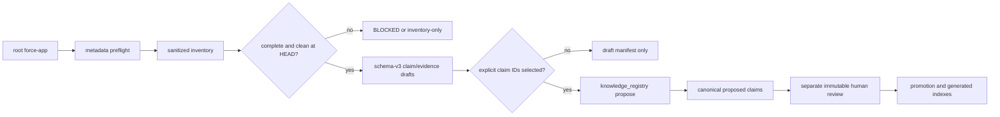

# force-app Knowledge Creation Architecture

Status: implemented, governed pilot

## Objective

Create reusable Salesforce Knowledge from the repository-root `force-app` without turning file
names, labels, model inference, dirty working-tree state, or generated prose into verified facts.
The workflow extends the existing schema-v3 claim/evidence/review lifecycle; it does not create a
parallel Markdown Knowledge store.

## Research basis

- Salesforce IDE deploy and retrieve commands operate on DX source format, which is designed for
  version-control workflows. This supports using committed source files as evidence of intended
  customer-owned state: [Salesforce Source Format](https://developer.salesforce.com/docs/platform/code-builder/guide/codebuilder-source-format.html).
- Metadata support varies by type and API version, so extractor coverage must be bounded and
  explicit rather than universal: [Salesforce Metadata Coverage Report](https://developer.salesforce.com/docs/metadata-coverage/53).
- Salesforce Code Analyzer v5 analyzes Apex, Visualforce, Flow, and Lightning source and can emit
  machine-readable findings. Those findings are a future quality/security evidence input, not
  business meaning: [Code Analyzer overview](https://developer.salesforce.com/docs/platform/salesforce-code-analyzer/guide/code-analyzer.html).
- GitHub Copilot project skills are repository folders containing `SKILL.md` and optional
  resources, while custom agents provide scoped tools and role instructions. This implementation
  keeps deterministic procedures in hidden skills and routes public prompts to the existing
  guarded investigator: [Agent Skills](https://docs.github.com/en/copilot/how-tos/copilot-on-github/customize-copilot/customize-cloud-agent/add-skills) and
  [custom agent configuration](https://docs.github.com/en/copilot/reference/custom-agents-configuration).

## Governed flow

The model and investigator can create `proposed` claims directly. Promotion stays human-governed
in one of two ways: the investigator may request
`knowledge_registry.py approve-claim --claim-id <id> --expected-revision <n>`, which the safety
hook stops for the human's chat-confirmation click (recorded as `copilot-chat-confirmation` with
the reviewer named in `knowledge.chatReviewer` local configuration, then auto-promoted and
re-indexed), or a human runs the file-based `review`/`promote` commands directly for external
mechanisms (owner decision 2026-07-14).

## Functionalities and artifacts

| Functionality | Artifact | Contract |
|---|---|---|
| Source inventory | `.cache/knowledge-proposals/force-app-inventory.json` | `schemas/force-app-knowledge-inventory.schema.json` |
| Candidate generation | `.cache/knowledge-proposals/force-app-drafts/*.yaml` | existing claim/evidence schema v3 |
| Candidate manifest | `.cache/knowledge-proposals/force-app-drafts/manifest.json` | `schemas/force-app-knowledge-draft-manifest.schema.json` |
| Proposal submission | `.ai/knowledge/claims/`, `.ai/knowledge/evidence/` | `scripts/knowledge_registry.py propose` |
| Review/promotion | `.ai/knowledge/reviews/`, generated domain indexes | existing Knowledge lifecycle |

All cache artifacts are ignored. Canonical evidence remains sanitized and contains a source
locator, exact repository commit, file revision digest, collector identity, timestamps,
completeness, limitations, and a digest of the sanitized observation.

## Extracted coverage

- Objects: labels, deployment and sharing values; candidate positive existence claims.
- Fields: label/type/selected flags/formula/references; field-schema and relation candidates.
- Apex and Flow: declarations, trigger/start configuration and bounded references; automation
  inventory candidates. Each also carries a **usage registry** — the objects and fields it declares
  it reads/writes plus the components it invokes (a Flow's `reads-field`/`writes-field`/
  `invokes-apex` targets and `referencedObjects`/`elementCounts`; Apex `queries-object`/
  `invokes-class` refs and `soqlObjects`/`dmlOperations` facts). Apex usage is a source-token
  heuristic and the claim records that limitation.
- Validation rules: owning object, active flag, error display field, error-message presence, and the
  custom fields referenced in the formula; automation-inventory candidates (with the heuristic
  limitation noted).
- Named/external credentials and remote sites: component identity, label, endpoint host only;
  integration candidates.
- Approval processes: object, label, active flag, step count, entry-criteria presence; automation
  inventory candidates.
- AI description layer: behavior-bearing components (Flow, Apex, triggers, approval processes,
  validation rules, LWC/Aura) additionally draft a `component-description` claim whose description
  the agent writes from the actual source before proposing (the registry rejects unfilled
  `<AGENT_...>` sentinels). These claims are `assurance: inferred` and become `verified` only through
  the human chat approval; they answer "what does this component do", which structural facts alone
  cannot.
- LWC/Aura: exposure, targets and source-declared references; generic `component-inventory`
  candidates (repository presence alone does not establish runtime behavior).
- Permission sets and layouts: dedicated extractors capture object/field permission grants (perm
  set) and placed fields/related lists (layout) as usage references, beyond the generic label facts;
  `component-inventory` candidates.
- Every other source-format metadata file (custom metadata, labels, queues, …): metadata type
  derived from the file suffix, label/fullName facts, and a generic `component-inventory` candidate —
  coverage is total, so a recognized source file never drafts nothing (2026-07-14 upgrade).
- Non-metadata files: path, category and digest only, explicitly counted as generic coverage.

## Batch conversion (`/batch-knowledge`)

Large architectures are converted one metadata type per batch through the five-phase
`batch-knowledge` skill: DISCOVER (inventory + existing-claim query + `knowledge.chatReviewer`
check) → PLAN (per-component dispositions, chunks of ≤25, expected approval clicks) → VERIFY PLAN
(clean-tree re-check, reconciliation, explicit human go-ahead) → EXECUTE (per chunk:
`draft --metadata-type <Type>`, agent-written descriptions, `propose`, one
`approve-claim --claim-spec <id>:<rev> …` batch = one human confirmation) → VERIFY (registry
query against the plan, `render-indexes --check`, batch report under `output/documentation/`).
Stop rules (dirty tree, propose failure, reconciliation conflict, ungroundable description)
pause the batch instead of improvising.

Credential values, source bodies, records, tokens, private keys, and inferred business semantics
are never included.

## Coverage and health (read-only, advisory)

Three deterministic reports make usage and validity visible without mutating any claim:

- `python scripts/force_app_knowledge.py coverage` — reuses the worklist status engine to report,
  per metadata type, how much of the force-app source is documented by a fresh verified claim vs
  proposed vs undocumented vs **drifted** (a verified claim whose component source digest no longer
  matches its evidence), plus a prioritised "document next" list that orders the next batch.
- `python scripts/knowledge_registry.py stale-report [--warn-days N]` — verified claims past
  `reviewBy` (`expired`) or within `N` days of it (`expiring`), so re-verification is scheduled
  before facts silently stop being effective.
- `python scripts/knowledge_registry.py verify-citations --envelope <path>` — validates a
  handoff/output envelope's cited `claimRefs` against current canonical state (`ok` / `missing` /
  `revision-mismatch` / `sha-mismatch` / `not-effective`), catching a design that cites a claim which
  has since drifted, expired, or been contested/rejected.

Marking a drifted or expired claim `stale` remains a governed human review; these reports never
mutate Knowledge.

## Refresh workflow (drift + expiry maintenance)

`python scripts/force_app_knowledge.py refresh [--metadata-type T] [--warn-days N] [--limit N]
[--dry-run]` selects only the verified claims that drifted (`verified-stale` in either worklist)
or are past/near `reviewBy`, and re-drafts exactly those through the normal draft pipeline. The
resulting manifest `propose` commands carry `--refresh-verified` — the explicit registry
acknowledgement that a verified/stale claim is demoted to a new **proposed** revision against
current evidence. This is fail-safe by construction: the claim stops being effective until a
human re-approves it, and the model still cannot create any status other than `proposed`.

## Collector versioning and reference kinds

The collector version (`COLLECTOR_VERSION`, currently 1.1.0) is recorded in every evidence
record. 1.1.0 adds two Apex source-token heuristics, tunable via optional
`config/knowledge-extraction.json`: `soql-field` (SELECT/WHERE field identifiers from inline
SOQL, standard fields included) and `var-field-ref` (member accesses through locally declared
sObject variables). Both stay `assurance: inferred`. Richer references change component facts and
therefore component digests — after upgrading the collector, downstream repos with populated
stores will see previously current claims flip to `verified-stale`; run the refresh workflow to
re-draft and re-approve them.

## Prompts, agents, and skills

Public prompts:

- `/inventory-force-app` — inventory only.
- `/propose-force-app-knowledge` — draft and optionally submit explicitly selected IDs.
- `/refresh-force-app-knowledge` — drift/expiry selection, re-draft, propose, chat approval.
- `/curate-knowledge` — knowledge-curator maintenance session (health | refresh | batch).

Investigator prompts route to `config-investigator`; maintenance routes to the dedicated
`knowledge-curator` role, which has the same knowledge command surface but no Salesforce org
tools. Hooks permit only fixed-root metadata preflight, the bounded inventory/draft/refresh
commands, and the governed registry proposal/approval commands. Hidden skills are
`inventory-force-app` and `propose-force-app-knowledge`.

## Evidence boundaries

- Dirty, modified, or untracked `force-app` can be inventoried but cannot become
  `metadata-repository` evidence tied to `HEAD`.
- Repository metadata establishes intended source at a commit, not deployed org state.
- Labels/descriptions do not establish business meaning or ownership.
- Static source does not establish runtime order, side effects, effective permissions, inaccessible
  managed-package internals, or absence.
- Source/org reconciliation remains a later investigator step through the existing guarded
  Salesforce review surface when the claim policy requires it.

## Current live blockers

At implementation time, metadata preflight stops because local harness configuration still has
placeholder values. The root `force-app` also contains untracked changes. These are correctly
reported as blockers; no canonical Knowledge claim was created from the current source tree.
