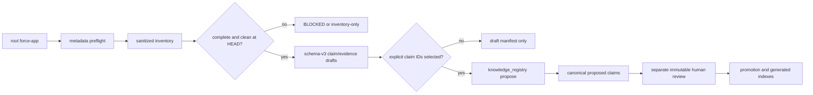

# force-app Knowledge Creation Architecture

Status: implemented, governed pilot

> Migration note (2026-07-24): repository-derived knowledge is moving to the one-file
> Knowledge Entry model (`docs/knowledge-one-file-contract.md`, executor
> `scripts/knowledge_store.py`). This document remains accurate for the retained v1 paths
> (org observations, semantic claims) and for the legacy repo-claim pipeline until the P5
> parity cutover described in `docs/knowledge-one-file-impact-map.md`.

## Objective

Create reusable Salesforce Knowledge from the repository-root `force-app` without turning file
names, labels, model inference, dirty working-tree state, or generated prose into verified facts.
The workflow extends the existing schema-v3 claim/evidence/review lifecycle; it does not create a
parallel Markdown Knowledge store.

## Research basis

- Salesforce IDE deploy and retrieve commands operate on DX source format, which is designed for
  version-control workflows. This supports using committed source files as evidence of intended
  customer-owned state: [Salesforce Source Format](https://developer.salesforce.com/docs/platform/code-builder/guide/codebuilder-source-format.html).
- Metadata support varies by type and API version, so extractor coverage must be bounded and
  explicit rather than universal: [Salesforce Metadata Coverage Report](https://developer.salesforce.com/docs/metadata-coverage/53).
- Salesforce Code Analyzer v5 analyzes Apex, Visualforce, Flow, and Lightning source and can emit
  machine-readable findings. Those findings are a future quality/security evidence input, not
  business meaning: [Code Analyzer overview](https://developer.salesforce.com/docs/platform/salesforce-code-analyzer/guide/code-analyzer.html).
- GitHub Copilot project skills are repository folders containing `SKILL.md` and optional
  resources, while custom agents provide scoped tools and role instructions. This implementation
  keeps deterministic procedures in hidden skills and routes public prompts to the existing
  guarded investigator: [Agent Skills](https://docs.github.com/en/copilot/how-tos/copilot-on-github/customize-copilot/customize-cloud-agent/add-skills) and
  [custom agent configuration](https://docs.github.com/en/copilot/reference/custom-agents-configuration).

## Governed flow

The model and investigator can create `proposed` claims directly. Promotion stays human-governed
in one of two ways: the investigator may request
`knowledge_registry.py approve-claim --claim-id <id> --expected-revision <n>`, which the safety
hook stops for the human's chat-confirmation click (recorded as `copilot-chat-confirmation` with
the reviewer named in `knowledge.chatReviewer` local configuration, then auto-promoted and
re-indexed), or a human runs the file-based `review`/`promote` commands directly for external
mechanisms (owner decision 2026-07-14).

## Functionalities and artifacts

| Functionality | Artifact | Contract |
|---|---|---|
| Source inventory | `.cache/knowledge-proposals/force-app-inventory.json` | `schemas/force-app-knowledge-inventory.schema.json` |
| Candidate generation | `.cache/knowledge-proposals/force-app-drafts/*.yaml` | existing claim/evidence schema v3 |
| Candidate manifest | `.cache/knowledge-proposals/force-app-drafts/manifest.json` | `schemas/force-app-knowledge-draft-manifest.schema.json` |
| Proposal submission | `.ai/knowledge/claims/`, `.ai/knowledge/evidence/` | `scripts/knowledge_registry.py propose` |
| Review/promotion | `.ai/knowledge/reviews/`, generated domain indexes | existing Knowledge lifecycle |

All cache artifacts are ignored. Canonical evidence remains sanitized and contains a source
locator, exact repository commit, file revision digest, collector identity, timestamps,
completeness, limitations, and a digest of the sanitized observation.

## Extracted coverage

- Objects: labels, deployment and sharing values, plus (1.3.0) `objectKind` discrimination
  (custom setting / platform event / big object / custom metadata type / standard-object
  extension), description, name-field shape, history/feed flags, and compact-layout assignment;
  candidate positive existence claims.
- Fields: label/type/selected flags/formula/references, plus (1.3.0) picklist values (local
  definitions capped at 100 with `picklistValuesTruncated`, global sets via `uses-value-set`,
  dependencies via `picklist-dependency`), roll-up summaries traced deterministically through
  `summaryForeignKey`/`summarizedField`, cross-object formula chains resolved through repo
  lookups (per-reference heuristic when regex-derived), lookup-filter fields, and relationship
  semantics (delete constraint, master-detail flags); field-schema and relation candidates.
- Apex and Flow: declarations, trigger/start configuration and bounded references; automation
  inventory candidates. Each also carries a **usage registry** — the objects and fields it declares
  it reads/writes plus the components it invokes (a Flow's `reads-field`/`writes-field`/
  `invokes-apex` targets and `referencedObjects`/`elementCounts`; Apex `queries-object`/
  `invokes-class` refs and `soqlObjects`/`dmlOperations` facts). Apex usage is a source-token
  heuristic and the claim records that limitation. 1.3.0 additions — Flow: per-element
  `facts.dataOperations` (object incl. `inputReference` resolution, filter vs retrieved vs
  written fields, output target, sort/limit), `facts.start` entry conditions and scheduled paths,
  `facts.variables`/`facts.formulas`, decision/formula field references, structural
  `queries-object`/`dml-object` edges, and the `filters-field` polarity (an update's filter
  fields select records — they are no longer counted as writes). Apex: sharing posture,
  annotations, inheritance, `isTest`, companion-meta apiVersion/status, `dmlTargets` resolved
  through the local variable map (incl. `Trigger.new` seeding), `uses-named-credential` from
  `callout:` literals, and heuristic `callout-endpoint` hostnames.
- Workflow (1.3.0): one component per object file — rules with criteria and time triggers, field
  updates (cross-object via `targetObject`) as `writes-field`, alerts (template + recipient
  types, never addresses) with `sends-alert`/`uses-template` edges, outbound messages (endpoint
  host + payload fields as `reads-field`), and tasks; automation-inventory candidates with a
  description stub.
- Approval processes (1.4.0): entry/step criteria (`filters-field`), approver routing
  (related-user-field approvers as field reads; user approver names never captured), record
  locks/editability, approval-page fields, and the action sets resolved to the owning object's
  Workflow components via `uses-workflow-action`/`sends-alert`/`uses-template`.
- Record data model (1.4.0): RecordType (picklist scoping, `uses-business-process`),
  GlobalValueSet/StandardValueSet (full value lists with closed/won/converted lifecycle flags),
  BusinessProcess (ordered pipeline values, lifecycle field, `uses-value-set`), DuplicateRule
  (block/alert behavior, `uses-matching-rule`, mapped fields; `alertText` joins
  facts.errorCatalog as `duplicate-alert` so pasted duplicate warnings resolve via BM25).
- UI surface (1.4.0): FlexiPage (component/field/visibility wiring, `displays-component`,
  heuristic `launches-flow`), Layout deepening (per-field Required/Readonly UI behavior,
  sections, action and embedded-page edges, related-list columns), QuickAction (mini-layout
  fields, overrides, flow/component launches), CustomApplication (tabs, utility bar, and
  `profileActionOverrides` → `overrides-view` — which FlexiPage a profile actually gets). LWC
  deepening: `targetConfigs` placement objects, `@api`/`@wire` facts, and — under the
  `markupFieldExtraction` toggle (default on) — record-form literals, JS field-literal
  heuristics, `uses-label`, `embeds-component`.
- Access model (1.4.0): PermissionSet and Profile share one grant-family extractor —
  level-aware `grants-field-read`/`grants-field-edit` (the legacy level-blind
  `grants-field-permission` stays declared but is no longer emitted), a compact
  `facts.objectAccess` CRUD map with `grants-object-view-all`/`-modify-all` edges,
  class/custom-permission/record-type/flow grants, `facts.systemPermissions` with
  `grants-user-permission`, and prioritized emission under `maxUsageRefs` (field grants cut
  first, dropped families named in `facts.truncatedFamilies`). Profile adds `assigns-layout`,
  default record types/app, and login-posture booleans (never IP ranges or hours).
- Working sets and routing (1.5.0): ListView (columns + filters with values), FieldSet
  (displayed vs available fields), SharingRules (criteria + `shares-with` grantees),
  Queue (`serves-object`, member counts only), and the shared assignment/auto-response/
  escalation rule parser (`filters-field`, `assigns-to` queue targets only, `uses-template`).
- Integration completion (1.5.0): NamedCredential full anatomy with the
  `uses-external-credential` chain, ExternalCredential protocol/principals (names and
  sequence only — never parameter values or certificates), ExternalDataSource and
  ExternalServiceRegistration routed as integrations, RemoteSiteSetting posture facts
  (`disableProtocolSecurity`), ConnectedApp scopes/relaxation/hosts with
  `grants-to-profile`/`-permission-set` pre-authorizations.
- Code and text (1.5.0): shared Visualforce parser (controller wiring, inputField writes /
  outputField reads as per-ref heuristics), Aura deepening (implements/attributes,
  `force:recordData` objects and fields), per-label `CustomLabel` components whose claim
  statements carry the label text (BM25-searchable) with `uses-label` consumer edges from
  Apex/Flow/validation-rule/VF/Aura/LWC, and validation-rule formulas upgraded to the
  resolved cross-object chain extractor (no more same-object misattribution).
- Configuration and analytics (1.5.0): CustomMetadata records (identity
  `Type__mdt.Record`, populated fields always, values sanitized and dropped entirely on
  protected records), `$Permission` tokens → `references-custom-permission`,
  PermissionSetGroup composition (`includes-`/`mutes-permission-set`), CustomTab `tabKind`
  (fixing the crawl's tab→object assumption end to end), ReportType/Report/Dashboard
  (bounded field vocabulary with filter values, report wiring, `runningUserPolicy` mode
  only), and PathAssistant (per-stage fields + HTML-stripped guidance).
- P3 tail (1.6.0): MatchingRule components (identity `Object.RuleName` — resolves
  DuplicateRule `uses-matching-rule` edges) and FlowDefinition activation pointers
  (`activeVersionNumber: 0` contradicts a Flow's own Active status); CompactLayout and
  WebLink (JS buttons flagged, bodies never stored, URL targets host-only); EmailTemplate
  components with `Folder/Name` identity resolving every `uses-template` edge, merge-field
  reads, and subject-bearing searchable statements; StaticResource type/cache posture
  (contents deliberately a black box); Role hierarchy via `reports-to`;
  MutingPermissionSet negative grants as facts only (`mutedObjectAccess`,
  `mutedSystemPermissions` — never mixed into the positive usage graph); DelegateGroup
  assignables (privilege-escalation blast radius); AuthProvider (endpoint hosts, execution
  user as presence boolean, registration handler via `invokes-class`); CspTrustedSite/
  CorsWhitelistOrigin browser-egress hosts; PlatformEventChannel(Member) streaming topology
  with heuristic CDC base-object association. AppMenu, HomePageLayout/Component,
  SharingReason, and big-object Index intentionally stay on the generic fallback (no
  knowledge yield).
- Validation rules: owning object, active flag, error display field, error-message presence, and the
  custom fields referenced in the formula; automation-inventory candidates (with the heuristic
  limitation noted).
- Named/external credentials and remote sites: component identity, label, endpoint host only;
  integration candidates.
- Approval processes: object, label, active flag, step count, entry-criteria presence; automation
  inventory candidates.
- AI description layer: behavior-bearing components (Flow, Apex, triggers, approval processes,
  validation rules, LWC/Aura) additionally draft a `component-description` claim whose description
  the agent writes from the actual source before proposing (the registry rejects unfilled
  `<AGENT_...>` sentinels). These claims are `assurance: inferred` and become `verified` only through
  the human chat approval; they answer "what does this component do", which structural facts alone
  cannot.
- LWC/Aura: exposure, targets and source-declared references; generic `component-inventory`
  candidates (repository presence alone does not establish runtime behavior).
- Permission sets and layouts: dedicated extractors capture object/field permission grants (perm
  set) and placed fields/related lists (layout) as usage references, beyond the generic label facts;
  `component-inventory` candidates.
- Every other source-format metadata file (custom metadata, labels, queues, …): metadata type
  derived from the file suffix, label/fullName facts, and a generic `component-inventory` candidate —
  coverage is total, so a recognized source file never drafts nothing (2026-07-14 upgrade).
- Non-metadata files: path, category and digest only, explicitly counted as generic coverage.

## Batch conversion (`/batch-knowledge`)

Large architectures are converted one metadata type per batch through the five-phase
`batch-knowledge` skill: DISCOVER (inventory + existing-claim query + `knowledge.chatReviewer`
check) → PLAN (per-component dispositions, chunks of ≤25, expected approval clicks) → VERIFY PLAN
(clean-tree re-check, reconciliation, explicit human go-ahead) → EXECUTE (per chunk:
`draft --metadata-type <Type>`, agent-written descriptions, `propose`, one
`approve-claim --claim-spec <id>:<rev> …` batch = one human confirmation) → VERIFY (registry
query against the plan, `render-indexes --check`, batch report under `output/documentation/`).
Stop rules (dirty tree, propose failure, reconciliation conflict, ungroundable description)
pause the batch instead of improvising.

Credential values, source bodies, records, tokens, private keys, and inferred business semantics
are never included.

## Coverage and health (read-only, advisory)

Three deterministic reports make usage and validity visible without mutating any claim:

- `python scripts/force_app_knowledge.py coverage` — reuses the worklist status engine to report,
  per metadata type, how much of the force-app source is documented by a fresh verified claim vs
  proposed vs undocumented vs **drifted** (a verified claim whose component source digest no longer
  matches its evidence), plus a prioritised "document next" list that orders the next batch.
- `python scripts/knowledge_registry.py stale-report [--warn-days N]` — verified claims past
  `reviewBy` (`expired`) or within `N` days of it (`expiring`), so re-verification is scheduled
  before facts silently stop being effective.
- `python scripts/knowledge_registry.py verify-citations --envelope <path>` — validates a
  handoff/output envelope's cited `claimRefs` against current canonical state (`ok` / `missing` /
  `revision-mismatch` / `sha-mismatch` / `not-effective`), catching a design that cites a claim which
  has since drifted, expired, or been contested/rejected.

Marking a drifted or expired claim `stale` remains a governed human review; these reports never
mutate Knowledge.

## Refresh workflow (drift + expiry maintenance)

`python scripts/force_app_knowledge.py refresh [--metadata-type T] [--warn-days N] [--limit N]
[--dry-run]` selects only the verified claims that drifted (`verified-stale` in either worklist)
or are past/near `reviewBy`, and re-drafts exactly those through the normal draft pipeline. The
resulting manifest `propose` commands carry `--refresh-verified` — the explicit registry
acknowledgement that a verified/stale claim is demoted to a new **proposed** revision against
current evidence. This is fail-safe by construction: the claim stops being effective until a
human re-approves it, and the model still cannot create any status other than `proposed`.

## Collector versioning and reference kinds

The collector version (`COLLECTOR_VERSION`, currently 1.6.0) is recorded in every evidence
record. 1.1.0 adds two Apex source-token heuristics, tunable via optional
`config/knowledge-extraction.json`: `soql-field` (SELECT/WHERE field identifiers from inline
SOQL, standard fields included) and `var-field-ref` (member accesses through locally declared
sObject variables). Both stay `assurance: inferred`. 1.2.0 adds the error catalog
(`errorSurfaceExtraction` toggle, default on): Flow custom errors, screen validation messages,
and fault paths — each with the author-written message text, an optional `$Label`-resolved
variant, and the decision paths guarding it — plus validation-rule error message text. Error
messages feed the BM25 search corpus and the claims-index `emitsErrors` column, so an
admin-pasted error message resolves to the automation that declares it.

1.3.0 (2026-07-22) is the first wave of the metadata-coverage expansion (defect fixes + core
automation and data model):

- Defect fixes: `GENERIC_TOKEN_TYPES` casing entries (FlexiPage, ExternalDataSource,
  PermissionSetGroup, MutingPermissionSet, AuthProvider), Apex companion-meta
  `apiVersion`/`status`, new-style NamedCredential Url-parameter endpoint hosts, and the feature
  crawl's tab→object association gated on repository custom objects.
- Kind vocabulary: canonical `ALL_REF_KINDS` in the extractor and a fourth registry
  classification set (`EXTERNAL_REF_KINDS`, excluded from usage derivation), pinned against
  drift by `tests/test_kind_contract.py`. New kinds: `filters-field`, `picklist-dependency`
  (field kinds); `uses-value-set`, `sends-alert`, `uses-template`, `uses-named-credential`
  (invocation kinds); `callout-endpoint` (external). References may carry a per-edge
  `heuristic: true` for kinds emitted both structurally and heuristically (`queries-object`,
  `dml-object`, `references-field`); `dml-object` — declared since 1.0 but never emitted — now
  fires from Flow record writes (structural) and Apex DML-target resolution (heuristic).
- Criteria capture: filter/criteria rows (field + operator + literal value) are captured
  unconditionally across Flow entry conditions, record filters, and Workflow rule criteria;
  literals pass a hard sanitizer (`sanitize_literal`) that collapses URLs to hostnames and
  drops credential-like strings, e-mail addresses, and IPs entirely.
- New coverage: `parse_workflow` (rules/fieldUpdates/alerts/outboundMessages/tasks), the Flow
  per-element data-operations model, and the CustomObject/CustomField enrichment described
  under "Extracted coverage".

1.4.0 (2026-07-23) is the second wave (automation completion, UI surface, access model):

- ApprovalProcess deepening, RecordType/GlobalValueSet/StandardValueSet/BusinessProcess/
  DuplicateRule parsers, FlexiPage/QuickAction/CustomApplication parsers, Layout and LWC
  deepening, and the shared PermissionSet/Profile access-bundle extractor — see "Extracted
  coverage" for each type's facts and edges.
- New kinds: `grants-field-read`, `grants-field-edit`, `grants-object-view-all`,
  `grants-object-modify-all` (field/object kinds); `uses-workflow-action`,
  `uses-business-process`, `uses-matching-rule`, `uses-label`, `embeds-component`,
  `displays-component`, `launches-flow` (kind-level heuristic), `overrides-view`,
  `grants-class-access`, `grants-custom-permission`, `grants-record-type`,
  `grants-flow-access`, `assigns-layout` (invocation kinds); `grants-user-permission`
  (external). `AUTOMATION_TYPES` gained Workflow (1.3.0) and DuplicateRule; `UI_TYPES` gained
  QuickAction and CustomApplication.
- New toggle: `markupFieldExtraction` (default on) gating LWC HTML/JS literal scanning.

1.5.0 (2026-07-23) is the third wave (working sets, routing, integrations, code/text, analytics):

- ListView/FieldSet/SharingRules/Queue, the shared rule-file parser
  (AssignmentRules/AutoResponseRules/EscalationRules → `AUTOMATION_TYPES`), the integration
  family completion (EDS/ESR/ConnectedApp now draft `integration` claims), the shared
  Visualforce parser + Aura deepening, per-label CustomLabel components with consumer
  `uses-label` edges, CustomMetadata record parsing (identity now `Type__mdt.Record`),
  PermissionSetGroup, CustomTab kinds, and ReportType/Report/Dashboard/PathAssistant — see
  "Extracted coverage".
- New kinds: `serves-object` (object kind); `assigns-to`, `uses-external-credential`,
  `references-auth-provider`, `grants-to-profile`, `grants-to-permission-set`,
  `references-custom-permission`, `includes-permission-set`, `mutes-permission-set`
  (invocation kinds); `shares-with` (external).

1.6.0 (2026-07-23) is the fourth wave — the audited P3 tail (see the "P3 tail" coverage
bullet). One new kind: `reports-to` (invocation — Role hierarchy). MutingPermissionSet is
deliberately facts-only (no negative-grant edges), and AppMenu/HomePageLayout/
HomePageComponent/SharingReason/Index remain intentionally generic.

Richer references change component facts and therefore component digests — after upgrading the
collector, downstream repos with populated stores will see previously current claims flip to
`verified-stale`; run the refresh workflow (`propose --refresh-verified`) to re-draft and
re-approve them. Plan one refresh pass per collector wave, not per phase.

## Prompts, agents, and skills

Public prompts:

- `/inventory-force-app` — inventory only.
- `/propose-force-app-knowledge` — draft and optionally submit explicitly selected IDs.
- `/refresh-force-app-knowledge` — drift/expiry selection, re-draft, propose, chat approval.
- `/curate-knowledge` — knowledge-curator maintenance session (health | refresh | batch).

Investigator prompts route to `config-investigator`; maintenance routes to the dedicated
`knowledge-curator` role, which has the same knowledge command surface but no Salesforce org
tools. Hooks permit only fixed-root metadata preflight, the bounded inventory/draft/refresh
commands, and the governed registry proposal/approval commands. Hidden skills are
`inventory-force-app` and `propose-force-app-knowledge`.

## Evidence boundaries

- Dirty, modified, or untracked `force-app` can be inventoried but cannot become
  `metadata-repository` evidence tied to `HEAD`.
- Repository metadata establishes intended source at a commit, not deployed org state.
- Labels/descriptions do not establish business meaning or ownership.
- Static source does not establish runtime order, side effects, effective permissions, inaccessible
  managed-package internals, or absence.
- Source/org reconciliation remains a later investigator step through the existing guarded
  Salesforce review surface when the claim policy requires it.

## Current live blockers

At implementation time, metadata preflight stops because local harness configuration still has
placeholder values. The root `force-app` also contains untracked changes. These are correctly
reported as blockers; no canonical Knowledge claim was created from the current source tree.
